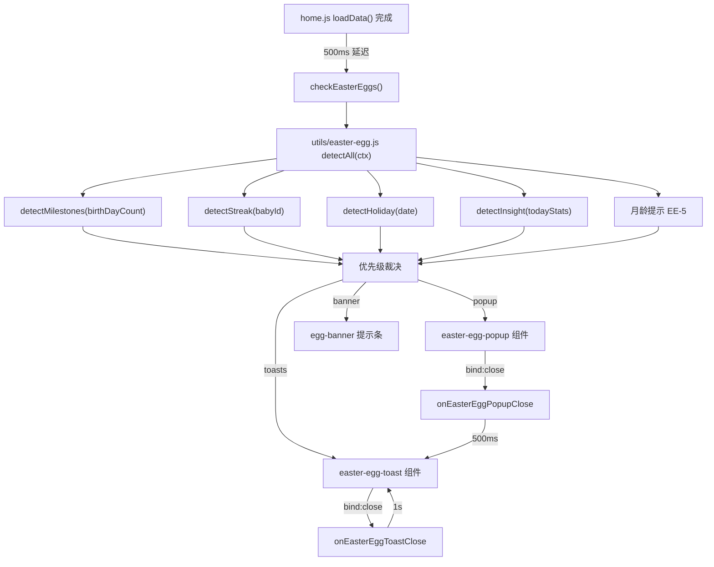

## 产品概述

在微信小程序"宝宝成长记录"的首页增加宝宝成长彩蛋功能，通过时间节点（满月/百日/周岁）、行为里程碑（首次记录/连续记录）、节日和数据洞察等维度，在适当时机弹出庆祝/鼓励弹窗或提示，增强产品情感温度和用户粘性。

## 核心功能

- 彩蛋检测引擎：纯函数模块，配置驱动检测 8 类彩蛋（EE-1 满月 ~ EE-8 数据洞察），返回弹窗/Toast/Banner 三层结果
- 弹窗组件：居中弹窗，支持 30day/100day/365day/streak_30 四种视觉形态，含数据回顾懒加载、数字翻转/粒子/祥云背景等 CSS 特效动画
- Toast 组件：底部滑入胶囊，自动 2.5s 消失，支持队列化逐个展示
- 提示条 Banner：问候语下方轻量横条，用于月龄提示和节日祝福
- 首页集成：loadData 完成后 500ms 异步检测，弹窗互斥取最高优先级，Toast 排队间隔 1s，Banner 取最高优先级一个
- 展示一次性：每个彩蛋每个宝宝只展示一次（StorageUtil 标记），多宝宝 babyId 隔离

## 技术栈

- 微信小程序原生框架（WXML/WXSS/JS）
- 数据存储：StorageUtil（wx.setStorageSync/getStorageSync）
- 数据查询：RecordService.getRecords()（仅弹窗展示时按需查询）
- 动画方案：纯 CSS @keyframes + 类名切换
- 色彩体系：美拉德色系，100% 使用 app.wxss 已有 CSS 变量

## 实现方案

### 整体策略

自底向上分层构建：先实现检测引擎（纯函数，可独立测试）-> 再实现两个展示组件（弹窗 + Toast）-> 最后首页集成串联全链路。按优先级增量交付，Task 1-4 完成即可交付 P0 核心体验。

### 关键技术决策

1. **检测引擎纯函数模块**：独立 `utils/easter-egg.js`，不依赖组件生命周期，可独立测试，未来可在其他页面复用
2. **数据回顾懒加载**：时间节点检测仅需 `birthDayCount`（零查询），数据回顾仅在弹窗实际展示时触发 `RecordService.getRecords()` 按需查询
3. **居中弹窗（非底部弹窗）**：与现有记录弹窗视觉差异化，产生"惊喜感"，允许更灵活的装饰性布局
4. **Toast 队列化**：逐个展示间隔 1 秒，保证每个彩蛋被看到；弹窗关闭后 500ms 开始 Toast 队列
5. **配置驱动**：MILESTONE_RULES 数组声明彩蛋规则，新增彩蛋只需追加配置项
6. **连续记录检测**：从本地缓存 `records_{babyId}` 构建日期集合逐天检查，避免云端查询，最多回溯 60 天

### 性能与可靠性

- 检测耗时目标 <= 50ms（纯本地计算 + StorageUtil 读取）
- 弹窗动画纯 CSS，不使用 JS 定时器驱动动画帧
- 粒子限制 16 个，避免低端机卡顿
- 包体积增量目标 <= 15KB（WXML + WXSS + JS 压缩后）
- Storage 写入失败静默降级，可接受偶尔重复展示

## 实施注意事项

- 所有 `@keyframes` 命名以 `egg` 前缀避免全局冲突
- Storage Key 严格遵循 `egg_{type}_{babyId}` 格式确保多宝宝隔离
- home.js / home.wxml / home.wxss / home.json 仅做增量修改，不重构现有代码
- 彩蛋专用图标在 `/images/icons/easter-egg/` 子目录，EE-4 复用已有 `/images/icons/rocket.png`
- 所有色值、圆角、阴影使用 app.wxss 已有 CSS 变量，禁止硬编码新色值

## 架构设计



## 目录结构

```
miniprogram/
├── utils/
│   └── easter-egg.js              # [NEW] 彩蛋检测引擎纯函数模块。实现 detectAll(ctx) 主入口、MILESTONE_RULES 配置数组、detectStreak 连续记录检测、detectHoliday 节日检测、detectInsight 数据洞察检测、markShown 标记函数、getNthWeekday 辅助函数。引入 StorageUtil，导出 detectAll/markShown/配置常量。
├── components/
│   ├── easter-egg-popup/          # [NEW] 彩蛋弹窗组件
│   │   ├── easter-egg-popup.js    # [NEW] 组件逻辑。Properties: show/type/eggData/storageKey/babyId。Observer 监听 show 触发 onOpen()。实现 loadRetrospect() 数据回顾懒加载（含 EE-2 生长数据对比）、close() 退场动画 + markShown、onMaskTap/stopPropagation。
│   │   ├── easter-egg-popup.json  # [NEW] 组件配置 { "component": true }
│   │   ├── easter-egg-popup.wxml  # [NEW] 弹窗模板。遮罩层 + 居中弹窗容器，条件渲染 4 种 type 图标区（30day 月亮/100day 数字翻转+祥云/365day 蛋糕+粒子/streak_30 火焰），标题区，EE-2 生长对比区，通用数据回顾卡片（EE-3 含第 4 张总记录），streak_30 连续天数，底部按钮。
│   │   └── easter-egg-popup.wxss  # [NEW] 弹窗样式。遮罩(z-index 2000)、居中容器(渐变背景/入退场 transition)、365day 粒子@keyframes particleFall、100day 祥云纹理 radial-gradient、数字翻转@keyframes digitFlipIn、图标弹跳@keyframes eggScaleBounce/eggBounceIn、标题渐入@keyframes eggFadeInUp、数据回顾卡片、生长对比行、加载三点脉冲、底部渐变按钮。
│   └── easter-egg-toast/          # [NEW] 彩蛋 Toast 组件
│       ├── easter-egg-toast.js    # [NEW] 组件逻辑。Properties: show/text/icon/storageKey/duration(2500ms)。Observer 监听 show 触发 showToast()。实现自动关闭 timer、dismiss() 退场 + markShown + triggerEvent('close')。
│       ├── easter-egg-toast.json  # [NEW] 组件配置 { "component": true }
│       ├── easter-egg-toast.wxml  # [NEW] Toast 模板。fixed 定位容器 + 图标 + 文案，支持点击关闭。
│       └── easter-egg-toast.wxss  # [NEW] Toast 样式。bottom 定位、暗色半透明胶囊、z-index 3000、entering/visible/leaving 三态动画、适配 safe-area-inset-bottom。
├── images/icons/easter-egg/       # [EXISTS] 10 个彩蛋图标 PNG 已就绪
├── pages/home/
│   ├── home.js                    # [MODIFY] 增量新增：引入 EasterEgg 模块，data 中添加 easterEggPopup/easterEggToast/easterEggBanner 状态字段，实现 checkEasterEggs()/\_showNextToast()/onEasterEggPopupClose()/onEasterEggToastClose()/closeEasterEggBanner() 方法，loadData() 末尾添加 setTimeout 调用，onRecordCreated() 顶部添加 \_checkFirstRecordEgg() 调用。
│   ├── home.wxml                  # [MODIFY] 增量新增：greeting-bar 与 baby-card 之间插入 egg-banner 提示条，文件末尾弹窗组件后追加 easter-egg-popup 和 easter-egg-toast 组件引用。
│   ├── home.wxss                  # [MODIFY] 增量新增：.egg-banner 容器/图标/文案/关闭按钮样式，@keyframes eggSlideDown 进入动画。
│   └── home.json                  # [MODIFY] usingComponents 中添加 easter-egg-popup 和 easter-egg-toast 两个组件注册。
└── styles/
    └── popup.wxss                 # [NO CHANGE] 复用
```

## 子代理

- **code-explorer**
- 用途：在实施过程中精准定位 home.js 的 loadData() 末尾位置、onRecordCreated() 位置、home.wxml 的 greeting-bar 和弹窗组件位置，确保增量修改准确插入
- 预期结果：获取精确的行号和上下文代码片段，避免误修改现有功能

## 技能

- **spec-workflow**
- 用途：遵循 Spec 工作流的 Phase 3 实施计划规范，确保任务拆分符合需求文档和设计文档
- 预期结果：生成的实施计划与 specs/easter-eggs/ 目录下三份文档保持一致