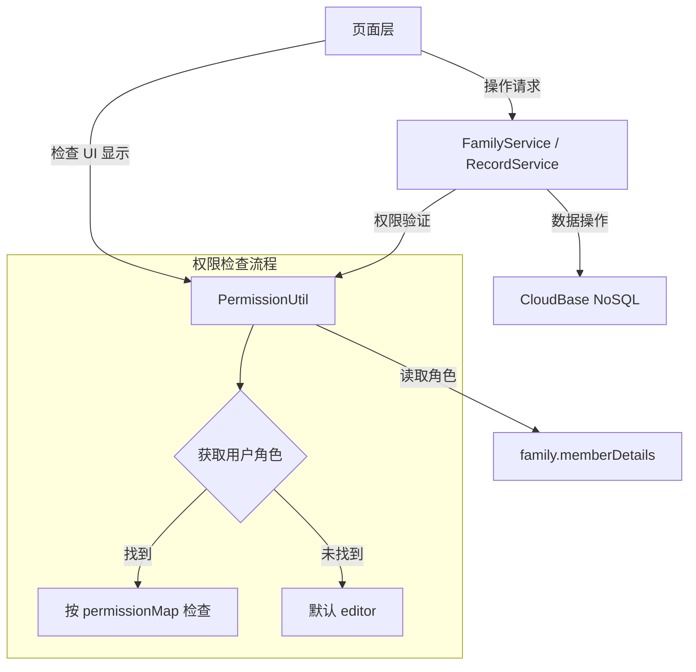
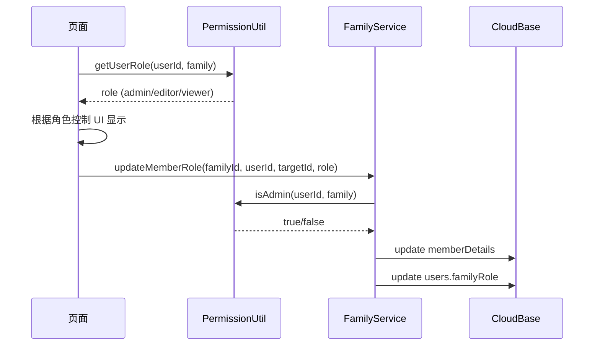

## 用户需求

根据已完成的需求文档、设计文档和任务分解文档，创建详细实施计划并按计划执行家庭协作功能增强。

## 产品概述

宝宝护理追踪小程序的家庭协作功能增强，实现完整的多成员权限管理体系，包括三级角色（admin/editor/viewer）、成员管理、记录创建者标识、基于角色的操作控制等功能。

## 核心功能

1. **权限工具类**：创建 `utils/permission.js`，实现 admin/editor/viewer 三级权限检查体系
2. **数据模型增强**：扩展 User/Family/Record 类型定义，支持 viewer 角色和 createdBy 对象格式
3. **家庭服务层增强**：加固 `updateMemberRole`/`removeMember`，新增 `transferAdmin`/`validateInviteCode`
4. **记录服务层增强**：统一 createdBy 为对象格式，兼容旧数据
5. **家庭管理页 UI**：成员角色展示、权限编辑弹窗、成员移除、邀请码有效期显示
6. **管理员退出增强**：退出前必须转让管理员或确认解散
7. **记录创建者标识**：首页和记录页显示创建者信息
8. **基于角色的操作权限**：Viewer 隐藏添加/编辑/删除按钮，Editor 不能删他人记录
9. **被移除成员检测**：首页初始化时验证成员身份有效性
10. **数据迁移脚本**：为现有数据补充 role 默认值

## 技术栈

- 前端框架：微信小程序原生
- 云服务：微信云开发（CloudBase NoSQL + 云函数）
- 数据存储：CloudBase NoSQL（families, users, records 集合）
- 本地缓存：wx.storage（StorageUtil 封装）

## 实现方案

### 总体策略

采用分层增强策略：先建立权限基础设施（工具类 + 数据模型），再增强服务层，最后在 UI 层集成权限控制。遵循最小改动原则，充分复用现有代码架构。

### 关键技术决策

1. **权限检查客户端为主**：小程序端做 UI 控制，CloudBase 安全规则做数据层防护。不额外引入云函数中间层，避免增加复杂度和延迟。

2. **createdBy 兼容策略**：现有 record.js 已用扁平字段 `creatorId/createdByName/createdByAvatar`，不改动已有字段，新增 `createdBy` 对象字段用于新记录，查询时通过 `normalizeCreatedBy()` 方法统一两种格式。这样确保零数据迁移风险。

3. **角色缺失默认 editor**：所有权限检查在角色字段缺失时默认为 editor，确保向后兼容。

4. **原子操作**：成员移除使用 `db.command.pull`（已有），权限变更使用整体替换 `memberDetails`（已有），避免并发问题。

### 性能考量

- 权限检查为纯内存计算（`PermissionUtil` 静态方法），无额外数据库查询开销
- 家庭信息通过 `StorageUtil` 缓存，首页 init 已有 30s 节流
- createdBy 格式归一化在查询结果处理时一次性完成，不产生额外请求

## 实现注意事项

1. **record.js 的 createdBy 字段**：现有 createRecord 方法已有 `creatorId/createdByName/createdByAvatar` 三个扁平字段（L160-161），新增 `createdBy` 对象字段时需保留原字段不变，避免影响现有功能。
2. **family.js 的权限检查**：现有方法使用 `family.creatorId !== userId` 做权限检查，改为 `PermissionUtil.isAdmin()` 后需保留 creatorId 检查作为 fallback（兼容无 memberDetails 的旧数据）。
3. **models/index.js 的 generateInviteCode**：family 页面已用去除易混淆字符版本，models 中的版本也需同步更新，但需确认其他调用方不受影响。
4. **家庭页面 wxml 增强**：当前 family.wxml 仅 72 行，成员卡片无操作按钮，需大幅增强但要保持现有美拉德色彩风格。

## 架构设计

### 权限系统架构



### 数据流



## 目录结构

```
miniprogram/
├── utils/
│   └── permission.js          # [NEW] 权限工具类。实现 PermissionUtil 静态类，包含 checkPermission/getUserRole/isAdmin/canEdit 方法，权限矩阵映射 9 种操作到 3 种角色，角色缺失默认 editor。
├── models/
│   └── index.js               # [MODIFY] 数据模型增强。User typedef 添加 viewer 角色，Record typedef 扩展 createdBy 为对象格式，generateInviteCode 去除易混淆字符（I/O/0/1）。
├── services/
│   ├── family.js              # [MODIFY] 家庭服务增强。updateMemberRole 增加 admin 约束检查和 users 同步，removeMember 增加自身移除防护和 users 清理，新增 transferAdmin 和 validateInviteCode 方法，refreshInviteCode 改用 PermissionUtil。
│   └── record.js              # [MODIFY] 记录服务增强。createRecord 新增 createdBy 对象字段（保留原扁平字段兼容），新增 normalizeCreatedBy 方法统一旧新格式。
├── pages/
│   ├── family/
│   │   ├── family.js          # [MODIFY] 家庭管理页逻辑增强。新增成员权限编辑、成员移除、管理员退出转让流程、邀请码有效期计算、角色文本映射。
│   │   ├── family.wxml        # [MODIFY] 家庭管理页模板增强。成员卡片增加角色标签和"我"标识，admin 可见权限编辑弹窗和移除按钮，邀请码区域增加有效期倒计时，非 admin 隐藏管理入口。
│   │   └── family.wxss        # [MODIFY] 家庭管理页样式增强。新增角色标签样式、权限编辑弹窗样式、左滑操作样式、有效期警告样式。
│   ├── home/
│   │   ├── home.js            # [MODIFY] 首页逻辑增强。init 中获取用户角色并存入 data，loadData 返回记录增加 createdBy 归一化，viewer 角色控制快捷按钮和时间线操作，新增被移除成员检测逻辑。
│   │   ├── home.wxml          # [MODIFY] 首页模板增强。时间线记录显示创建者信息（头像+昵称），viewer 角色隐藏快捷添加按钮和时间线编辑/删除操作。
│   │   └── home.wxss          # [MODIFY] 首页样式增强。新增创建者标识样式。
│   └── record/
│       ├── record.js          # [MODIFY] 记录页逻辑增强。init 中获取用户角色，viewer 隐藏 FAB 和操作菜单，editor 删除他人记录增加确认。
│       └── record.wxml        # [MODIFY] 记录页模板增强。viewer 隐藏 FAB 按钮和批量管理入口。
├── app.js                     # [MODIFY] 应用入口增强。initUser 后缓存 familyRole 到全局。
scripts/
└── migrate-family-roles.js    # [NEW] 数据迁移脚本。为 families 集合中缺少 role 的 memberDetails 补充默认值（creatorId 为 admin，其余为 editor）。
```

## 关键代码结构

```javascript
// utils/permission.js - 核心权限检查类
class PermissionUtil {
  static PERMISSIONS = {
    'record.view': ['admin', 'editor', 'viewer'],
    'record.create': ['admin', 'editor'],
    'record.edit': ['admin', 'editor'],
    'record.delete.own': ['admin', 'editor'],
    'record.delete.other': ['admin'],
    'member.invite': ['admin'],
    'member.manage': ['admin'],
    'family.dissolve': ['admin']
  };

  static checkPermission(userId, family, permission) { /* ... */ }
  static getUserRole(userId, family) { /* ... */ }
  static isAdmin(userId, family) { /* ... */ }
  static canEdit(userId, family) { /* ... */ }
}
```

```javascript
// services/record.js - normalizeCreatedBy 兼容方法签名
/**
 * 统一 createdBy 格式
 * @param {Object} record - 记录对象
 * @returns {{ userId: string, nickName: string, avatar?: string }}
 */
static normalizeCreatedBy(record) { /* 兼容 createdBy 对象、creatorId 扁平字段、无字段三种情况 */ }
```

## Agent Extensions

### SubAgent

- **code-explorer**
- Purpose: 在实施各阶段前探索相关代码文件的具体实现细节，确保修改精准
- Expected outcome: 获取准确的代码行号、方法签名和调用关系

### MCP

- **cloudbase**
- Purpose: 使用 readNoSqlDatabaseStructure 查看 families/records/users 集合结构，确认现有字段
- Expected outcome: 确认数据库实际字段与设计文档一致

### Skill

- **ui-design**
- Purpose: 在增强家庭管理页 UI 时，遵循设计规范确保界面风格一致
- Expected outcome: 生成符合美拉德色彩风格的权限编辑弹窗和成员管理 UI