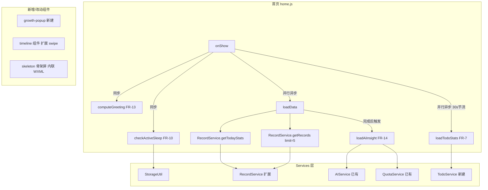

## 用户需求

根据 `specs/home-redesign/tasks.md` 实施首页改版，结合 `requirements.md`（FR-1~FR-15）和 `design.md`（v1.2）完成全部功能开发。

## 产品概述

将现有"静态展示型"首页升级为"智能感知型"首页，提升信息密度、操作效率和情感温度。改版涵盖宝宝卡片、今日概览、智能提醒、快捷操作、时间线、视觉体验共六个模块，合计采纳 15 条优化建议。

## 页面结构总览（自上而下）

```
┌─────────────────────────────┐
│  FR-13  顶部问候语 + 日期    │
├─────────────────────────────┤
│  FR-1   宝宝状态横幅         │  ← 含 FR-2 多宝切换
├─────────────────────────────┤
│  FR-7   今日待办（条件显示） │
├─────────────────────────────┤
│  FR-3/4/5/6  今日概览        │
├─────────────────────────────┤
│  FR-8/9/10   快捷记录        │
├─────────────────────────────┤
│  FR-14  宝宝洞察 AI 卡片     │
├─────────────────────────────┤
│  FR-11/12  今日记录时间线    │
└─────────────────────────────┘
```

## 核心功能

1. **宝宝状态横幅（FR-1）**：显示当前状态（睡眠中/上次喂养/上次记录），支持快速结束睡眠；状态使用对应主题色（睡眠-紫色#B8A8D4、喂养-绿色#A8D4A8）
2. **多宝快速切换（FR-2）**：首页直接切换宝宝，最多显示 3 个头像，超出显示"+N"
3. **统计数字跳转（FR-3）**：点击概览统计跳转记录页对应类型筛选（URL参数 `?type=feeding/sleep/diaper/temperature`）
4. **时间提示（FR-4）**：显示"上次 Xh Xm 前"等提示（22rpx小字），睡眠中显示"已睡 Xh Xm"
5. **睡眠统计增强（FR-5）**：主显时长、次显次数、达标绿勾；NSF 3档标准（0-3月≥14h、4-11月≥12h、12月+≥11h）
6. **体温统计增强（FR-6）**：主显最新值、状态色（<37.5绿/37.5-38.5橙/≥38.5红）、发烧警示横条
7. **今日待办卡片（FR-7）**：疫苗/里程碑待办横向滚动展示，逾期红色角标，7天内即将到期橙色标注
8. **喂养预测角标（FR-8）**：基于今昨两天最近3次喂养间隔预测，超时显示"该喂了⚡"橙色背景
9. **生长快捷入口（FR-9）**：快捷操作区改为5格横向scroll-view，新增生长按钮
10. **睡眠计时状态（FR-10）**：三态按钮（正常/计时中脉冲动画/异常>24h），Storage key: `active_sleep_{babyId}`
11. **时间线快速编辑（FR-11）**：左滑显示编辑/删除按钮，角度判断（<30°水平方向），滑动距离>30px触发
12. **时间线限 5 条（FR-12）**：limit改为5，底部"查看全部 X 条今日记录"按钮跳转记录页
13. **顶部问候语（FR-13）**：5档时段问候（5-12早安/12-14午安/14-18下午好/18-22晚上好/22-5夜深了），出生第N天
14. **AI 洞察卡片（FR-14）**：AI生成今日摘要（80字内），8s超时降级，缓存key: `ai_insight_{babyId}_{YYYY-MM-DD}`，折叠状态持久化
15. **骨架屏（FR-15）**：Shimmer扫光动画（1.5s周期），7个占位块，渐显过渡300ms

## 技术栈

- **框架**: 微信小程序原生（WXML + WXSS + JS）
- **云服务**: 微信云开发（wx.cloud）
- **数据库**: 微信云数据库（NoSQL）
- **基础库**: >= 2.20.0

## 实现方案

### 整体策略

采用 4 阶段渐进式开发，按依赖关系排序：

1. **M1 基础服务层**：扩展 RecordService、新建 TodoService、抽取 growth-popup、新增 formatDuration
2. **M2 首页核心模块**：骨架屏、问候语、状态横幅、多宝切换、今日概览
3. **M3 首页交互模块**：待办卡片、睡眠计时、喂养预测、生长入口、时间线编辑、AI 洞察
4. **M4 关联页改造**：记录页跳转参数、AI 助手预置消息、全局联调

### 关键技术决策

**1. RecordService.getTodayStats 扩展**：追加 `lastTimeTs`（最新喂养时间戳）、`lastEndTimeTs`（最新睡眠结束时间戳）、`latestValue`/`latestValueTs`（最新体温值及时间戳），在遍历记录时同步收集。

**2. RecordService.getRecords 扩展**：新增可选 `dateRange: { start, end }` 参数，支持跨今昨两天查询喂养记录用于 FR-8 预测。

**3. TodoService 设计**：从 discover.js 提取待办统计逻辑，实现 30s 内存缓存（`_cache = { babyId, ts, data }`），导出单例确保首页与发现页共享缓存。

**4. 睡眠计时方案**：不使用 setInterval，在 `onShow` 时一次性计算并展示静态字符串。`active_sleep_{babyId}` 存储于 StorageUtil，跨会话恢复。

**5. CSS 变量规范**：所有颜色使用 app.wxss 已定义的语义变量，home.wxss 顶部 `page {}` 扩展首页专属变量（如 `--status-sleeping-bg`、`--insight-bg`）。

**6. AI 洞察流程**：检查记录数 -> 检查缓存（`ai_insight_{babyId}_{YYYY-MM-DD}`）-> QuotaService 检查 -> AIService.generateText（8s 超时）-> 缓存 -> 降级兜底（本地规则摘要）。

## 实现注意事项

### 性能优化

- 骨架屏 shimmer 使用纯 CSS animation，不使用 JS 定时器
- 睡眠计时在 `onShow` 时一次性计算，避免 setInterval
- TodoService 30s 节流，与发现页共享缓存
- AI 洞察异步加载，不阻塞首页主体渲染

### 向后兼容

- RecordService 扩展为追加式，原有字段和调用方式保持不变
- discover.js 改为调用 TodoService，但保留原有菜单徽章更新逻辑

### 样式规范

- 禁止在 home.wxss / home.wxml 内联样式中使用硬编码十六进制颜色
- 优先使用 app.wxss 中已定义的语义变量
- 仅当语义变量不存在时，在 home.wxss 的 `page {}` 内扩展新变量

## 架构设计



## 目录结构

```
miniprogram/
├── pages/home/
│   ├── home.js           # [MODIFY] 新增 greeting/activeSleep/todoStats/aiInsight/familyBabies 等状态和处理逻辑
│   ├── home.wxml         # [MODIFY] 重构整体结构，增加骨架屏/问候语/状态横幅/待办/洞察等模块
│   ├── home.wxss         # [MODIFY] 新增 CSS 变量、skeleton/greeting/status-banner/insight 等样式
│   └── home.json         # [MODIFY] 引用 growth-popup 组件
├── pages/record/
│   └── record.js         # [MODIFY] onLoad 读取 ?type= 参数映射 currentFilter
├── pages/discover/
│   └── discover.js       # [MODIFY] loadTodoStats 改调 TodoService
├── pages/ai-assistant/
│   └── ai-assistant.js   # [MODIFY] onLoad 读取 ?presetMsg=true 参数生成预置消息
├── services/
│   ├── record.js         # [MODIFY] getTodayStats 扩展字段、getRecords 新增 dateRange 参数
│   └── todo.js           # [NEW] TodoService，从 discover.js 提取，30s 内存缓存
├── components/
│   ├── timeline/
│   │   ├── timeline.js   # [MODIFY] 新增 swipeEnabled prop 和 touch 手势处理
│   │   ├── timeline.wxml # [MODIFY] 增加滑动操作按钮 DOM 结构
│   │   └── timeline.wxss # [MODIFY] 增加 swipe-actions 样式
│   └── growth-popup/
│       ├── growth-popup.js   # [NEW] 从 growth 页提取的生长录入弹窗
│       ├── growth-popup.wxml # [NEW]
│       ├── growth-popup.wxss # [NEW]
│       └── growth-popup.json # [NEW]
└── utils/
    └── date.js           # [MODIFY] 新增 formatDuration(ms) 函数
```

## 关键代码结构

### home.js data 结构扩展

```javascript
data: {
  // 基础状态（已有）
  currentBaby: null,
  todayStats: { feeding: {}, sleep: {}, diaper: {}, temperature: {} },
  recentRecords: [],
  loading: true,
  
  // FR-2: 多宝切换
  familyBabies: [],
  switching: false,
  
  // FR-13: 问候语
  greeting: '',
  todayDateText: '',
  birthDayCount: 0,
  
  // FR-1/10: 状态横幅 + 睡眠计时
  activeSleep: null,
  activeStatus: { type: 'none', text: '', color: '' },
  activeSleepDisplay: '',
  sleepAbnormal: false,
  
  // FR-7: 今日待办
  todoStats: { total: 0, vaccine: 0, milestone: 0, overdue: 0 },
  
  // FR-3/4/5/6: 今日概览增强
  sleepDisplay: '',
  sleepGoalMet: false,
  tempStatus: '',
  tempStatusText: '',
  tempColor: '',
  showFeverAlert: false,
  feedingAgoText: '',
  sleepAgoText: '',
  totalTodayCount: 0,
  
  // FR-8: 喂养预测
  feedingPrediction: { show: false, text: '', urgent: false },
  
  // FR-14: AI 洞察
  aiInsight: { show: false, loading: false, text: '', fallback: false, collapsed: false },
  
  // FR-11: 时间线编辑
  openedSwipeId: '',
  editingRecord: null,
  
  // FR-9: 生长弹窗
  showGrowthPopup: false
}
```

### TodoService 接口

```javascript
class TodoService {
  constructor() {
    this._cache = null; // { babyId, ts, data }
  }
  
  async getTodoStats(baby) {
    // 30s 内存缓存
    const now = Date.now();
    if (this._cache && this._cache.babyId === baby._id && now - this._cache.ts < 30000) {
      return this._cache.data;
    }
    const data = await this._compute(baby);
    this._cache = { babyId: baby._id, ts: now, data };
    return data;
  }
  
  async _compute(baby) { /* 迁移自 discover.js loadTodoStats */ }
}
module.exports = new TodoService();
```

### formatDuration 函数

```javascript
function formatDuration(ms) {
  if (!ms || ms < 0) return '0m';
  const totalMinutes = Math.floor(ms / 60000);
  const hours = Math.floor(totalMinutes / 60);
  const minutes = totalMinutes % 60;
  if (hours > 0 && minutes > 0) return `${hours}h ${minutes}m`;
  if (hours > 0) return `${hours}h`;
  return `${minutes}m`;
}
```

## CSS 变量规范

### 现有可复用变量（来自 app.wxss）

| 用途 | CSS 变量 | 值 |
| --- | --- | --- |
| 睡眠状态色 | `var(--sleep-color)` | `#B8A8D4` |
| 喂养状态色 | `var(--feeding-color)` | `#A8D4A8` |
| 成功/正常色 | `var(--success-color)` | `#7BC950` |
| 警告/低烧色 | `var(--warning-color)` | `#D4883D` |
| 危险/发烧色 | `var(--danger-color)` | `#E85454` |
| 主色调 | `var(--primary-color)` | `#D4B896` |
| 浅主色 | `var(--primary-light)` | `#E8DCC8` |
| 主背景 | `var(--bg-primary)` | `#F5F1EB` |


### 新增变量（在 home.wxss page {} 中扩展）

```css
page {
  /* 状态横幅背景 */
  --status-sleeping-bg: rgba(184, 168, 212, 0.12);   /* sleep-color 透明版 */
  --status-feeding-bg:  rgba(168, 212, 168, 0.12);   /* feeding-color 透明版 */
  --status-default-bg:  rgba(212, 184, 150, 0.08);   /* primary-color 透明版 */

  /* AI 洞察卡片 */
  --insight-bg: linear-gradient(135deg, rgba(212, 184, 150, 0.06) 0%, rgba(248, 244, 238, 1) 100%);
  --insight-border: rgba(212, 184, 150, 0.2);

  /* 今日待办卡片 */
  --todo-vaccine-bg:    rgba(212, 136, 61, 0.1);
  --todo-milestone-bg:  rgba(123, 169, 201, 0.1);
  --todo-overdue-bg:    rgba(232, 84, 84, 0.1);

  /* 喂养预测角标 */
  --badge-prediction-bg:  rgba(168, 212, 168, 0.9);
  --badge-urgent-bg:      var(--warning-color);

  /* 体温警示横条 */
  --fever-alert-bg:     var(--danger-bg);
  --fever-alert-border: rgba(232, 84, 84, 0.3);
  --fever-alert-text:   var(--danger-color);
}
```

## 关键计算函数

### computeActiveStatus（FR-1 状态判断）

```javascript
// 优先级：睡眠中 > 上次喂养 > 上次记录 > 无记录
computeActiveStatus(todayStats, activeSleep, nowTs, latestRecordTs) {
  if (activeSleep) {
    const elapsed = nowTs - activeSleep.startTimeTs;
    return { type: 'sleeping', text: `正在睡觉 · 已 ${formatDuration(elapsed)}`, color: 'var(--sleep-color)' };
  }
  if (todayStats.feeding.lastTimeTs) {
    const ago = nowTs - todayStats.feeding.lastTimeTs;
    return { type: 'feeding_ago', text: `上次喂养 ${formatDuration(ago)} 前`, color: 'var(--feeding-color)' };
  }
  const latestTs = todayStats.sleep.lastEndTimeTs || latestRecordTs;
  if (latestTs) {
    const ago = nowTs - latestTs;
    return { type: 'record_ago', text: `上次记录 ${formatDuration(ago)} 前`, color: 'var(--primary-color)' };
  }
  return { type: 'none', text: '今天还没有记录，点击下方快速添加', color: 'var(--text-hint)' };
}
```

### computeTempStatus（FR-6 体温状态）

```javascript
computeTempStatus(value) {
  if (value === null) return { status: 'none', text: '--', color: 'var(--text-hint)' };
  if (value < 37.5)  return { status: 'normal',    text: '正常', color: 'var(--success-color)' };
  if (value < 38.5)  return { status: 'low_fever', text: '低烧', color: 'var(--warning-color)' };
  return               { status: 'fever',     text: '发烧', color: 'var(--danger-color)' };
}
```

### getSleepGoal（FR-5 睡眠达标）

```javascript
function getSleepGoal(ageMonths) {
  if (ageMonths <= 3)  return 14 * 3600; // 0-3个月: 14h（单位秒）
  if (ageMonths <= 11) return 12 * 3600; // 4-11个月: 12h
  return 11 * 3600;                      // 12月+: 11h
}
```

### computeFeedingPrediction（FR-8 喂养预测）

```javascript
async computeFeedingPrediction(babyId, nowTs) {
  const todayStart = new Date(); todayStart.setHours(0,0,0,0);
  const yesterdayStart = todayStart.getTime() - 86400000;
  
  const records = await RecordService.getRecords(babyId, {
    recordType: 'feeding',
    dateRange: { start: yesterdayStart, end: nowTs },
    limit: 3,
    orderBy: 'startTimeTs',
    order: 'desc'
  });
  
  if (records.length < 3) return { show: false };

  const intervals = [];
  for (let i = 0; i < records.length - 1; i++) {
    intervals.push(records[i].startTimeTs - records[i+1].startTimeTs);
  }
  const avgInterval = intervals.reduce((a, b) => a + b) / intervals.length;

  // 过滤异常值（> 6h 或 < 1h）
  if (avgInterval > 6 * 3600000 || avgInterval < 3600000) return { show: false };

  const lastFeedingTs = records[0].startTimeTs;
  const nextPredictTs = lastFeedingTs + avgInterval;
  const remaining = nextPredictTs - nowTs;

  if (remaining <= 0) return { show: true, text: '该喂了 ⚡', urgent: true };
  return { show: true, text: `约 ${formatDuration(remaining)} 后`, urgent: false };
}
```

## RecordService 扩展详情

### getTodayStats 新增字段

```javascript
// 在 case 'feeding': 中追加
if (!stats.feeding.lastTimeTs || record.startTimeTs > stats.feeding.lastTimeTs) {
  stats.feeding.lastTimeTs = record.startTimeTs;
}

// 在 case 'sleep': 中追加
if (record.endTimeTs && (!stats.sleep.lastEndTimeTs || record.endTimeTs > stats.sleep.lastEndTimeTs)) {
  stats.sleep.lastEndTimeTs = record.endTimeTs;
}

// 在 case 'temperature': 中追加
if (!stats.temperature.latestValueTs || record.startTimeTs > stats.temperature.latestValueTs) {
  stats.temperature.latestValue = record.data.temperature;
  stats.temperature.latestValueTs = record.startTimeTs;
}
```

### getRecords 新增 dateRange 参数

```javascript
// 当传入 dateRange: { start, end } 时，按 startTimeTs 范围筛选
// 用于 FR-8 喂养预测跨今昨两天查询
async getRecords(babyId, options = {}) {
  const { recordType, limit, dateRange } = options;
  let query = this.db.collection('records').where({ babyId });
  
  if (recordType) query = query.where({ recordType });
  
  if (dateRange) {
    query = query.where({
      startTimeTs: wx.cloud.database().command.gte(dateRange.start).and(
        wx.cloud.database().command.lte(dateRange.end)
      )
    });
  }
  
  // ... 其余逻辑保持不变
}
```

## 任务依赖关系

```
T-1.1 ─┐
T-1.2 ─┤
T-1.3 ─┼─→ T-2.3 → T-2.4
T-1.4  │         └→ T-2.5 → T-3.5
T-1.5 ─┤                 └→ T-3.6
T-1.6 ─┘                 └→ T-3.7 → T-4.2

T-2.1 → T-2.2 → T-2.3（均需要骨架屏先完成）

T-1.3 → T-3.1（TodoService 先建好）

T-3.1 ~ T-3.7 可并行执行（无内部依赖）

T-4.1 独立（可在 T-2.5 完成后任意时间执行）
```

## 风险说明

| 风险 | 可能性 | 影响 | 缓解措施 |
| --- | --- | --- | --- |
| growth-popup 提取破坏 growth 页 | 中 | 中 | T-1.5 完成后回归 growth 页全功能 |
| discover.js 迁移到 TodoService 后待办数据不同步 | 低 | 高 | T-1.4 必须验证发现页徽章与首页待办数一致 |
| RecordService.getTodayStats 扩展影响其他调用方 | 低 | 中 | 新字段追加式扩展，原有字段保持不变 |
| AI 洞察缓存 key 碰撞（多宝同日） | 极低 | 低 | key 含 babyId，天然隔离 |
| swipe 手势与页面滚动冲突 | 中 | 中 | 角度判断（< 30°）限制水平触发 |