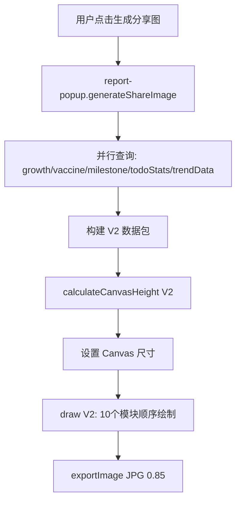

## 产品概述

将现有宝宝成长报告分享图从"体检报告式"纯数字堆砌，升级为「宝宝成绩单」风格。新分享图包含 10 个独立绘制模块，以可视化方式（状态标签、范围条、进度条、密度热力图等）展示宝宝的喂养/睡眠/排便/体温四维指标、生长发育、疫苗接种、里程碑达成等信息，让不懂育儿数据的家人也能一目了然。

## 核心功能

- 温情化标题区："{宝宝名}的一周/月度成绩单" + 出生第 N 天标记
- 综合评分可视化：5 级颜色的线性进度条 + 评分等级文字
- 四维指标卡：每卡含彩色状态标签、月龄参考范围条（三段式+定位点）、智能提示语、周环比箭头
- 每日记录密度条：7 个色块热力图，仅周报显示
- 生长发育模块：身高/体重 + WHO 百分位标签，超 30 天标注时效
- 疫苗接种进度：进度条 + 逾期/全部完成状态提示
- 里程碑达成：最近 3 个已达成 + 下一个待解锁
- 本周成就：最多 3 条成就亮点（含 emoji 前缀），无成就时显示鼓励语
- AI 建议精简：从原始评语中按优先级提取 1-2 句，不超过 60 字
- 动态高度布局：无数据模块自动跳过不留空白，最小高度 1200px

## 技术栈

- 绘制引擎：微信小程序 Canvas 2D API（延续 V1）
- 数据源：`TrendService`（静态方法）、`TodoService`（getTodoStats）、`who-standards.js`、云数据库
- 服务：`ShareCanvasService` 就地重构（V1 ~650 行 → V2 ~1200 行）
- DPR/导出：限制 2x，JPG quality 0.85（同 V1）

## 实现方案

### 策略

在现有 `share-canvas.js` 上就地重构，不新建 V2 文件。V1 和 V2 不需要共存。保持 `draw()` 和 `calculateCanvasHeight()` 作为主入口，内部改为调用 10 个独立模块方法，每个模块返回结束 Y 坐标实现自上而下累加式布局。

### 关键技术决策

1. **纵向堆叠指标卡**（非 2x2 网格）：每卡需容纳标题行+范围条行+提示行，纵向布局更适合阅读且高度计算更简单
2. **并行数据查询**：growth/vaccine/milestone/todoStats 使用 `Promise.all` 并行执行，每个附 `.catch()` 防单点失败
3. **模块动态跳过**：每个绘制方法在入口检查数据是否存在，无数据时直接返回 startY，后续模块自然上移
4. **成就依赖指标状态**：`_drawIndicatorCards` 将各维度 status 挂载到 data 对象上，`_calculateAchievements` 在其后读取

### 数据流



## 实现备忘

- **性能**：新增的 4 个数据库查询全部并行，不增加总耗时；`_calculateAchievements` 在 `calculateCanvasHeight` 和 `_drawAchievementSection` 中各调用一次，成就数组规模极小（<=3），无需缓存
- **兼容性**：`calculateCanvasHeight` 签名从 `(reportData, aiComment, ctx)` 变为 `(data, ctx)`，需同步更新 `generateShareImage()` 调用处
- **回归保护**：保持 `draw(ctx, data)` 签名不变（V1 已是此签名）；保持 Canvas 节点 ID `#shareCanvas` 和离屏方案不变；保持导出路径和分享流程不变
- **emoji 降级**：成就和提示语包含 emoji，部分 Android 设备可能渲染异常，当前先保留 emoji，后续可降级为纯文字符号
- **WHO 百分位**：月龄不连续（如缺 13/14 月），使用 `<=ageMonths` 的最大 key 匹配策略

## 架构设计

### V1 → V2 架构对比

```
V1 (~650行)                           V2 (~1200行)
├── _drawBackground()                 ├── _drawBackground()        (不变)
├── _drawHeader()                     ├── _drawTitleSection()       (重构)
│                                     ├── _drawBabyInfoCard()       (重构)
├── _drawStatCards() 2x2              ├── _drawIndicatorCards()     (重构)
│                                     │     └── _drawSingleIndicatorCard()
│                                     ├── _drawDensityBar()         (新增)
│                                     ├── _drawGrowthSection()      (新增)
│                                     ├── _drawVaccineProgress()    (新增)
│                                     ├── _drawMilestoneSection()   (新增)
│                                     ├── _drawAchievementSection() (新增)
├── _drawAIComment()                  ├── _drawAIAdvice()           (优化)
├── _drawFooter()                     ├── _drawFooter()             (微调)
└── 工具方法                           └── 工具方法 (复用+10个新增)
```

## 目录结构

```
miniprogram/
├── services/
│   └── share-canvas.js          # [MODIFY] V1→V2 重构。扩展 CANVAS_CONFIG（V2颜色/字体/布局），新增 10 个工具方法（_getScoreColor/Label、_getStatusColors、_getZoneDotColor、_getPercentileDisplay、_getDensityColor、_truncateAIAdvice、_calculateDailyCounts、_countRecordDays、_calculateAchievements），重写 _drawHeader 为 _drawTitleSection + _drawBabyInfoCard，重写 _drawStatCards 为 _drawIndicatorCards + _drawSingleIndicatorCard，新增 _drawDensityBar、_drawGrowthSection、_drawVaccineProgress、_drawMilestoneSection、_drawAchievementSection、_drawAIAdvice（替代 _drawAIComment），更新 _drawFooter 副标题，重构 calculateCanvasHeight 签名和 draw 主流程
├── components/
│   └── report-popup/
│       └── report-popup.js      # [MODIFY] 在 loadReport() 中新增并行数据查询（growth/vaccine/milestone/todoStats/trendData），新增 _calcPercentile(type, value, baby) 方法，处理 growthData/vaccineData/milestoneData/trendData 并通过 setData 存储，更新 generateShareImage() 构建 V2 数据包和调用 calculateCanvasHeight V2 签名
├── services/trendService.js     # [REUSE] 调用静态方法 getReferenceRange/calculateStatus/calculateRangeBarPosition/generateTip，不修改
├── services/todo.js             # [REUSE] 调用 getTodoStats()，不修改
├── config/who-standards.js      # [REUSE] 调用 WHO_WEIGHT/WHO_HEIGHT 百分位数据，不修改
└── utils/date.js                # [REUSE] 调用 calculateAgeMonths()，不修改
```

## Agent Extensions

### SubAgent

- **code-explorer**
- 目的：在实施每个任务前，搜索 share-canvas.js 和 report-popup.js 中的现有方法结构、依赖引用关系，确保重构时不遗漏调用链
- 预期结果：精确定位所有需要修改的方法签名和调用点，避免回归

### Skill

- **spec-workflow**
- 目的：遵循标准软件工程流程，确保需求-设计-实施的完整性和一致性
- 预期结果：实施计划与需求文档和设计文档完全对齐