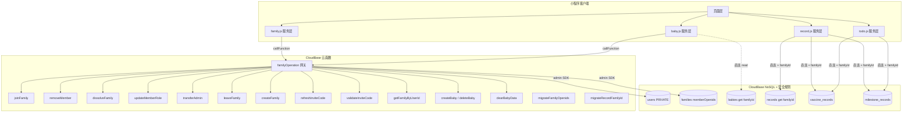

## 用户需求

根据已完成的 v4.2 Spec 三件套（requirements.md v1.2、design.md v1.1、tasks.md v1.0）创建可执行的开发计划。

## 产品概述

Baby Care Tracker 微信小程序需要将所有跨用户数据库写操作迁移到 CloudBase 云函数网关，并配置基于 familyId 的精确安全规则，实现家庭级数据隔离。

## 核心功能

- 创建 `familyOperation` 云函数网关，支持 13 个 action（createFamily/joinFamily/removeMember/dissolveFamily/updateMemberRole/transferAdmin/leaveFamily/refreshInviteCode/validateInviteCode/getFamilyByUserId/createBaby/deleteBaby/clearBabyData）
- 编写 2 个存量数据迁移云函数（migrateFamilyOpenids、migrateRecordFamilyId），为安全规则做数据准备
- 改造客户端 `family.js`（10 方法）、`baby.js`（2 方法）、`settings.js`（clearAllCloudData）为 callFunction 适配器模式
- 为 12 处 `where({ babyId })` 查询附加 familyId 条件
- 为 `record.js` 的 createRecord 新增 familyId 字段写入
- 配置 6 个集合的 CUSTOM 安全规则（users: PRIVATE，其余使用 get() 交叉校验 familyId + memberOpenids）
- 修复 `baby-list.js` 直接 doc().remove() 绕过 babyService 的问题
- 修复 `family.js` 页面层直接 db.collection('families').doc().update() 的 3 处操作

## 技术栈

- 运行环境：微信小程序 + CloudBase NoSQL
- 云函数：wx-server-sdk ~2.6.3，Node.js（CloudBase 默认运行时）
- 客户端：原生小程序 JS，wx.cloud.callFunction
- 安全规则：CloudBase CUSTOM 规则，使用 `get()` 内置函数做跨集合校验
- 数据库：CloudBase NoSQL（6 个集合：users/families/babies/records/vaccine_records/milestone_records）

## 实现方案

采用「云函数网关 + 适配器模式客户端改造」方案。所有跨用户写操作通过单一 `familyOperation` 云函数执行（admin SDK 绕过安全规则），客户端 service 层方法签名不变、内部实现替换为 callFunction，实现调用方零改动。安全规则通过 `families.memberOpenids` + `get()` 交叉校验实现家庭级数据隔离。

关键技术决策：

1. 身份识别使用 `cloud.getWXContext().OPENID`（不可伪造），不信任客户端传入的 userId
2. `families` 集合安全规则 `"update": false, "delete": false`，所有写操作必须走云函数
3. 记录类集合（records/vaccine_records/milestone_records）使用 `get('database.families.' + doc.familyId).memberOpenids` 做读权限校验
4. 存量数据必须先迁移（补充 familyId 和 memberOpenids），再配置安全规则，避免数据"消失"
5. 邀请码限流：60s 内最多 5 次（内存 Map，实例级别）

## 实现注意事项

- **阻塞点**：Phase 2 数据迁移必须全量完成并验证后才能进入 Phase 3 配置安全规则
- **执行顺序约束**：T-3.8（安全规则配置）必须在所有客户端改造（T-3.1~T-3.7）完成后才能执行
- **适配器模式**：`family.js` 改造时保持方法签名和返回值不变，错误码映射到现有的 `throw new Error()` 行为
- **离线队列兼容**：`record.js createRecord()` 在组装离线记录数据时写入 familyId，`sync.js` 本身无需修改
- **安全规则缓存**：配置后等待 2-5 分钟缓存生效再测试
- **CloudBase get() 限制**：每条规则表达式最多 3 个 get()，当前方案仅用 1 个，在限制范围内

## 架构设计



## 目录结构

```
cloudfunctions/
  familyOperation/
    index.js        # [NEW] 云函数网关入口，13 个 action + 工具函数（getFamily/isAdmin/clearUserFamily/familyNotFound/permissionDenied/generateInviteCode/getAllDocs），完整实现见 design.md 3.1-3.11
    package.json    # [NEW] wx-server-sdk ~2.6.3
    config.json     # [NEW] timeout: 20
  migrateFamilyOpenids/
    index.js        # [NEW] 存量迁移：families 补充 memberOpenids，实现见 design.md 3.20
    package.json    # [NEW] wx-server-sdk ~2.6.3
    config.json     # [NEW] timeout: 60
  migrateRecordFamilyId/
    index.js        # [NEW] 存量迁移：records 补充 familyId，实现见 design.md 3.19
    package.json    # [NEW] wx-server-sdk ~2.6.3
    config.json     # [NEW] timeout: 60
miniprogram/
  services/
    family.js       # [MODIFY] 10 个方法内部替换为 callFunction 适配器，保留 getFamilyDetail/getFamilyMembers/checkMembership 直连
    baby.js         # [MODIFY] createBaby/deleteBaby 改为 callFunction，保留 getBabiesByFamilyId/getBabyById/updateBaby/uploadAvatar 直连
    record.js       # [MODIFY] createRecord 新增 familyId 字段写入（在线+离线路径），getRecords where 附加 familyId
    todo.js         # [MODIFY] 2 处 where 附加 familyId（_computeVaccineStats L140, _computeMilestoneStats L200）
  pages/
    record/record.js       # [MODIFY] calculateFilterCounts where 附加 familyId
    baby-list/baby-list.js # [MODIFY] deleteBaby 改为 babyService.deleteBaby(id, familyInfo._id)
  packageGrowth/pages/
    growth/growth.js       # [MODIFY] loadGrowthRecords where 附加 familyId
    vaccine/vaccine.js     # [MODIFY] loadVaccineList where 附加 familyId
    milestone/milestone.js # [MODIFY] loadMilestones where 附加 familyId
  packageSocial/pages/
    family/family.js       # [MODIFY] 第 136-157/249-296 行改为 familyService.refreshInviteCode()，删除 generateInviteCode()
    settings/settings.js   # [MODIFY] clearAllCloudData 改为 callFunction + 3 处 where 附加 familyId
    export/export.js       # [MODIFY] 2 处 where 附加 familyId
  components/
    report-popup/report-popup.js # [MODIFY] 3 处 where 附加 familyId
```

## 扩展使用

### SubAgent

- **code-explorer**
- 用途：Phase 1 开发前探索现有 `family.js` 服务层完整代码，精确定位所有需要平移到云函数的业务逻辑行号和完整实现；Phase 3 开发前定位所有 12 处 where 查询的精确位置和上下文
- 预期结果：获取精确的代码行号、方法签名、调用链，确保云函数实现与客户端逻辑 1:1 一致

### MCP

- **cloudbase > manageFunctions**
- 用途：Phase 2 中部署 migrateFamilyOpenids 和 migrateRecordFamilyId 云函数到 CloudBase 环境
- 预期结果：云函数成功部署到 neo3-7gtg0bdtc9fcc672 环境

- **cloudbase > readNoSqlDatabaseContent**
- 用途：Phase 2 迁移完成后验证 families 文档均有 memberOpenids 字段、records 文档均有 familyId 字段
- 预期结果：确认存量数据迁移全量覆盖，满足安全规则配置前置条件

- **cloudbase > managePermissions**
- 用途：T-3.8 配置 6 个集合的安全规则（PRIVATE/CUSTOM）
- 预期结果：6 个集合安全规则配置生效，家庭成员可读、非成员被拒绝

### Skill

- **cloud-functions**
- 用途：Phase 1 云函数开发遵循 CloudBase 云函数最佳实践（运行时选择、部署、超时配置、日志）
- 预期结果：云函数代码符合 CloudBase 规范，正确使用 admin SDK

- **cloudbase-document-database-in-wechat-miniprogram**
- 用途：Phase 3 客户端改造时确保 where 查询语法、安全规则条件子集匹配等符合小程序 SDK 规范
- 预期结果：所有 12 处查询改造后能通过安全规则校验