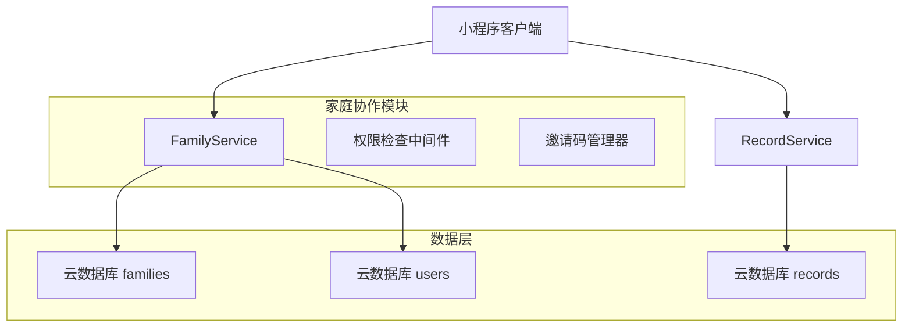
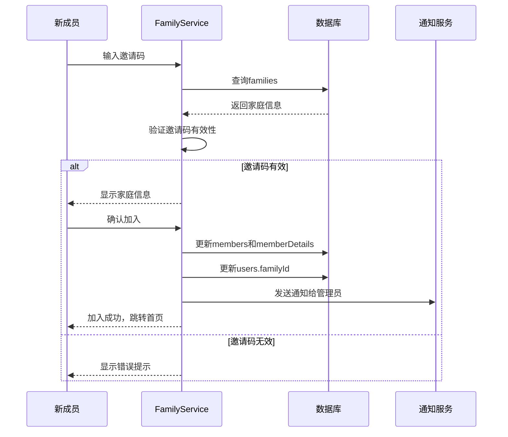
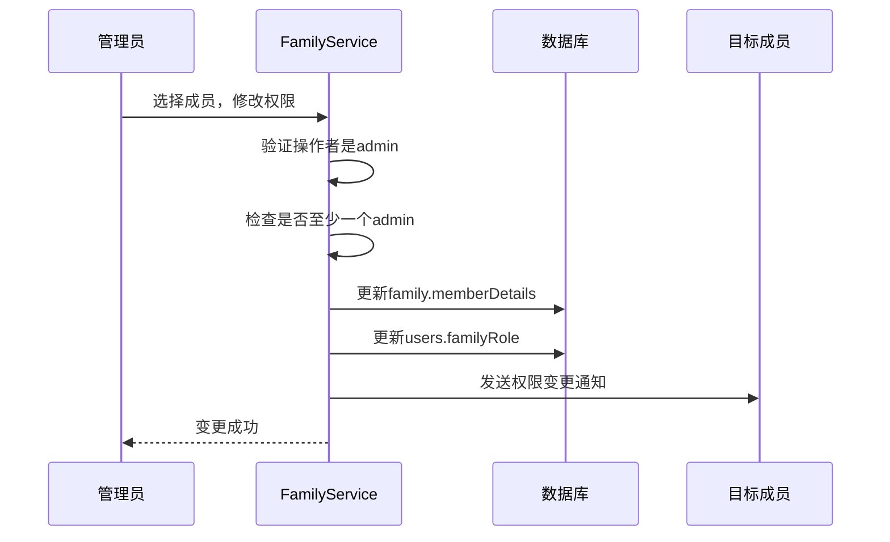
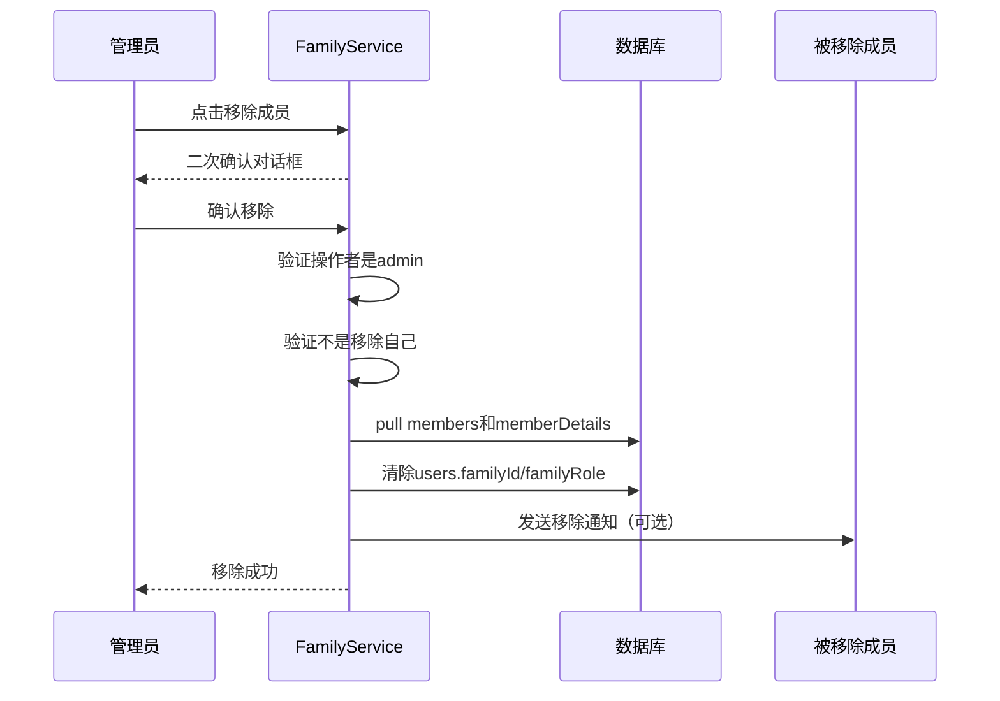

# 设计文档 - 家庭协作功能增强

## 概述

本设计文档基于需求文档，为家庭协作功能的5个核心场景提供详细的技术实现方案。设计遵循最小改动原则，充分利用现有代码架构进行增强。

---

## 架构设计

### 系统架构图



### 技术栈

| 层级 | 技术 | 说明 |
|------|------|------|
| 前端 | 微信小程序原生 | 保持现有技术栈 |
| 云服务 | 微信云开发 | CloudBase 数据库 + 云函数 |
| 数据存储 | CloudBase NoSQL | families, users, records 集合 |
| 本地缓存 | wx.storage | 用户/家庭/宝宝信息缓存 |

---

## 详细设计

### 1. 数据模型设计

#### 1.1 Family 集合增强

```javascript
// 现有结构基础上增强
{
  _id: string,
  name: string,
  creatorId: string,
  creatorName: string,
  members: [userId],           // 保持兼容
  memberDetails: [{
    userId: string,
    name: string,
    relation: string,
    // 角色扩展：admin | editor | viewer
    role: 'admin' | 'editor' | 'viewer',
    joinedAt: string,
    // 新增：最后活跃时间（可选）
    lastActiveAt?: string
  }],
  inviteCode: string,
  inviteCodeExpiry: string,
  createdAt: string,
  updatedAt: string,
  // 新增：操作日志（可选，V2）
  operationLogs?: [{
    operatorId: string,
    action: string,
    targetId?: string,
    timestamp: string
  }]
}
```

#### 1.2 Record 集合增强

```javascript
// 在现有记录基础上添加创建者信息
{
  _id: string,
  babyId: string,
  recordType: string,
  startTime: Date,
  endTime?: Date,
  data: object,
  note?: string,
  // 新增：创建者信息（冗余存储，便于查询）
  createdBy: {
    userId: string,
    nickName: string,
    avatar?: string
  },
  // 新增：最后修改者
  updatedBy?: {
    userId: string,
    nickName: string
  },
  createdAt: Date,
  updatedAt: Date
}
```

#### 1.3 User 集合增强

```javascript
// 现有结构已支持，补充字段说明
{
  _id: string,
  _openid: string,
  nickname: string,
  avatar: string,
  role: 'parent' | 'family_member',
  relation: string,
  relationText: string,
  familyId?: string,
  // 角色与 family.memberDetails.role 保持一致
  familyRole?: 'admin' | 'editor' | 'viewer',
  createdAt: Date,
  updatedAt: Date
}
```

---

### 2. 权限系统设计

#### 2.1 权限矩阵

| 操作 | Admin | Editor | Viewer |
|------|-------|--------|--------|
| 查看记录 | ✅ | ✅ | ✅ |
| 添加记录 | ✅ | ✅ | ❌ |
| 编辑自己的记录 | ✅ | ✅ | ❌ |
| 编辑他人记录 | ✅ | ✅ | ❌ |
| 删除自己的记录 | ✅ | ✅ | ❌ |
| 删除他人记录 | ✅ | ❌ | ❌ |
| 生成邀请码 | ✅ | ❌ | ❌ |
| 修改成员权限 | ✅ | ❌ | ❌ |
| 移除成员 | ✅ | ❌ | ❌ |
| 解散家庭 | ✅ | ❌ | ❌ |

#### 2.2 权限检查工具类

```javascript
// utils/permission.js
class PermissionUtil {
  /**
   * 检查用户是否有指定权限
   * @param {string} userId 当前用户ID
   * @param {Object} family 家庭信息
   * @param {string} permission 权限类型
   */
  static checkPermission(userId, family, permission) {
    const member = family.memberDetails?.find(m => m.userId === userId);
    if (!member) return false;
    
    const role = member.role || 'editor';
    
    const permissionMap = {
      'record.view': ['admin', 'editor', 'viewer'],
      'record.create': ['admin', 'editor'],
      'record.edit': ['admin', 'editor'],
      'record.delete.own': ['admin', 'editor'],
      'record.delete.other': ['admin'],
      'member.invite': ['admin'],
      'member.manage': ['admin'],
      'family.dissolve': ['admin']
    };
    
    return permissionMap[permission]?.includes(role) || false;
  }
  
  /**
   * 获取用户角色
   */
  static getUserRole(userId, family) {
    const member = family.memberDetails?.find(m => m.userId === userId);
    return member?.role || 'editor';
  }
  
  /**
   * 是否是管理员
   */
  static isAdmin(userId, family) {
    return this.getUserRole(userId, family) === 'admin';
  }
}
```

---

### 3. API 设计

#### 3.1 FamilyService 增强

```javascript
class FamilyService {
  // 现有方法保持不变...
  
  /**
   * 更新成员角色
   * @param {string} familyId 家庭ID
   * @param {string} operatorId 操作者ID（必须是admin）
   * @param {string} targetUserId 目标用户ID
   * @param {string} newRole 新角色：admin/editor/viewer
   */
  async updateMemberRole(familyId, operatorId, targetUserId, newRole) {
    // 1. 验证操作者是admin
    // 2. 验证目标成员存在
    // 3. 检查是否至少保留一个admin
    // 4. 更新memberDetails中的role
    // 5. 同步更新users集合中的familyRole
  }
  
  /**
   * 移除家庭成员
   * @param {string} familyId 家庭ID
   * @param {string} operatorId 操作者ID（必须是admin）
   * @param {string} targetUserId 要移除的用户ID
   * @param {boolean} isAdminRemove 是否是管理员主动移除
   */
  async removeMember(familyId, operatorId, targetUserId, isAdminRemove = false) {
    // 1. 验证操作者是admin
    // 2. 不能移除自己（通过leaveFamily处理）
    // 3. 使用db.command.pull移除memberDetails和members
    // 4. 更新被移除用户的users记录（清除familyId和familyRole）
    // 5. 保留其创建的记录（createdBy信息保留）
  }
  
  /**
   * 验证邀请码有效性
   * @param {string} inviteCode 邀请码
   * @returns {Promise<Object>} 验证结果
   */
  async validateInviteCode(inviteCode) {
    // 1. 查询families集合
    // 2. 检查inviteCode是否匹配
    // 3. 检查inviteCodeExpiry是否过期
    // 4. 返回家庭基本信息（名称、成员数）
  }
  
  /**
   * 转让管理员权限
   * @param {string} familyId 家庭ID
   * @param {string} currentAdminId 当前管理员ID
   * @param {string} newAdminId 新管理员ID
   */
  async transferAdmin(familyId, currentAdminId, newAdminId) {
    // 1. 验证currentAdminId是admin
    // 2. 验证newAdminId是家庭成员
    // 3. 更新memberDetails中两人的role
    // 4. 更新creatorId为newAdminId
    // 5. 同步users集合
  }
}
```

#### 3.2 RecordService 增强

```javascript
class RecordService {
  // 现有方法保持不变...
  
  /**
   * 创建记录（带创建者信息）
   * @param {Object} recordData 记录数据
   * @param {Object} creator 创建者信息
   */
  async createRecord(recordData, creator) {
    // 1. 构建记录对象
    const record = {
      ...recordData,
      createdBy: {
        userId: creator._id,
        nickName: creator.nickname,
        avatar: creator.avatar
      },
      createdAt: new Date(),
      updatedAt: new Date()
    };
    // 2. 插入数据库
    // 3. 返回结果
  }
  
  /**
   * 获取记录列表（带权限过滤）
   * @param {string} babyId 宝宝ID
   * @param {Object} user 当前用户
   * @param {Object} options 查询选项
   */
  async getRecordsWithPermission(babyId, user, options = {}) {
    // 1. 检查用户是否有查看权限
    // 2. 执行查询
    // 3. 返回记录列表（包含createdBy信息）
  }
  
  /**
   * 删除记录（带权限检查）
   * @param {string} recordId 记录ID
   * @param {Object} user 当前用户
   * @param {Object} family 家庭信息
   */
  async deleteRecordWithPermission(recordId, user, family) {
    // 1. 查询记录获取createdBy.userId
    // 2. 检查权限：
    //    - Admin可以删除任何记录
    //    - Editor只能删除自己创建的记录
    //    - Viewer不能删除
    // 3. 执行删除或抛出权限错误
  }
}
```

---

### 4. 页面设计

#### 4.1 家庭管理页（pages/family/family）增强

```
┌─────────────────────────────┐
│ ← 家庭管理                   │
├─────────────────────────────┤
│ ┌─────────────────────────┐ │
│ │ 👨‍👩‍👧 我的家庭              │ │
│ │ 3位成员                  │ │
│ └─────────────────────────┘ │
├─────────────────────────────┤
│ 家庭成员                    │
│ ┌─────────────────────────┐ │
│ │ 👤 妈妈        管理员  我│ │ ← 高亮显示自己
│ │ 2024-01-15加入           │ │
│ └─────────────────────────┘ │
│ ┌─────────────────────────┐ │
│ │ 👤 爸爸        成员      │ │ ← 左滑显示操作
│ │ 2024-01-20加入     [修改│ │    [修改权限] [移除]
│ └─────────────────────────┘ │
│ ┌─────────────────────────┐ │
│ │ 👤 奶奶        仅查看   │ │
│ │ 2024-02-01加入          │ │
│ └─────────────────────────┘ │
├─────────────────────────────┤
│ 邀请家人                    │
│ ┌─────────────────────────┐ │
│ │ 邀请码: ABC123          │ │
│ │ 有效期至: 2024-02-15    │ │
│ │ [复制] [分享] [重新生成]│ │
│ └─────────────────────────┘ │
├─────────────────────────────┤
│ [退出家庭]                  │
└─────────────────────────────┘
```

#### 4.2 成员权限编辑弹窗

```
┌─────────────────────────────┐
│ 修改成员权限          [X]   │
├─────────────────────────────┤
│                             │
│  爸爸                       │
│  当前权限: 成员             │
│                             │
│  选择新权限:                │
│  ○ 管理员 - 可管理成员和设置│
│  ● 成员   - 可添加编辑记录  │
│  ○ 仅查看 - 只能查看记录    │
│                             │
│  [取消]    [确认修改]       │
│                             │
└─────────────────────────────┘
```

#### 4.3 记录列表创建者标识

```
┌─────────────────────────────┐
│ 记录列表                     │
├─────────────────────────────┤
│ ┌─────────────────────────┐ │
│ │ 🍼 母乳喂养  120ml      │ │
│ │ 09:30                   │ │
│ │ 👤 妈妈（我）  ✅       │ │ ← 创建者标识
│ └─────────────────────────┘ │
│ ┌─────────────────────────┐ │
│ │ 😴 睡眠      2小时      │ │
│ │ 08:00 - 10:00           │ │
│ │ 👤 爸爸               │ │
│ └─────────────────────────┘ │
│ ┌─────────────────────────┐ │
│ │ 💩 排便      正常        │ │
│ │ 07:30                   │ │
│ │ 👤 已退出成员          │ │ ← 灰色显示
│ └─────────────────────────┘ │
└─────────────────────────────┘
```

---

### 5. 关键流程设计

#### 5.1 成员加入流程



#### 5.2 权限变更流程



#### 5.3 成员移除流程



---

### 6. 安全设计

#### 6.1 邀请码安全

```javascript
// 邀请码生成算法（增强版）
function generateInviteCode() {
  const chars = 'ABCDEFGHJKLMNPQRSTUVWXYZ23456789'; // 去除易混淆字符
  let code = '';
  for (let i = 0; i < 6; i++) {
    code += chars.charAt(Math.floor(Math.random() * chars.length));
  }
  return code;
}

// 邀请码验证限流
const inviteCodeAttempts = new Map(); // 实际应使用Redis或数据库存储

function checkInviteCodeLimit(inviteCode) {
  const key = `${inviteCode}_${getClientIP()}`;
  const attempts = inviteCodeAttempts.get(key) || 0;
  
  if (attempts >= 5) {
    throw new Error('验证次数过多，请1小时后再试');
  }
  
  inviteCodeAttempts.set(key, attempts + 1);
  setTimeout(() => inviteCodeAttempts.delete(key), 3600000); // 1小时后重置
}
```

#### 6.2 权限检查安全

```javascript
// 关键操作必须在服务端验证权限
// 客户端仅用于UI展示控制

// 服务端安全规则（CloudBase）
{
  "read": "auth != null && resource.data.members.includes(auth.uid)",
  "write": "auth != null && (
    (resource.data.creatorId == auth.uid) ||
    (getRole(auth.uid) == 'admin')
  )"
}
```

---

### 7. 数据迁移方案

#### 7.1 现有数据兼容性处理

```javascript
// 数据迁移脚本
async function migrateFamilyData() {
  const families = await db.collection('families').get();
  
  for (const family of families.data) {
    // 1. 确保memberDetails存在
    if (!family.memberDetails) {
      family.memberDetails = family.members.map(userId => ({
        userId,
        name: '',
        role: userId === family.creatorId ? 'admin' : 'editor',
        joinedAt: family.createdAt
      }));
    }
    
    // 2. 确保所有成员有role字段
    family.memberDetails.forEach(member => {
      if (!member.role) {
        member.role = member.userId === family.creatorId ? 'admin' : 'editor';
      }
    });
    
    // 3. 添加邀请码使用次数字段
    if (!family.inviteCodeMaxUses) {
      family.inviteCodeMaxUses = 1;
      family.inviteCodeUsedCount = family.members.length - 1;
    }
    
    // 4. 更新文档
    await db.collection('families').doc(family._id).update({
      data: {
        memberDetails: family.memberDetails,
        inviteCodeMaxUses: family.inviteCodeMaxUses,
        inviteCodeUsedCount: family.inviteCodeUsedCount
      }
    });
  }
}
```

#### 7.2 Record数据迁移

```javascript
// 为现有记录添加createdBy字段
async function migrateRecordData() {
  const records = await db.collection('records').get();
  
  for (const record of records.data) {
    if (!record.createdBy) {
      // 尝试从家庭信息推断创建者
      const family = await db.collection('families').doc(record.familyId).get();
      const creator = family.data?.memberDetails?.[0]; // 默认为创建者
      
      if (creator) {
        await db.collection('records').doc(record._id).update({
          data: {
            createdBy: {
              userId: creator.userId,
              nickName: creator.name || '家庭成员'
            }
          }
        });
      }
    }
  }
}
```

---

### 8. 测试策略

#### 8.1 单元测试要点

```javascript
// PermissionUtil 测试
describe('PermissionUtil', () => {
  test('admin should have all permissions', () => {
    const family = createMockFamily('admin');
    expect(PermissionUtil.isAdmin('user1', family)).toBe(true);
    expect(PermissionUtil.checkPermission('user1', family, 'member.manage')).toBe(true);
  });
  
  test('viewer should only have view permission', () => {
    const family = createMockFamily('viewer');
    expect(PermissionUtil.checkPermission('user1', family, 'record.view')).toBe(true);
    expect(PermissionUtil.checkPermission('user1', family, 'record.create')).toBe(false);
  });
});
```

#### 8.2 集成测试场景

1. **邀请码生命周期测试**
   - 生成 → 分享 → 使用 → 过期

2. **权限变更测试**
   - Editor → Admin → 验证权限变化
   - 唯一Admin尝试降级 → 应被拒绝

3. **成员移除测试**
   - 移除后验证数据访问权限
   - 验证记录保留但显示为"已退出"

---

## 附录

### A. 错误码定义

| 错误码 | 描述 | 处理建议 |
|--------|------|---------|
| FAMILY_001 | 邀请码无效 | 检查输入或联系管理员重新生成 |
| FAMILY_002 | 邀请码已过期 | 联系管理员重新生成 |
| FAMILY_003 | 已是家庭成员 | 无需重复加入 |
| FAMILY_004 | 权限不足 | 联系管理员获取权限 |
| FAMILY_005 | 不能移除自己 | 使用"退出家庭"功能 |
| FAMILY_006 | 至少需要一位管理员 | 先指定新管理员再操作 |

### B. 接口变更清单

| 文件 | 变更类型 | 说明 |
|------|---------|------|
| services/family.js | 增强 | 添加updateMemberRole, removeMember, transferAdmin |
| services/record.js | 增强 | 添加createdBy字段处理 |
| utils/permission.js | 新增 | 权限检查工具类 |
| pages/family/family.js | 增强 | 添加权限编辑和成员移除功能 |
| pages/family/family.wxml | 增强 | 添加创建者标识和操作按钮 |
| pages/record/record.js | 增强 | 添加权限检查 |
| pages/home/home.js | 增强 | 显示创建者信息，角色权限控制 |
