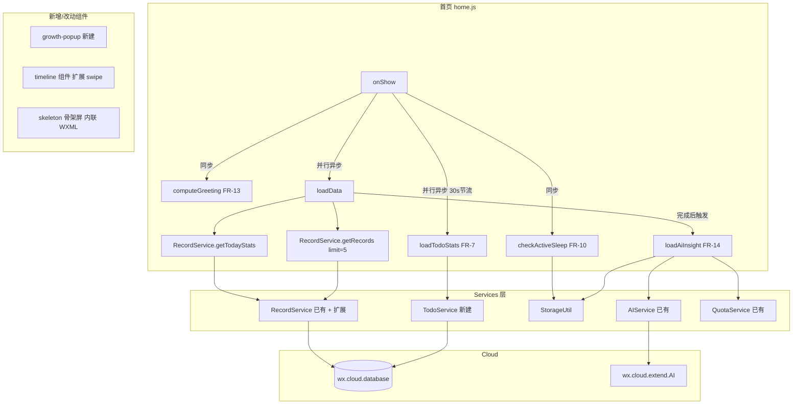

# 设计文档 - 主页改版（Home Redesign）

> 版本：v1.2 | 日期：2026-04-01 | 状态：待确认

---

## 一、架构概览

### 1.1 整体架构图



### 1.2 技术栈

| 层 | 技术 | 备注 |
|---|---|---|
| 页面框架 | 微信小程序原生 WXML/WXSS/JS | 基础库 ≥ 2.20.0 |
| 状态管理 | 页面 data + StorageUtil | 无 Redux，本地缓存优先 |
| 网络层 | wx.cloud.database + RecordService | 云端优先 + 离线降级 |
| AI | wx.cloud.extend.AI / hunyuan-2.0-instruct-20251111 | 已有 AIService |
| 样式 | WXSS + CSS Variables（美拉德色系） | 已有完整设计系统 |

---

## 二、数据流设计

### 2.1 首页数据加载流程

```
onShow()
  │
  ├─① [同步] 读 StorageUtil.getCurrentBaby() → 渲染问候语（FR-13）
  │
  ├─② [同步] 读 StorageUtil.get('active_sleep_{babyId}') → 设置睡眠计时初态（FR-10）
  │
  ├─③ [并行异步] loadData()
  │     ├─ RecordService.getTodayStats(babyId)   → todayStats
  │     └─ RecordService.getRecords(babyId, { limit: 5 }) → recentRecords
  │
  ├─④ [并行异步] loadTodoStats()（30s 节流）
  │     └─ TodoService.getTodoStats(babyId)       → todoStats
  │
  └─⑤ [异步，loadData 完成后触发] loadAiInsight()
        ├─ 检查 StorageUtil 缓存 ai_insight_{babyId}_{date}
        ├─ 命中缓存 → 直接渲染
        └─ 未命中 → QuotaService 检查 → AIService.generateText() → 缓存并渲染
```

### 2.2 页面 data 结构设计

```javascript
// home.js 完整 data 结构（新版）
data: {
  // ── 基础状态 ──
  currentBaby: null,          // 当前宝宝
  familyBabies: [],           // 家庭所有宝宝列表（FR-2 多宝切换）
  switching: false,           // 宝宝切换中（FR-2 局部 loading）
  loading: true,              // 主数据加载中（控制骨架屏 FR-15）
  error: false,
  errorMsg: '',

  // ── FR-13：问候语 ──
  greeting: '',               // "早安 ☀️"
  todayDateText: '',          // "4月1日 周三"
  birthDayCount: 0,           // 出生第 N 天

  // ── FR-1：宝宝状态横幅 ──
  activeStatus: {
    type: 'none',             // 'sleeping' | 'feeding_ago' | 'record_ago' | 'none'
    text: '',                 // 显示文案
    color: '',                // 状态色（CSS 变量字符串）
    durationMs: 0             // 已持续/距上次 毫秒数
  },

  // ── FR-10：睡眠计时 ──
  activeSleep: null,          // { _id, startTimeTs } | null（来自 Storage）
  activeSleepDisplay: '',     // "1h 20m"（格式化字符串，onShow 时计算）
  sleepAbnormal: false,       // 睡眠超 24h 异常标记

  // ── FR-7：今日待办 ──
  todoStats: {
    total: 0,
    vaccine: 0,
    milestone: 0,
    overdue: 0
  },

  // ── FR-3/4/5/6：今日概览 ──
  todayStats: {
    feeding:     { count: 0, totalAmount: 0, lastTimeTs: 0 },
    sleep:       { count: 0, totalDuration: 0, lastEndTimeTs: 0 },
    diaper:      { count: 0, wet: 0, dirty: 0 },
    temperature: { count: 0, latestValue: null }
  },
  // 格式化展示字段（loadData 后由 computeDisplayFields() 统一计算）
  sleepDisplay: '',           // "8h 30m"（FR-5）
  sleepGoalMet: false,        // 是否达标（FR-5）
  tempStatus: '',             // 'normal' | 'low_fever' | 'fever'（FR-6）
  tempStatusText: '',         // "正常" | "低烧" | "发烧"（FR-6）
  tempColor: '',              // 体温数值颜色（FR-6）
  showFeverAlert: false,      // 高烧警示条（FR-6 ≥38.5°C）
  totalTodayCount: 0,         // 今日记录总条数，= feeding+sleep+diaper+temperature count 之和（FR-12）

  // ── FR-4：时间提示 ──
  feedingAgoText: '',         // "上次 2h 前"
  sleepAgoText: '',           // "已睡 1h 20m" / "上次醒来 3h 前"

  // ── FR-8：喂养预测 ──
  feedingPrediction: {
    show: false,
    text: '',                 // "约 2h 后" | "该喂了 ⚡"
    urgent: false
  },

  // ── FR-11/12：时间线 ──
  recentRecords: [],
  openedSwipeId: '',          // 当前展开滑动操作的记录 ID（互斥控制）

  // ── FR-14：AI 洞察 ──
  aiInsight: {
    show: false,
    loading: false,
    text: '',
    fallback: false,          // true = 降级模式（显示"快速模式"标注）
    collapsed: false          // 折叠状态（持久化到 StorageUtil）
  },

  // ── 弹窗控制 ──
  showFeedingPopup: false,
  showSleepPopup: false,
  showDiaperPopup: false,
  showTemperaturePopup: false,
  showGrowthPopup: false,     // FR-9 新增
  editingRecord: null         // FR-11 编辑时传入的记录数据（null = 新建模式）
}
```

### 2.3 关键计算函数组织

所有 `data` 中的格式化展示字段通过统一的 `computeDisplayFields(nowTs)` 在 `loadData()` 完成后调用，避免逻辑分散：

```javascript
// home.js
computeDisplayFields(nowTs) {
  const { todayStats, activeSleep, currentBaby, recentRecords } = this.data;
  // FR-1/10: 状态横幅（latestRecordTs 取 recentRecords[0]?.startTimeTs）
  const latestRecordTs = recentRecords[0]?.startTimeTs || 0;
  const activeStatus = this.computeActiveStatus(todayStats, activeSleep, nowTs, latestRecordTs);
  const activeSleepDisplay = activeSleep ? formatDuration(nowTs - activeSleep.startTimeTs) : '';
  const sleepAbnormal = activeSleep && (nowTs - activeSleep.startTimeTs) > 86400000;
  // FR-4: 时间提示
  const feedingAgoText = todayStats.feeding.lastTimeTs
    ? `上次 ${formatDuration(nowTs - todayStats.feeding.lastTimeTs)} 前` : '';
  const sleepAgoText = activeSleep
    ? `已睡 ${formatDuration(nowTs - activeSleep.startTimeTs)}`
    : todayStats.sleep.lastEndTimeTs
      ? `上次醒来 ${formatDuration(nowTs - todayStats.sleep.lastEndTimeTs)} 前` : '';
  // FR-5: 睡眠时长
  const sleepDisplay = formatDuration(todayStats.sleep.totalDuration * 1000);
  const ageMonths = calcAgeMonths(currentBaby?.birthDate);
  const sleepGoalMet = todayStats.sleep.totalDuration >= getSleepGoal(ageMonths);
  // FR-6: 体温状态
  const { status: tempStatus, text: tempStatusText, color: tempColor } =
    this.computeTempStatus(todayStats.temperature.latestValue);
  const showFeverAlert = tempStatus === 'fever';
  // FR-12: 总记录数
  const { feeding, sleep, diaper, temperature } = todayStats;
  const totalTodayCount = feeding.count + sleep.count + diaper.count + temperature.count;

  this.setData({
    activeStatus, activeSleepDisplay, sleepAbnormal,
    feedingAgoText, sleepAgoText,
    sleepDisplay, sleepGoalMet,
    tempStatus, tempStatusText, tempColor, showFeverAlert,
    totalTodayCount
  });
}
```

---

## 三、各模块详细设计

### 3.1 FR-13 问候语模块

**实现方式：纯本地计算，无网络请求**

```javascript
// home.js - 计算问候语（在 onShow 同步执行）
computeGreeting(baby) {
  const now = new Date();
  const hour = now.getHours();
  const greetings = [
    [5,  12, '早安 ☀️'],
    [12, 14, '午安'],
    [14, 18, '下午好'],
    [18, 22, '晚上好 🌙'],
    [22, 24, '夜深了，注意休息'],
    [0,   5, '夜深了，注意休息']
  ];
  const greeting = greetings.find(([s, e]) => hour >= s && hour < e)?.[2] || '你好';

  const weekDays = ['日','一','二','三','四','五','六'];
  const todayDateText = `${now.getMonth()+1}月${now.getDate()}日 周${weekDays[now.getDay()]}`;

  let birthDayCount = 0;
  if (baby?.birthDate) {
    const birth = new Date(baby.birthDate);
    birth.setHours(0,0,0,0);
    const today = new Date(); today.setHours(0,0,0,0);
    birthDayCount = Math.floor((today - birth) / 86400000) + 1;
  }

  this.setData({ greeting, todayDateText, birthDayCount });
}
```

**WXML 结构：**
```xml
<view class="greeting-bar">
  <view class="greeting-row">
    <text class="greeting-text">{{greeting}}</text>
    <text class="greeting-date">{{todayDateText}}</text>
  </view>
  <text class="birth-day" wx:if="{{currentBaby && birthDayCount > 0}}">
    {{currentBaby.name}} 出生第 {{birthDayCount}} 天 🎉
  </text>
</view>
```

---

### 3.2 FR-1 + FR-10 宝宝状态横幅 & 睡眠计时

**两者共用 `activeSleep` 状态，设计为单一数据源：**

```javascript
// 状态判断优先级：睡眠中 > 上次喂养 > 上次记录 > 无记录
// 注意：record_ago 优先取最新睡眠的 endTimeTs，若无则取所有记录中最新一条的 startTimeTs
computeActiveStatus(todayStats, activeSleep, nowTs, latestRecordTs) {
  if (activeSleep) {
    const elapsed = nowTs - activeSleep.startTimeTs;
    return { type: 'sleeping', text: `正在睡觉 · 已 ${formatDuration(elapsed)}`, color: 'var(--sleep-color)' };
  }
  if (todayStats.feeding.lastTimeTs) {
    const ago = nowTs - todayStats.feeding.lastTimeTs;
    return { type: 'feeding_ago', text: `上次喂养 ${formatDuration(ago)} 前`, color: 'var(--feeding-color)' };
  }
  // FR-1 AC-3: 有其他记录时取最新一条的 startTimeTs
  const latestTs = todayStats.sleep.lastEndTimeTs || latestRecordTs;
  if (latestTs) {
    const ago = nowTs - latestTs;
    return { type: 'record_ago', text: `上次记录 ${formatDuration(ago)} 前`, color: 'var(--primary-color)' };
  }
  return { type: 'none', text: '今天还没有记录，点击下方快速添加', color: 'var(--text-hint)' };
}
```

**睡眠计时 Storage Key：** `active_sleep_{babyId}`，存储格式：
```javascript
{ _id: 'record_id', startTimeTs: 1743500000000 }
```

**`getTodayStats` 需扩展**返回 `lastTimeTs`（最新喂养时间戳）和 `lastEndTimeTs`（最新睡眠结束时间戳），在 `RecordService.getTodayStats` 中额外收集：
```javascript
// 在 case 'feeding': 中追加
if (!stats.feeding.lastTimeTs || record.startTimeTs > stats.feeding.lastTimeTs) {
  stats.feeding.lastTimeTs = record.startTimeTs;
}
// 在 case 'sleep': 中追加
if (record.endTimeTs && (!stats.sleep.lastEndTimeTs || record.endTimeTs > stats.sleep.lastEndTimeTs)) {
  stats.sleep.lastEndTimeTs = record.endTimeTs;
}
```

---

### 3.3 FR-2 多宝切换

**数据获取：** `onLoad` 时调用 `BabyService.getBabiesByFamilyId()`，将结果存入 `familyBabies`。

**交互设计：**
- 宝宝卡片右侧展示最多 3 个其他宝宝头像（40rpx 圆形），第 4+ 显示 "+N"
- 点击后：① `StorageUtil.saveCurrentBaby(baby)` → ② `setData({ currentBaby: baby })` → ③ `loadData()`
- 切换时对宝宝卡片区域加局部 loading 遮罩（`switching: true`）

```xml
<view class="baby-switch" wx:if="{{familyBabies.length > 1}}">
  <view 
    class="switch-avatar {{item._id === currentBaby._id ? 'active' : ''}}"
    wx:for="{{familyBabies}}"
    wx:if="{{index < 3}}"
    wx:key="_id"
    bindtap="switchBaby"
    data-baby="{{item}}"
  >
    <image src="{{item.avatar || '/images/default-baby-avatar.svg'}}" mode="aspectFill"/>
  </view>
  <text class="switch-more" wx:if="{{familyBabies.length > 3}}">+{{familyBabies.length - 3}}</text>
</view>
```

---

### 3.3.1 FR-3 统计数字跳转

**首页点击处理：**
```javascript
onStatTap(e) {
  const type = e.currentTarget.dataset.type; // 'feeding' | 'sleep' | 'diaper' | 'temperature'
  wx.switchTab({
    url: `/pages/record/record?type=${type}`
  });
}
```

**记录页接收参数（record.js 改动）：**
```javascript
// pages/record/record.js
const FILTER_TYPE_MAP = ['all', 'feeding', 'sleep', 'diaper', 'temperature', 'growth'];

onLoad(options) {
  // FR-3: 读取 URL 参数并映射到 currentFilter
  if (options.type) {
    const index = FILTER_TYPE_MAP.indexOf(options.type);
    if (index > 0) {
      this.setData({ currentFilter: index });
    }
    // 若 type 无效，默认保持 currentFilter: 0（全部）
  }
  // ... 其他初始化逻辑
}
```

---

### 3.4 FR-5 + FR-6 今日概览增强

**`RecordService.getTodayStats` 需扩展的字段：**

| 字段 | 类型 | 说明 |
|---|---|---|
| `feeding.lastTimeTs` | number | 最新喂养 startTimeTs |
| `sleep.lastEndTimeTs` | number | 最新睡眠 endTimeTs |
| `temperature.latestValue` | number\|null | 最新体温值（倒序取第一条） |

**温度颜色映射（home.js computed）：**
```javascript
// FR-6: 体温状态计算——颜色复用 app.wxss 已定义语义变量
computeTempStatus(value) {
  if (value === null) return { status: 'none', text: '--', color: 'var(--text-hint)' };
  if (value < 37.5)  return { status: 'normal',    text: '正常', color: 'var(--success-color)' };
  if (value < 38.5)  return { status: 'low_fever', text: '低烧', color: 'var(--warning-color)' };
  return               { status: 'fever',     text: '发烧', color: 'var(--danger-color)' };
}
```

> **RecordService.getTodayStats 扩展**：需在温度统计时计算 `latestValue` 字段：
> ```javascript
> // 在 case 'temperature': 中
> stats.temperature.count++;
> stats.temperature.values.push(record.data.temperature);
> // 计算 latestValue：取 startTimeTs 最大的记录的温度值
> if (!stats.temperature.latestValueTs || record.startTimeTs > stats.temperature.latestValueTs) {
>   stats.temperature.latestValue = record.data.temperature;
>   stats.temperature.latestValueTs = record.startTimeTs;
> }
> ```

**睡眠达标分段（NSF 标准简化版）：**
```javascript
function getSleepGoal(ageMonths) {
  if (ageMonths <= 3)  return 14 * 3600; // 0-3个月: 14h（单位秒）
  if (ageMonths <= 11) return 12 * 3600; // 4-11个月: 12h
  return 11 * 3600;                      // 12月+: 11h
}
```

---

### 3.5 FR-7 今日待办 — TodoService 设计

**新建文件：** `miniprogram/services/todo.js`

```javascript
class TodoService {
  constructor() {
    this.db = wx.cloud.database();
    this._cache = null;        // { babyId, ts, data } 30s 内复用
  }

  /**
   * 获取待办统计
   * @param {Object} baby 宝宝对象 { _id, birthDate }
   * @returns {Promise<{ total, vaccine, milestone, overdue }>}
   */
  async getTodoStats(baby) {
    const now = Date.now();
    // 30s 节流缓存
    if (this._cache && this._cache.babyId === baby._id && now - this._cache.ts < 30000) {
      return this._cache.data;
    }
    // 复用 discover.js 的计算逻辑（逐步提取）
    const data = await this._compute(baby);
    this._cache = { babyId: baby._id, ts: now, data };
    return data;
  }

  async _compute(baby) { /* 迁移自 discover.js loadTodoStats 内逻辑 */ }
}

module.exports = TodoService;
```

**discover.js 同步改造：**
```javascript
// 原 loadTodoStats() 内逻辑迁移到 TodoService._compute()
// discover.js 改为：
async loadTodoStats() {
  const todoService = new TodoService();
  const todoStats = await todoService.getTodoStats(this.data.currentBaby);
  this.setData({ todoStats });
  // 更新菜单徽章逻辑保留在 discover.js
}
```

---

### 3.6 FR-8 喂养节律预测

**计算逻辑（跨今昨两天）：**
```javascript
async computeFeedingPrediction(babyId, nowTs) {
  // FR-8 AC-1: 取今日+昨日合计至少 3 条喂养记录
  const todayStart = new Date(); todayStart.setHours(0,0,0,0);
  const yesterdayStart = todayStart.getTime() - 86400000;
  
  // RecordService.getRecords 需支持 dateRange 参数跨天查询
  const records = await RecordService.getRecords(babyId, {
    recordType: 'feeding',
    dateRange: { start: yesterdayStart, end: nowTs },
    limit: 3,
    orderBy: 'startTimeTs',
    order: 'desc'
  });
  
  if (records.length < 3) return { show: false };

  const intervals = [];
  for (let i = 0; i < records.length - 1; i++) {
    intervals.push(records[i].startTimeTs - records[i+1].startTimeTs);
  }
  const avgInterval = intervals.reduce((a, b) => a + b) / intervals.length;

  // FR-8 AC-4: 过滤异常值（> 6h 或 < 1h）
  if (avgInterval > 6 * 3600000 || avgInterval < 3600000) return { show: false };

  const lastFeedingTs = records[0].startTimeTs;
  const nextPredictTs = lastFeedingTs + avgInterval;
  const remaining = nextPredictTs - nowTs;

  // FR-8 AC-2: 超时显示"该喂了 ⚡"
  if (remaining <= 0) return { show: true, text: '该喂了 ⚡', urgent: true };
  return { show: true, text: `约 ${formatDuration(remaining)} 后`, urgent: false };
}
```

> **RecordService 扩展**：`getRecords` 需新增 `dateRange` 参数支持，当传入 `{ start, end }` 时，按 `startTimeTs` 范围筛选而非默认的"今日"。

---

### 3.7 FR-9 growth-popup 组件提取

**新建组件：** `miniprogram/components/growth-popup/`

| 文件 | 说明 |
|---|---|
| `growth-popup.js` | 从 `growth.js` 提取 showAddPopup、formData、saveGrowthData 逻辑 |
| `growth-popup.wxml` | 从 `growth.wxml` 的 `add-popup` 块提取 |
| `growth-popup.wxss` | 抽取相关样式 |
| `growth-popup.json` | `{ "component": true }` |

**组件 Properties：**
```javascript
properties: {
  show: { type: Boolean, value: false },
  babyId: { type: String, value: '' }
}
// Events: close, saved
```

**home.json 引用：**
```json
{
  "usingComponents": {
    "growth-popup": "/components/growth-popup/growth-popup"
  }
}
```

---

### 3.8 FR-10 睡眠计时按钮

**快捷按钮的三种状态（通过 `activeSleep` 判断）：**

| 状态 | 样式 | 点击行为 |
|---|---|---|
| 无进行中睡眠 | 正常睡眠按钮（蓝紫渐变） | `startSleep()` |
| 睡眠中（< 24h） | "Xh Xm · 结束"，脉冲动画 | `endSleep()` |
| 睡眠异常（> 24h） | "⚠️ 异常" 橙色，无脉冲 | 打开 sleep-popup 编辑 |

```xml
<!-- 睡眠快捷按钮 - 动态渲染 -->
<view class="action-btn sleep {{activeSleep ? 'sleep-active' : ''}}" bindtap="onSleepBtnTap">
  <view class="action-icon-wrapper">
    <image class="action-icon" src="/images/icons/sleep-white.png" mode="aspectFit"/>
  </view>
  <view class="action-text" wx:if="{{!activeSleep}}">睡眠</view>
  <view class="sleep-timer" wx:elif="{{!sleepAbnormal}}">
    <text class="sleep-duration">{{activeSleepDisplay}}</text>
    <text class="sleep-end-hint">· 结束</text>
  </view>
  <view class="action-text sleep-abnormal" wx:else>⚠️ 异常</view>
</view>
```

**脉冲动画（CSS）：**
```css
/* 复用 app.wxss 已有 @keyframes pulse，此处仅扩展应用范围 */
.sleep-active .action-icon-wrapper {
  animation: pulse 2s ease-in-out infinite;
  /* 额外叠加阴影扩散效果 */
  box-shadow: 0 0 0 0 rgba(184, 168, 212, 0.4); /* 使用 --sleep-color 的 rgba 形式 */
}

/* 睡眠活跃按钮覆盖底色渐变 */
.action-btn.sleep.sleep-active {
  background: linear-gradient(135deg, var(--sleep-color) 0%, #9B8BC4 100%);
}
```

---

### 3.9 FR-11 时间线左滑编辑

**实现方案：touch 手势 + 绝对定位操作区**

原因：微信小程序无内置 swipe-cell，`movable-view` 有性能问题。touch 手势方案轻量可控。

**timeline 组件新增 Properties：**
```javascript
properties: {
  swipeEnabled: { type: Boolean, value: false }  // 首页传 true，记录页保持原有交互
}
```

**手势逻辑（timeline.js 新增）：**
```javascript
onTouchStart(e) {
  this._touchStartX = e.touches[0].clientX;
  this._touchStartY = e.touches[0].clientY;  // 记录 Y 坐标用于角度判断
},
onTouchMove(e) {
  const dx = e.touches[0].clientX - this._touchStartX;
  const dy = e.touches[0].clientY - this._touchStartY;
  const distance = Math.sqrt(dx*dx + dy*dy);
  
  // FR-11 NFR-4: 滑动距离 > 30px 且角度 < 30°（水平方向明显）
  if (distance > 30 && Math.abs(dy / dx) < Math.tan(30 * Math.PI / 180)) {
    if (dx < 0) {
      // 左滑：展开操作按钮
      this.setData({ openedSwipeId: this.data.records[e.currentTarget.dataset.index]._id });
    } else {
      // 右滑：收起
      this.setData({ openedSwipeId: '' });
    }
  }
},
onTouchEnd(e) {
  // 手势结束，不做额外处理（状态已在 onTouchMove 中更新）
}
```

**WXML 结构（追加到 record-item）：**
```xml
<view class="record-item-wrapper" style="position:relative;overflow:hidden">
  <view class="record-item" style="transform: translateX({{item._id === openedSwipeId ? '-160rpx' : '0'}});transition:transform 0.25s ease">
    <!-- 原有内容 -->
  </view>
  <view class="swipe-actions" wx:if="{{swipeEnabled}}">
    <view class="swipe-btn edit" bindtap="onEditTap" data-record="{{item}}">编辑</view>
    <view class="swipe-btn delete" bindtap="onDeleteTap" data-record="{{item}}">删除</view>
  </view>
</view>
```

---

### 3.10 FR-14 AI 洞察卡片

**完整流程：**

```
loadData() 完成
    │
    ▼
hasAnyRecord = feeding.count + sleep.count + diaper.count + temperature.count > 0
    │ false → 不显示 AI 卡片，return
    │ true
    ▼
检查缓存 StorageUtil.get(`ai_insight_${babyId}_${todayStr}`)
    │ todayStr 格式为 YYYY-MM-DD（如 "2026-04-01"）
    │ 命中 → setData aiInsight.text，渲染完毕
    │ 未命中
    ▼
QuotaService.getQuotaInfo().remaining > 0 ？
    │ 否 → 走降级（本地规则摘要），标注 fallback: true
    │ 是
    ▼
setData aiInsight.loading = true（显示"正在分析..."）
    │
    ▼
Promise.race([AIService.generateText(prompt, context), timeout(8000)])
    │ 成功 → 缓存到 StorageUtil（key: ai_insight_{babyId}_{YYYY-MM-DD}）+ setData
    │ 失败/超时 → 走降级
```

**点击跳转（FR-14 AC-6）：**
```javascript
onInsightTap() {
  wx.navigateTo({
    url: '/pages/ai-assistant/ai-assistant?presetMsg=true'
  });
}
```
> AI 助手页 `onLoad` 读取 `presetMsg=true` 参数后，自行调用 `RecordService.getTodayStats()` 获取当日数据生成预置消息。

**折叠状态持久化（FR-14 AC-7）：**
```javascript
// 初始化时读取
onLoad() {
  const collapsed = StorageUtil.get('insight_collapsed') || false;
  this.setData({ 'aiInsight.collapsed': collapsed });
}
// 切换折叠时保存
toggleInsightCollapse() {
  const collapsed = !this.data.aiInsight.collapsed;
  StorageUtil.set('insight_collapsed', collapsed);
  this.setData({ 'aiInsight.collapsed': collapsed });
}
```

**Prompt 模板（与 Requirements 完全一致）：**
```javascript
buildInsightPrompt(baby, stats) {
  // System context
  const context = `你是一位专业育儿顾问。请根据以下数据，用简洁温暖的中文给家长提供今日宝宝状态总结，控制在 80 字以内，不要分点列出，用自然的句子表达。`;

  const ageMonths = calcAgeMonths(baby.birthDate);
  
  // User prompt（注意空格与 Requirements 一致）
  const prompt = `宝宝 ${baby.name}，${ageMonths}个月。今日数据：` +
    `喂养 ${stats.feeding.count} 次` +
    (stats.feeding.totalAmount > 0 ? `（配方奶 ${stats.feeding.totalAmount}ml）` : '') +
    `、睡眠 ${formatDuration(stats.sleep.totalDuration * 1000)}（共 ${stats.sleep.count} 次）` +
    `、换尿布 ${stats.diaper.count} 次` +
    (stats.temperature.latestValue ? `、最新体温 ${stats.temperature.latestValue}°C` : '') + `。`;

  return { prompt, context };
}
```

**降级规则引擎：**
```javascript
buildFallbackInsight(stats) {
  const parts = [];
  if (stats.feeding.count > 0) parts.push(`今日喂养${stats.feeding.count}次`);
  if (stats.sleep.totalDuration > 0) parts.push(`睡眠${formatDuration(stats.sleep.totalDuration * 1000)}`);
  if (stats.diaper.count > 0) parts.push(`换尿布${stats.diaper.count}次`);
  return parts.join('，') + '，宝宝今天辛苦了！';
}
```

---

### 3.11 FR-15 骨架屏

**实现方案：WXML 条件渲染 + CSS shimmer**

`loading` 为 `true` 时展示骨架屏，无需新增状态字段。

**Shimmer CSS（添加到 home.wxss）：**
```css
/* 骨架屏扫光动画 */
@keyframes shimmer {
  0%   { background-position: -200% center; }
  100% { background-position: 200% center; }
}

.skeleton-block {
  /* 使用 --primary-light 和 --bg-primary 构成美拉德色系渐变扫光 */
  background: linear-gradient(
    90deg,
    var(--bg-primary) 25%,
    var(--primary-light) 50%,
    var(--bg-primary) 75%
  );
  background-size: 200% 100%;
  animation: shimmer 1.5s ease-in-out infinite;
  border-radius: var(--radius-sm);
}
```

**骨架屏结构（home.wxml 条件块）：**
```xml
<block wx:if="{{loading}}">
  <!-- 问候语骨架 -->
  <view class="skeleton-block" style="height:48rpx;width:60%;margin:32rpx 32rpx 8rpx"/>
  <view class="skeleton-block" style="height:32rpx;width:40%;margin:0 32rpx 24rpx"/>
  <!-- 宝宝卡片骨架 -->
  <view class="skeleton-block" style="height:120rpx;margin:0 32rpx 24rpx;border-radius:var(--radius-md)"/>
  <!-- 今日概览骨架 -->
  <view class="skeleton-block" style="height:160rpx;margin:0 32rpx 24rpx;border-radius:var(--radius-md)"/>
  <!-- 快捷入口骨架 -->
  <view class="skeleton-block" style="height:120rpx;margin:0 32rpx 24rpx;border-radius:var(--radius-md)"/>
  <!-- 时间线 3 条骨架 -->
  <view wx:for="{{[1,2,3]}}" wx:key="*this"
    class="skeleton-block" style="height:80rpx;margin:0 32rpx 16rpx;border-radius:var(--radius-sm)"/>
</block>
```

---

## 四、CSS 变量规范

### 4.1 现有可复用变量（来自 app.wxss）

| 用途 | CSS 变量 | 值 |
|---|---|---|
| 睡眠状态色 | `var(--sleep-color)` | `#B8A8D4` |
| 喂养状态色 | `var(--feeding-color)` | `#A8D4A8` |
| 排便状态色 | `var(--diaper-color)` | `#D4C8A8` |
| 体温状态色 | `var(--temperature-color)` | `#D4A8A8` |
| 成功/正常色 | `var(--success-color)` | `#7BC950` |
| 警告/低烧色 | `var(--warning-color)` | `#D4883D` |
| 危险/发烧色 | `var(--danger-color)` | `#E85454` |
| 主色调 | `var(--primary-color)` | `#D4B896` |
| 浅主色 | `var(--primary-light)` | `#E8DCC8` |
| 深主色 | `var(--primary-dark)` | `#8B7B6B` |
| 主背景 | `var(--bg-primary)` | `#F5F1EB` |
| 卡片背景 | `var(--bg-secondary)` | `#FFFFFF` |
| 主文字色 | `var(--text-primary)` | `#3D3D3D` |
| 次文字色 | `var(--text-secondary)` | `#666666` |
| 辅助文字色 | `var(--text-hint)` | `#999999` |
| 边框色 | `var(--border-color)` | `rgba(139,123,107,0.1)` |
| 阴影-卡片 | `var(--shadow-card)` | `0 4rpx 24rpx rgba(139,123,107,0.08)` |
| 过渡-普通 | `var(--transition-normal)` | `0.3s ease` |
| 圆角-小 | `var(--radius-sm)` | `12rpx` |
| 圆角-中 | `var(--radius-md)` | `24rpx` |
| 圆角-大 | `var(--radius-lg)` | `32rpx` |
| 喂养渐变背景 | `var(--feeding-bg)` | `linear-gradient(135deg,#E8F4E8,#D4E8D4)` |
| 睡眠渐变背景 | `var(--sleep-bg)` | `linear-gradient(135deg,#E8E4F4,#D4D0E8)` |
| 警告背景 | `var(--warning-bg)` | `#FFF5EB` |
| 危险背景 | `var(--danger-bg)` | `#FFF5F5` |

### 4.2 新增变量（在 home.wxss 中扩展 page 选择器）

```css
/* home.wxss 顶部新增，扩展首页专属语义变量 */
page {
  /* 状态横幅背景 */
  --status-sleeping-bg: rgba(184, 168, 212, 0.12);   /* sleep-color 透明版 */
  --status-feeding-bg:  rgba(168, 212, 168, 0.12);   /* feeding-color 透明版 */
  --status-default-bg:  rgba(212, 184, 150, 0.08);   /* primary-color 透明版 */

  /* AI 洞察卡片 */
  --insight-bg: linear-gradient(135deg, rgba(212, 184, 150, 0.06) 0%, rgba(248, 244, 238, 1) 100%);
  --insight-border: rgba(212, 184, 150, 0.2);

  /* 今日待办卡片 */
  --todo-vaccine-bg:    rgba(212, 136, 61, 0.1);    /* warning-color 透明 */
  --todo-milestone-bg:  rgba(123, 169, 201, 0.1);   /* info-color 透明 */
  --todo-overdue-bg:    rgba(232, 84, 84, 0.1);     /* danger-color 透明 */

  /* 喂养预测角标 */
  --badge-prediction-bg:  rgba(168, 212, 168, 0.9); /* feeding-color 高透 */
  --badge-urgent-bg:      var(--warning-color);     /* 超时紧急 */

  /* 体温警示横条 */
  --fever-alert-bg:     var(--danger-bg);
  --fever-alert-border: rgba(232, 84, 84, 0.3);
  --fever-alert-text:   var(--danger-color);
}
```

### 4.3 颜色使用规则

1. **禁止**在 home.wxss / home.wxml 内联样式中使用硬编码十六进制颜色
2. **优先**使用 app.wxss 中已定义的语义变量（success/warning/danger/feeding/sleep 等）
3. 仅当语义变量不存在时，在 home.wxss 的 `page {}` 内扩展新变量（见 4.2）
4. 对于透明度变体，使用 `rgba` 格式并注释对应原变量名

---

## 五、工具函数设计

### 4.1 新增 `formatDuration(ms)`

```javascript
// utils/date.js 新增
function formatDuration(ms) {
  const totalMinutes = Math.floor(ms / 60000);
  const hours = Math.floor(totalMinutes / 60);
  const minutes = totalMinutes % 60;
  if (hours > 0 && minutes > 0) return `${hours}h ${minutes}m`;
  if (hours > 0) return `${hours}h`;
  return `${minutes}m`;
}
module.exports = { ..., formatDuration };
```

---

## 五、文件变更清单

| 文件路径 | 改动类型 | 主要变更说明 |
|---|---|---|
| `pages/home/home.js` | **大改** | 新增 greeting/activeSleep/todoStats/aiInsight/familyBabies 等状态和处理逻辑 |
| `pages/home/home.wxml` | **大改** | 重构整体结构，增加所有新模块的 WXML |
| `pages/home/home.wxss` | **增量** | 增加 greeting/status-banner/skeleton/pulse 等样式 |
| `pages/home/home.json` | **增量** | 引用 growth-popup 组件 |
| `pages/record/record.js` | **小改** | `onLoad` 读取 `?type=` URL 参数，映射 `currentFilter`（详见 3.3.1 节） |
| `services/todo.js` | **新建** | 提取 discover.js todoStats 逻辑为独立 Service |
| `services/record.js` | **小改** | ① `getTodayStats` 增加 `lastTimeTs`/`lastEndTimeTs`/`latestValue` 字段；② `getRecords` 新增 `dateRange` 参数支持跨天查询（FR-8） |
| `pages/discover/discover.js` | **小改** | `loadTodoStats` 改调 `TodoService` |
| `pages/ai-assistant/ai-assistant.js` | **小改** | `onLoad` 读取 `?presetMsg=true` 参数，自动生成今日数据预置消息（FR-14） |
| `components/growth-popup/` | **新建** | 从 growth 页提取的生长录入弹窗组件 |
| `components/timeline/timeline.js` | **增量** | 新增 `swipeEnabled` prop 和 touch 手势处理（含角度判断） |
| `components/timeline/timeline.wxml` | **增量** | 增加滑动操作按钮 DOM 结构 |
| `components/timeline/timeline.wxss` | **增量** | 增加 swipe-actions 样式 |
| `utils/date.js` | **增量** | 新增 `formatDuration(ms)` 函数 |

---

## 六、关键设计决策

### 决策 1：FR-7 TodoService 的节流策略
- **方案A（选定）**：TodoService 内置 30s 内存缓存，首页和发现页共享同一实例（单例模式）
- **方案B（弃用）**：app.js 全局维护 todoStats，onShow 时广播更新
- **理由**：方案A无需改动 app.js，侵入性最小；单例可保证两个页面数据严格一致

### 决策 2：FR-11 滑动实现方案
- **方案A（选定）**：Touch 手势 + CSS transform translateX
- **方案B（弃用）**：`movable-view` 组件
- **理由**：`movable-view` 在列表中有已知性能问题（每项都是独立可拖拽节点），touch 方案只对展开项做动画更高效

### 决策 3：FR-14 AI 超时时间
- **选定**：8 秒超时，降级展示本地摘要
- **理由**：`hunyuan-2.0-instruct-20251111` 在简短 prompt 下响应通常 < 3s，8s 留有充足余量同时不影响用户感知；超时后降级而非显示错误，保证卡片始终有内容

### 决策 4：FR-10 睡眠计时不使用 setInterval
- **选定**：`onShow` 时计算一次并展示静态字符串，不实时更新
- **理由**：首页是育儿记录的操作入口而非监控大屏，秒级实时计时在小程序中会带来不必要的性能开销；家长的操作粒度是分钟级，刷新频率足够

---

*文档版本：v1.2*  
*创建日期：2026-04-01*  
*状态：待确认*
