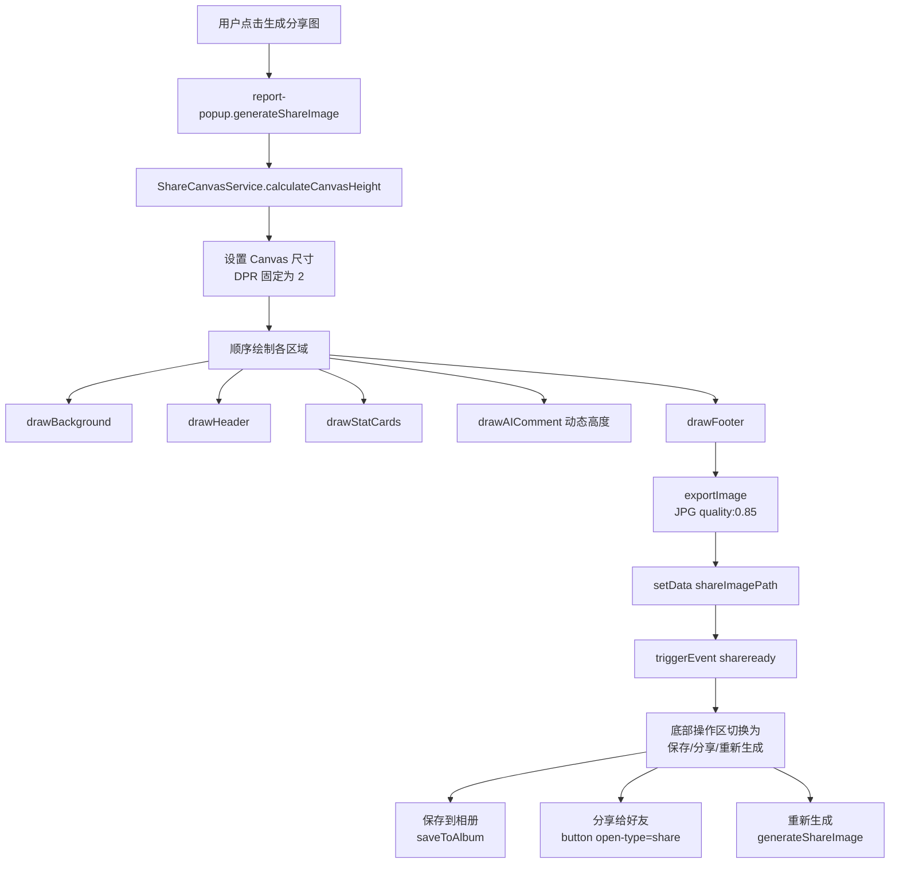

# 设计文档 - 成长报告分享图优化

## 概述

本设计文档基于需求文档中的三轮 Review 发现，对成长报告分享图功能进行系统性技术优化。核心改动包括：Canvas 绘制引擎重构、底部操作区完善、分享链路闭环、代码架构拆分。

## 架构设计

### 当前架构

```
record.js (页面)
  ├── onShareReady() ← triggerEvent('shareready')
  ├── onShareAppMessage() → 使用 shareImagePath
  └── report-popup (组件, 929 行)
        ├── 报告数据计算 (~250 行)
        ├── AI 评语生成 (~40 行)
        ├── Canvas 绘制 (~400 行)
        │     ├── initCanvas()
        │     ├── drawShareBackground()
        │     ├── drawShareHeader()
        │     ├── drawShareStats()
        │     ├── drawShareAIComment()
        │     ├── drawShareFooter()  ← ⚠️ 未调用
        │     ├── exportCanvas()
        │     ├── roundRect()
        │     └── wrapText()
        ├── 保存/分享 (~50 行)
        │     ├── saveToAlbum()  ← ⚠️ 无 UI 入口
        │     └── shareToFriend() ← ⚠️ 无 UI 入口
        └── 其他 (~190 行)
```

### 优化后架构

```
record.js (页面)
  ├── onShareReady() ← triggerEvent('shareready')
  ├── onShareAppMessage() → 带参数路径
  └── report-popup (组件, ~550 行)
        ├── 报告数据计算 (~250 行)
        ├── AI 评语生成 (~40 行)
        ├── 分享图生成入口 → 委托 ShareCanvasService
        ├── 保存/分享交互 (~50 行)
        └── 其他 (~200 行)

services/share-canvas.js (新建, ~350 行)
  ├── CANVAS_CONFIG (配置常量)
  ├── generateShareImage(canvas, reportData, babyInfo, options)
  ├── _drawBackground()
  ├── _drawHeader()
  ├── _drawStatCards()
  ├── _drawAIComment() → 动态高度
  ├── _drawFooter()
  ├── _exportImage()
  ├── _roundRect()
  ├── _wrapText() → 改进版，支持段落
  └── _calculateCanvasHeight() → 根据内容计算总高度
```

### 数据流（优化后）



## 详细设计

### 1. Canvas 绘制配置常量化

```javascript
// services/share-canvas.js

const CANVAS_CONFIG = {
  // 基础尺寸（逻辑像素）
  WIDTH: 750,
  MIN_HEIGHT: 1200,
  MAX_DPR: 2,

  // 导出配置
  EXPORT_QUALITY: 0.85,
  EXPORT_TYPE: 'jpg',

  // 颜色体系（美拉德色系）
  COLORS: {
    bgGradientTop: '#F5F0E8',
    bgGradientBottom: '#FFF8F0',
    headerBg: '#D4A574',
    cardBg: '#FFFFFF',
    footerBg: '#3D3427',
    textPrimary: '#3D3427',
    textSecondary: '#8B7355',
    textTertiary: '#5D4E37',
    accent: '#D4A574',
    white: '#FFFFFF',
    whiteTranslucent: 'rgba(255,255,255,0.6)',
  },

  // 卡片颜色
  STAT_COLORS: {
    feeding: '#FF9F43',
    sleep: '#5F9FFF',
    diaper: '#7BC950',
    temperature: '#FF6B6B',
    summary: '#D4A574',
  },

  // 字体
  FONTS: {
    family: '"PingFang SC", "Microsoft YaHei", sans-serif',
    titleLarge: 'bold 36px',
    titleMedium: 'bold 32px',
    titleSmall: 'bold 24px',
    bodyLarge: '24px',
    bodyMedium: '22px',
    bodySmall: '20px',
    scoreLarge: 'bold 48px',
    statValue: 'bold 36px',
  },

  // 布局
  LAYOUT: {
    padding: 30,
    cardGap: 20,
    headerHeight: 280,
    statCardHeight: 160,
    footerHeight: 100,
    borderRadius: 16,
  }
};
```

### 2. 动态高度计算

```javascript
/**
 * 计算 Canvas 总高度
 * @param {Object} reportData - 报告数据
 * @param {string} aiComment - AI 评语文本
 * @param {CanvasRenderingContext2D} ctx - Canvas 上下文（用于 measureText）
 * @returns {number} Canvas 总高度（逻辑像素）
 */
calculateCanvasHeight(reportData, aiComment, ctx) {
  const { LAYOUT, WIDTH } = CANVAS_CONFIG;
  let height = 0;

  // 头部区域
  height += LAYOUT.headerHeight; // 280

  // 统计卡片区域（2行2列 或 2行1列+空）
  height += LAYOUT.statCardHeight * 2 + LAYOUT.cardGap; // 160*2 + 20 = 340
  height += LAYOUT.cardGap; // 间距 20

  // AI 评语区域（动态）
  const aiCommentWidth = WIDTH - LAYOUT.padding * 2 - 40; // 650
  const lineHeight = 28;
  const titleHeight = 50; // 标题 + 间距
  const paddingVertical = 40; // 上下内边距

  ctx.font = `${CANVAS_CONFIG.FONTS.bodyMedium} ${CANVAS_CONFIG.FONTS.family}`;
  const lines = this._calculateTextLines(ctx, aiComment, aiCommentWidth);
  const aiCardHeight = titleHeight + lines.length * lineHeight + paddingVertical;

  height += aiCardHeight + LAYOUT.cardGap;

  // 底部区域
  height += LAYOUT.footerHeight; // 100
  height += LAYOUT.cardGap; // 底部间距

  return Math.max(height, CANVAS_CONFIG.MIN_HEIGHT);
}
```

### 3. 改进的文字换行方法

```javascript
/**
 * 计算文字行数（支持 \n 换行符和自动换行）
 */
_calculateTextLines(ctx, text, maxWidth) {
  const lines = [];
  // 先按段落分割
  const paragraphs = text.split('\n');

  for (const paragraph of paragraphs) {
    if (paragraph.trim() === '') {
      lines.push(''); // 保留空行
      continue;
    }

    let line = '';
    for (const char of paragraph) {
      const testLine = line + char;
      const metrics = ctx.measureText(testLine);
      if (metrics.width > maxWidth && line) {
        lines.push(line);
        line = char;
      } else {
        line = testLine;
      }
    }
    if (line) lines.push(line);
  }

  return lines;
}

/**
 * 绘制多行文字（支持段落间距）
 */
_drawWrappedText(ctx, text, x, y, maxWidth, lineHeight) {
  const lines = this._calculateTextLines(ctx, text, maxWidth);
  let currentY = y;

  for (const line of lines) {
    if (line === '') {
      currentY += lineHeight * 0.5; // 空行使用半倍行高
    } else {
      ctx.fillText(line, x, currentY);
      currentY += lineHeight;
    }
  }

  return currentY; // 返回最终 Y 坐标
}
```

### 4. DPR 限制与图片压缩

```javascript
/**
 * 初始化 Canvas（DPR 限制为 2）
 */
initCanvas(canvas, totalHeight) {
  const dpr = Math.min(wx.getSystemInfoSync().pixelRatio, CANVAS_CONFIG.MAX_DPR);
  const width = CANVAS_CONFIG.WIDTH;

  canvas.width = width * dpr;
  canvas.height = totalHeight * dpr;

  const ctx = canvas.getContext('2d');
  ctx.scale(dpr, dpr);

  return { ctx, dpr, width, height: totalHeight };
}

/**
 * 导出 Canvas 为压缩图片
 */
exportImage(canvas, totalHeight) {
  return new Promise((resolve, reject) => {
    wx.canvasToTempFilePath({
      canvas,
      destWidth: CANVAS_CONFIG.WIDTH,
      destHeight: totalHeight,
      quality: CANVAS_CONFIG.EXPORT_QUALITY,
      fileType: CANVAS_CONFIG.EXPORT_TYPE,
      success: (res) => resolve(res.tempFilePath),
      fail: (err) => reject(err)
    });
  });
}
```

### 5. 无体温数据时的替代卡片

```javascript
/**
 * 绘制统计卡片区域
 */
async drawStatCards(ctx, reportData, startY) {
  const { LAYOUT } = CANVAS_CONFIG;
  const cardWidth = 345;
  const cardHeight = LAYOUT.statCardHeight;
  const gap = LAYOUT.cardGap;

  // 第一行：喂养 + 睡眠
  await this._drawStatCard(ctx, 30, startY, cardWidth, cardHeight, {
    title: '喂养记录',
    icon: '/images/icons/feeding-color.png',
    value: `${reportData.feeding.totalCount}次`,
    detail: `日均 ${reportData.feeding.avgCount} 次`,
    color: CANVAS_CONFIG.STAT_COLORS.feeding
  });

  await this._drawStatCard(ctx, 375, startY, cardWidth, cardHeight, {
    title: '睡眠记录',
    icon: '/images/icons/sleep-color.png',
    value: `${reportData.sleep.totalHours}h`,
    detail: `日均 ${reportData.sleep.avgHours}h`,
    color: CANVAS_CONFIG.STAT_COLORS.sleep
  });

  // 第二行：排便 + 体温/总结
  await this._drawStatCard(ctx, 30, startY + cardHeight + gap, cardWidth, cardHeight, {
    title: '排便记录',
    icon: '/images/icons/diaper-color.png',
    value: `${reportData.diaper.totalCount}次`,
    detail: `湿${reportData.diaper.wetCount} 脏${reportData.diaper.dirtyCount}`,
    color: CANVAS_CONFIG.STAT_COLORS.diaper
  });

  // ✅ 修复：无体温数据时绘制总结卡片
  if (reportData.temperature.count > 0) {
    await this._drawStatCard(ctx, 375, startY + cardHeight + gap, cardWidth, cardHeight, {
      title: '体温记录',
      icon: '/images/icons/temperature.png',
      value: `${reportData.temperature.avgTemp}°C`,
      detail: `${reportData.temperature.minTemp}-${reportData.temperature.maxTemp}°C`,
      color: CANVAS_CONFIG.STAT_COLORS.temperature
    });
  } else {
    // 替代卡片：总记录汇总
    const totalRecords = reportData.feeding.totalCount + 
                         Math.round(reportData.sleep.totalMinutes / 60) + 
                         reportData.diaper.totalCount;
    await this._drawStatCard(ctx, 375, startY + cardHeight + gap, cardWidth, cardHeight, {
      title: '记录汇总',
      icon: null, // 无图标，使用色条即可
      value: `${totalRecords}条`,
      detail: '本周期总记录',
      color: CANVAS_CONFIG.STAT_COLORS.summary
    });
  }
}
```

### 6. 底部操作区 UI 状态切换

```xml
<!-- report-popup.wxml - 底部操作区改造 -->

<!-- 底部操作 -->
<view class="popup-footer">
  <!-- 未生成状态：只显示生成按钮 -->
  <view wx:if="{{!shareImagePath}}" class="action-btn primary" bindtap="generateShareImage">
    <image class="btn-icon" src="/images/icons/image.png" mode="aspectFit"></image>
    <text class="btn-text">生成分享图</text>
  </view>

  <!-- 已生成状态：显示三个操作按钮 -->
  <block wx:else>
    <view class="action-btn secondary" bindtap="saveToAlbum">
      <image class="btn-icon" src="/images/icons/download.png" mode="aspectFit"></image>
      <text class="btn-text">保存</text>
    </view>

    <button class="action-btn tertiary share-button" open-type="share">
      <image class="btn-icon" src="/images/icons/share.png" mode="aspectFit"></image>
      <text class="btn-text">分享</text>
    </button>

    <view class="action-btn secondary" bindtap="regenerateShareImage">
      <image class="btn-icon" src="/images/icons/refresh.png" mode="aspectFit"></image>
      <text class="btn-text">重新生成</text>
    </view>
  </block>
</view>
```

### 7. 分享路径携带参数

```javascript
// record.js - onShareAppMessage 优化
onShareAppMessage() {
  const { shareImagePath, shareBabyName, currentBaby } = this.data;
  
  // 构建带参数的分享路径
  const reportPopup = this.selectComponent('#reportPopup');
  const period = reportPopup?.data?.currentPeriod || 'week';
  
  return {
    title: `${shareBabyName || currentBaby?.name || '宝宝'}的成长报告`,
    path: `/pages/record/record?showReport=1&period=${period}`,
    imageUrl: shareImagePath
  };
}

// record.js - onLoad 中处理分享参数
onLoad(options) {
  this._lastLoadTime = 0;

  // 处理分享链接参数
  if (options.showReport === '1') {
    this._showReportOnReady = true;
    this._reportPeriod = options.period || 'week';
  }

  // FR-3: 从 URL 参数读取类型筛选
  if (options.type && TYPE_TO_FILTER_INDEX[options.type] !== undefined) {
    this._initialFilter = TYPE_TO_FILTER_INDEX[options.type];
  }

  this.init();
}
```

### 8. 错误处理与缓存安全

```javascript
// report-popup.js - 优化后的 generateShareImage
async generateShareImage() {
  // 检查缓存（增加文件存在性验证）
  const currentHash = this.hashReportData();
  if (this.data.lastReportHash === currentHash && this.data.shareImagePath) {
    // 验证 temp 文件是否仍然存在
    try {
      await new Promise((resolve, reject) => {
        wx.getFileInfo({
          filePath: this.data.shareImagePath,
          success: resolve,
          fail: reject
        });
      });
      wx.showToast({ title: '分享图已生成', icon: 'success' });
      return;
    } catch (e) {
      // 文件不存在，需要重新生成
      console.log('缓存图片已失效，重新生成');
    }
  }

  wx.showLoading({ title: '生成分享图中...', mask: true });

  try {
    const shareCanvas = new ShareCanvasService();
    const { canvas, ctx } = await this.initCanvas();

    // 准备数据
    const data = {
      reportData: this.data.reportData,
      babyInfo: this.data.babyInfo,
      reportPeriod: this.data.reportPeriod,
      overallScore: this.data.overallScore,
      aiComment: this.data.aiComment,
      imageCache: this.imageCache
    };

    // 计算动态高度
    const totalHeight = shareCanvas.calculateCanvasHeight(
      data.reportData, data.aiComment, ctx
    );

    // 重新设置 Canvas 尺寸
    shareCanvas.initCanvas(canvas, totalHeight);

    // 顺序绘制
    await shareCanvas.draw(ctx, data);

    // 导出
    const imagePath = await shareCanvas.exportImage(canvas, totalHeight);

    this.setData({
      shareImagePath: imagePath,
      lastReportHash: currentHash
    });

    this.triggerEvent('shareready', {
      imagePath,
      babyName: this.data.babyInfo?.name || '宝宝'
    });

    wx.hideLoading();
    wx.showToast({ title: '生成成功', icon: 'success' });

  } catch (error) {
    console.error('生成分享图失败:', error);
    wx.hideLoading();
    
    // ✅ 修复 B8: 失败时清除缓存哈希
    this.setData({
      lastReportHash: '',
      shareImagePath: ''
    });
    
    wx.showToast({ title: '生成失败，请重试', icon: 'error' });
  }
}
```

## 文件变更清单

| 操作 | 文件 | 说明 |
|------|------|------|
| **新建** | `miniprogram/services/share-canvas.js` | Canvas 绘制服务，~350 行 |
| **修改** | `miniprogram/components/report-popup/report-popup.js` | 移除绘制逻辑，引入 ShareCanvasService，修复缓存安全 |
| **修改** | `miniprogram/components/report-popup/report-popup.wxml` | 底部操作区状态切换，增加保存/分享/重新生成按钮 |
| **修改** | `miniprogram/components/report-popup/report-popup.wxss` | 新增按钮样式，分享 button 样式重置 |
| **修改** | `miniprogram/pages/record/record.js` | 分享路径带参，处理 showReport 参数 |

## 安全考虑

- 分享图中不包含任何敏感信息（如宝宝的精确出生日期、家庭地址等）
- 仅展示宝宝姓名、月龄、统计数据
- `canvasToTempFilePath` 生成的临时文件存储在微信沙箱中，不会自动外泄
- 保存相册前需用户明确授权

## 测试策略

### 关键测试场景

| # | 场景 | 验证点 |
|---|------|--------|
| T1 | 周报 + 全部数据完整 | 4 个卡片全部绘制，AI 评语 4 段完整显示 |
| T2 | 月报 + 无体温数据 | 右下角显示"记录汇总"替代卡片 |
| T3 | 周报 + 0 条记录 | 生成按钮禁用或提示无数据 |
| T4 | AI 评语极长（模拟 6 段文字） | Canvas 高度自适应，Footer 位置正确 |
| T5 | AI 评语极短（1 段文字） | Canvas 不低于最小高度，底部无过大空白 |
| T6 | 3x DPR 设备 | Canvas DPR 限制为 2，图片 < 500KB |
| T7 | 1x DPR 设备（模拟器） | Canvas DPR 为 1，图片正常清晰 |
| T8 | 头像 URL 失效 | 使用名字首字母占位符，流程不中断 |
| T9 | 生成中途网络异常 | catch 清除哈希，提示重试 |
| T10 | 保存相册 → 权限拒绝 → 引导设置 | 完整流程可用 |
| T11 | 生成后切换周报/月报 | 分享图清除，按钮恢复为"生成分享图" |
| T12 | 从分享卡片打开小程序 | 自动打开报告弹窗 |
| T13 | 多次快速点击生成按钮 | 防重复提交，第二次命中缓存 |

### 设备覆盖

- iOS: iPhone 8 (2x DPR)、iPhone 13 (3x DPR)
- Android: Redmi Note (2.75x DPR)、Samsung Galaxy (3x DPR)
- 微信开发者工具模拟器

---

*文档版本：v1.0*  
*创建日期：2026-04-03*  
*关联需求：specs/share-image-optimization/requirements.md*
