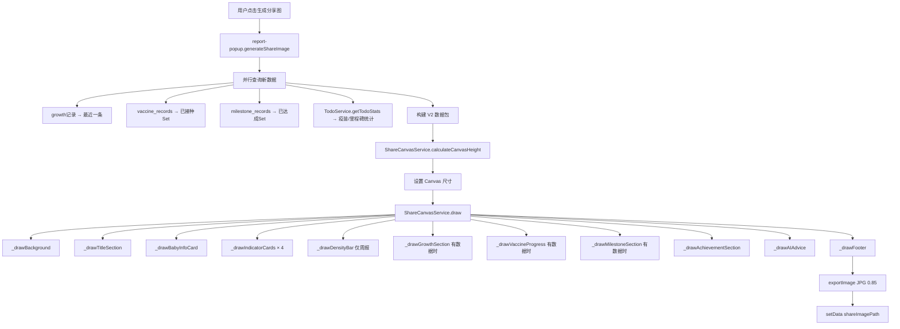

# 设计文档 - 成长报告分享图 V2（成绩单式）

## 设计规格

```
DESIGN SPECIFICATION
====================
1. Purpose Statement: 
   将宝宝日常喂养/睡眠/排便/体温数据转化为一张具有温度感和高信息密度的
   分享图（"成绩单"），让记录者（爸妈）一键分享给家人（爷爷奶奶/亲友），
   接收者无需育儿专业知识即可一目了然地看懂宝宝状态。

2. Aesthetic Direction: Soft/pastel（柔和温暖）
   - 延续项目现有的「美拉德色系」暖色基调
   - 不做跳跃/冲击风格，保持母婴产品的亲和力和可信度
   - 用色块、进度条、范围条等可视化元素取代纯数字堆砌

3. Color Palette:
   - 背景渐变: #F5F0E8 → #FFF8F0 (暖米黄渐变)
   - 头部色块: #D4A574 (温暖焦糖)
   - 底部色块: #3D3427 (深可可)
   - 卡片背景: #FFFFFF (纯白)
   - 分数色系: 
     * 90-100: #7BC950 (柔和绿 ← --success-color)
     * 80-89:  #5ABFB0 (蓝绿)
     * 70-79:  #D4883D (暖橙 ← --warning-color)
     * 60-69:  #E8745A (橙红)
     * <60:    #E85454 (柔红 ← --danger-color)
   - 四维卡片色条: 
     * 喂养 #FF9F43, 睡眠 #5F9FFF, 排便 #7BC950, 体温 #FF6B6B
   - 状态标签:
     * 正常: #7BC950 文字 + rgba(123,201,80,0.15) 背景
     * 偏少/偏多: #D4883D 文字 + rgba(212,136,61,0.15) 背景
     * 明显偏少/偏多: #E85454 文字 + rgba(232,84,84,0.15) 背景
     * 无数据: #999999 文字 + rgba(153,153,153,0.15) 背景

4. Typography: 
   - Canvas 字体: "PingFang SC", "Microsoft YaHei", sans-serif
   - 标题层级: bold 36px / bold 32px / bold 24px
   - 正文层级: 24px / 22px / 20px / 18px
   - 数值强调: bold 48px (综合评分) / bold 36px (指标数值)
   - 状态标签: bold 18px

5. Layout Strategy:
   - 纵向瀑布流式卡片排列，宽度固定 750px
   - 每个模块是一个独立的带圆角白色卡片
   - 模块之间 20px 间距，左右内边距 30px
   - 四维指标卡采用纵向堆叠（而非2x2网格），每卡含标题行+范围条行+提示行
   - 头部色块区使用渐变叠加，打破纯矩形的机械感
   - 底部品牌区深色对比，形成视觉收束
```

## 概述

在 `ShareCanvasService` V1（4个统计卡片 + AI评语）基础上，重构为 **10 个独立绘制模块**，每个模块是一个方法，支持动态跳过。采用**自上而下累加式 Y 坐标计算**，确保动态高度精确。

## 架构设计

### 当前架构 vs 目标架构

```
V1 架构 (share-canvas.js ~650行)              V2 架构 (share-canvas-v2.js ~1200行)
├── _drawBackground()                        ├── _drawBackground()          (不变)
├── _drawHeader()                            ├── _drawTitleSection()        (重构: 温情标题)
│                                            ├── _drawBabyInfoCard()        (重构: 综合评分进度条)
├── _drawStatCards() → 2x2网格               ├── _drawIndicatorCards()      (重构: 4张纵向卡片)
│                                            │     ├── _drawSingleIndicatorCard()
│                                            │     │     ├── 标题行: 名称 + 状态标签 + 数值 + 环比
│                                            │     │     ├── 范围条行: 三段式条 + 定位点 + 参考文字
│                                            │     │     └── 提示行: 智能提示语
│                                            ├── _drawDensityBar()          (新增: 7日热力)
│                                            ├── _drawGrowthSection()       (新增: 身高/体重)
│                                            ├── _drawVaccineProgress()     (新增: 疫苗进度)
│                                            ├── _drawMilestoneSection()    (新增: 里程碑)
│                                            ├── _drawAchievementSection()  (新增: 本周成就)
├── _drawAIComment()                         ├── _drawAIAdvice()            (优化: ≤2句)
├── _drawFooter()                            ├── _drawFooter()              (微调: 品牌文案)
└── 工具方法                                  └── 工具方法 (复用+新增)
```

### 数据流 (V2)



### 技术栈

- **绘制引擎**: 微信小程序 Canvas 2D API（同 V1）
- **数据源**: `TrendService`(静态方法) + `TodoService` + `who-standards.js` + 云数据库
- **服务**: `ShareCanvasService` V2（在 V1 基础上重构扩展）
- **DPR/导出**: 限制 2x，JPG quality 0.85（同 V1）

## 详细设计

### 1. CANVAS_CONFIG V2 配置扩展

```javascript
// 在 V1 CANVAS_CONFIG 基础上新增
const CANVAS_CONFIG_V2 = {
  ...CANVAS_CONFIG,

  // 新增颜色
  COLORS: {
    ...CANVAS_CONFIG.COLORS,
    // 评分等级色
    scoreExcellent: '#7BC950',    // 90-100
    scoreGood: '#5ABFB0',         // 80-89
    scoreFair: '#D4883D',         // 70-79
    scorePoor: '#E8745A',         // 60-69
    scoreCritical: '#E85454',     // <60
    // 状态标签色
    statusNormal: '#7BC950',
    statusNormalBg: 'rgba(123,201,80,0.15)',
    statusWarning: '#D4883D',
    statusWarningBg: 'rgba(212,136,61,0.15)',
    statusDanger: '#E85454',
    statusDangerBg: 'rgba(232,84,84,0.15)',
    statusMuted: '#999999',
    statusMutedBg: 'rgba(153,153,153,0.15)',
    // 范围条色
    rangeBarBg: 'rgba(212,165,116,0.12)',
    rangeBarNormal: 'rgba(123,201,80,0.3)',
    // 密度条色
    densityEmpty: '#E8E0D8',
    densityLight: '#D4B896',
    densityMedium: '#C49A6C',
    densityDark: '#A0785A',
    densityDeep: '#8B6B4E',
    // 成就色
    achievementBg: 'rgba(212,165,116,0.08)',
  },

  // 新增字体规格
  FONTS: {
    ...CANVAS_CONFIG.FONTS,
    statusTag: 'bold 18px',
    tipText: '20px',
    densityLabel: '16px',
    percentileTag: 'bold 16px',
    achievementText: '20px',
    sectionIcon: '22px',
  },

  // 新增布局规格
  LAYOUT_V2: {
    // 标题区
    titleSection: {
      height: 120,      // 标题+副标题+出生天数
      titleY: 50,
      subtitleY: 85,
    },
    // 宝宝信息卡
    babyInfoCard: {
      height: 160,       // 头像+名字+月龄+评分进度条
      avatarSize: 80,
      progressBarWidth: 200,
      progressBarHeight: 12,
      progressBarRadius: 6,
    },
    // 指标卡 (单张)
    indicatorCard: {
      height: 110,       // 标题行40 + 范围条行30 + 提示行24 + 间距16
      titleRowHeight: 36,
      rangeBarHeight: 8,
      rangeBarDotSize: 14,
      tipRowHeight: 24,
      innerPadding: 16,
    },
    // 密度条
    densityBar: {
      height: 70,        // 标题20 + 方块30 + 标签20
      blockSize: 28,
      blockGap: 12,
      blockRadius: 6,
    },
    // 生长数据
    growthSection: {
      height: 100,       // 标题30 + 两行数据70
      itemHeight: 30,
    },
    // 疫苗进度
    vaccineProgress: {
      height: 80,        // 标题30 + 进度条30 + 间距20
      barHeight: 16,
      barRadius: 8,
    },
    // 里程碑
    milestoneSection: {
      height: 90,        // 标题30 + 已达成行30 + 下一个行30
      badgeHeight: 28,
    },
    // 本周成就
    achievementSection: {
      lineHeight: 28,    // 每行成就高度
      maxItems: 3,
    },
    // AI 建议 (精简版)
    aiAdvice: {
      maxChars: 60,      // 最大字符数
      lineHeight: 26,
      titleHeight: 36,
      paddingVertical: 30,
    },
    // 模块间距
    sectionGap: 16,
    // 卡片内边距
    cardPadding: 20,
  }
};
```

### 2. 模块 ① — 标题区 (FR-1)

> **头部背景高度说明**：V1 中 `_drawBackground()` 绘制的头部色块高度为 280px（`LAYOUT.headerHeight`），
> 在 V2 中该色块覆盖 标题区(120px) + 宝宝信息卡(160px) = 280px，两个模块都位于该色块之上。
> 因此 `_drawBackground()` 的 `headerHeight` 参数无需修改，保持 V1 的 280px 即可。

```javascript
/**
 * 绘制标题区 - 温情化
 * @returns {number} 区域结束 Y 坐标
 */
_drawTitleSection(ctx, data, startY) {
  const { COLORS, FONTS } = CANVAS_CONFIG;
  const { babyInfo, reportPeriod, currentPeriod } = data;
  
  // 背景色块（头部区域全宽）
  // 已在 _drawBackground 中绘制
  
  // 标题："{宝宝名}的一周成绩单"
  const periodText = currentPeriod === 'week' ? '一周' : '月度';
  let babyName = babyInfo?.name || '宝宝';
  if (babyName.length > 4) babyName = babyName.substring(0, 4) + '…';
  const title = `${babyName}的${periodText}成绩单`;
  
  ctx.fillStyle = COLORS.white;
  ctx.font = `${FONTS.titleLarge} ${FONTS.family}`;
  ctx.textAlign = 'center';
  ctx.fillText(title, 375, startY + 50);
  
  // 副标题：日期范围 + 出生第N天
  ctx.font = `${FONTS.bodyLarge} ${FONTS.family}`;
  ctx.fillStyle = COLORS.whiteTranslucent;
  ctx.fillText(reportPeriod || '', 375, startY + 82);
  
  // 出生第N天标记
  if (babyInfo?.birthDate) {
    const birth = new Date(babyInfo.birthDate);
    const now = new Date();
    const daysSinceBirth = Math.floor((now - birth) / (1000 * 60 * 60 * 24));
    ctx.font = `${FONTS.bodySmall} ${FONTS.family}`;
    ctx.fillText(`出生第 ${daysSinceBirth} 天`, 375, startY + 108);
  }
  
  return startY + 120;
}
```

### 3. 模块 ② — 宝宝信息卡 + 综合评分进度条 (FR-2)

```javascript
/**
 * 绘制宝宝信息卡 + 综合评分线性进度条
 * @returns {number} 区域结束 Y 坐标
 */
async _drawBabyInfoCard(ctx, data, startY) {
  const { COLORS, FONTS, LAYOUT } = CANVAS_CONFIG;
  const { babyInfo, overallScore } = data;
  const cardY = startY;
  const cardHeight = 160;
  
  // 白色卡片背景
  ctx.fillStyle = COLORS.cardBg;
  this._roundRect(ctx, 30, cardY, 690, cardHeight, LAYOUT.borderRadius);
  ctx.fill();
  
  // 头像（左侧）
  await this._drawAvatar(ctx, babyInfo, 50, cardY + 20, 80);
  
  // 名字 + 月龄
  ctx.fillStyle = COLORS.textPrimary;
  ctx.font = `${FONTS.titleMedium} ${FONTS.family}`;
  ctx.textAlign = 'left';
  ctx.fillText(babyInfo?.name || '宝宝', 150, cardY + 50);
  
  ctx.fillStyle = COLORS.textSecondary;
  ctx.font = `${FONTS.bodyLarge} ${FONTS.family}`;
  ctx.fillText(babyInfo?.ageText || '', 150, cardY + 80);
  
  // 右侧：综合评分 + 进度条
  const scoreX = 500;
  
  // 评分数字
  const scoreColor = this._getScoreColor(overallScore);
  ctx.fillStyle = scoreColor;
  ctx.font = `${FONTS.scoreLarge} ${FONTS.family}`;
  ctx.textAlign = 'center';
  ctx.fillText(String(overallScore || 0), scoreX + 70, cardY + 55);
  
  // 评分等级文字
  const scoreLabel = this._getScoreLabel(overallScore);
  ctx.font = `bold 18px ${FONTS.family}`;
  ctx.fillText(scoreLabel, scoreX + 70, cardY + 80);
  
  // 线性进度条
  const barX = scoreX;
  const barY = cardY + 100;
  const barWidth = 160;
  const barHeight = 12;
  
  // 进度条背景
  ctx.fillStyle = 'rgba(212,165,116,0.15)';
  this._roundRect(ctx, barX, barY, barWidth, barHeight, 6);
  ctx.fill();
  
  // 进度条填充
  const fillWidth = Math.max(barHeight, barWidth * (overallScore / 100));
  ctx.fillStyle = scoreColor;
  this._roundRect(ctx, barX, barY, fillWidth, barHeight, 6);
  ctx.fill();
  
  return cardY + cardHeight + 16;
}

/**
 * 根据评分返回颜色
 */
_getScoreColor(score) {
  if (score >= 90) return '#7BC950';
  if (score >= 80) return '#5ABFB0';
  if (score >= 70) return '#D4883D';
  if (score >= 60) return '#E8745A';
  return '#E85454';
}

/**
 * 根据评分返回等级文字
 */
_getScoreLabel(score) {
  if (score >= 90) return '非常棒!';
  if (score >= 80) return '状态良好';
  if (score >= 70) return '部分可优化';
  if (score >= 60) return '需要关注';
  return '建议咨询医生';
}
```

### 4. 模块 ③ — 四维指标卡 (FR-3)

这是 V2 最核心的改动，从 2x2 网格卡片改为**纵向堆叠的详情卡片**，每张卡片包含：标题行、范围条行、提示行。

```javascript
/**
 * 绘制四维指标卡（喂养/睡眠/排便/体温）
 * @returns {number} 区域结束 Y 坐标
 */
_drawIndicatorCards(ctx, data, startY) {
  const { reportData, trendData, babyInfo } = data;
  const TrendService = require('./trendService');
  
  let currentY = startY;
  
  // 计算月龄
  let ageMonths = null;
  if (babyInfo?.birthDate) {
    const birth = new Date(babyInfo.birthDate);
    const now = new Date();
    ageMonths = (now.getFullYear() - birth.getFullYear()) * 12 
                + now.getMonth() - birth.getMonth();
  }
  
  // === 喂养卡 ===
  const feedingRange = ageMonths !== null 
    ? TrendService.getReferenceRange('feeding', ageMonths) : null;
  const feedingAvg = parseFloat(reportData.feeding.avgCount);
  const feedingStatus = TrendService.calculateStatus(
    feedingAvg, feedingRange, 'feeding', 
    { lastWeekAvg: trendData?.feeding?.lastWeekAvg || 0 }
  );
  currentY = this._drawSingleIndicatorCard(ctx, currentY, {
    title: '喂养',
    color: '#FF9F43',
    icon: '/images/icons/feeding-color.png',
    value: feedingAvg,
    unit: '次/日',
    status: feedingStatus,
    range: feedingRange,
    tip: TrendService.generateTip('feeding', feedingStatus),
    change: trendData?.feeding,
  });
  
  // === 睡眠卡 ===
  const sleepRange = ageMonths !== null
    ? TrendService.getReferenceRange('sleep', ageMonths) : null;
  const sleepAvg = parseFloat(reportData.sleep.avgHours);
  const sleepStatus = TrendService.calculateStatus(
    sleepAvg, sleepRange, 'sleep',
    { lastWeekAvg: trendData?.sleep?.lastWeekAvg || 0 }
  );
  currentY = this._drawSingleIndicatorCard(ctx, currentY, {
    title: '睡眠',
    color: '#5F9FFF',
    icon: '/images/icons/sleep-color.png',
    value: sleepAvg,
    unit: 'h/日',
    status: sleepStatus,
    range: sleepRange,
    tip: TrendService.generateTip('sleep', sleepStatus),
    change: trendData?.sleep,
  });
  
  // === 排便卡 ===
  const diaperRange = ageMonths !== null
    ? TrendService.getReferenceRange('diaper', ageMonths) : null;
  const diaperAvg = reportData.diaper.totalCount / 
    (data.currentPeriod === 'week' ? 7 : 30);
  const diaperStatus = TrendService.calculateStatus(
    diaperAvg, diaperRange, 'diaper',
    { lastWeekAvg: trendData?.diaper?.lastWeekAvg || 0 }
  );
  currentY = this._drawSingleIndicatorCard(ctx, currentY, {
    title: '排便',
    color: '#7BC950',
    icon: '/images/icons/diaper-color.png',
    value: Math.round(diaperAvg * 10) / 10,
    unit: '次/日',
    status: diaperStatus,
    range: diaperRange,
    tip: TrendService.generateTip('diaper', diaperStatus),
    change: trendData?.diaper,
  });
  
  // === 体温卡 ===
  const tempData = reportData.temperature;
  const tempStatus = TrendService.calculateStatus(
    null, null, 'temperature',
    { 
      abnormalCount: tempData.records 
        ? tempData.records.filter(t => t >= 37.5).length : 0,
      hasData: tempData.count > 0 
    }
  );
  currentY = this._drawSingleIndicatorCard(ctx, currentY, {
    title: '体温',
    color: '#FF6B6B',
    icon: '/images/icons/temperature.png',
    value: tempData.count > 0 ? tempData.avgTemp : '--',
    unit: tempData.count > 0 ? '°C' : '',
    status: tempStatus,
    range: null, // 体温无参考范围条
    tip: TrendService.generateTip('temperature', tempStatus),
    change: null, // 体温无环比
    isTemperature: true,
  });
  
  // 将各维度状态保存到 data 上，供 _calculateAchievements 引用
  data._feedingStatus = feedingStatus;
  data._sleepStatus = sleepStatus;
  data._diaperStatus = diaperStatus;
  data._tempStatus = tempStatus;
  
  return currentY;
}

/**
 * 绘制单个指标卡
 * 
 * 布局示意:
 * ┌──────────────────────────────────────────────────────────┐
 * │ [色条] [图标] 喂养  [正常]          6.5 次/日  ↑12%     │ ← 标题行
 * │         ■■■■■■■■■■■■■■■●■■■■■■■■     参考 5-8次        │ ← 范围条行
 * │         喂养规律，保持即可 👍                             │ ← 提示行
 * └──────────────────────────────────────────────────────────┘
 */
_drawSingleIndicatorCard(ctx, startY, cardData) {
  const { COLORS, FONTS, LAYOUT } = CANVAS_CONFIG;
  const TrendService = require('./trendService');
  const padding = LAYOUT.padding;
  const cardX = padding;
  const cardWidth = 750 - padding * 2;
  const cardPadding = 20;
  const cardInnerX = cardX + cardPadding;
  
  // 计算卡片高度 (标题行 + 范围条行(可选) + 提示行)
  let cardHeight = 36 + 16; // 标题行 + 上下间距
  if (cardData.range) cardHeight += 30; // 范围条行
  cardHeight += 24; // 提示行
  cardHeight += 16; // 底部间距
  
  // 卡片背景
  ctx.fillStyle = COLORS.cardBg;
  this._roundRect(ctx, cardX, startY, cardWidth, cardHeight, 12);
  ctx.fill();
  
  // 左侧色条 (4px 宽)
  ctx.fillStyle = cardData.color;
  this._roundRect(ctx, cardX, startY, 6, cardHeight, 3);
  ctx.fill();
  
  let currentY = startY + 12;
  
  // === 标题行 ===
  // 图标 (24x24)
  // (图标绘制逻辑与 V1 _drawStatCard 类似，此处省略)
  
  // 标题文字
  ctx.fillStyle = COLORS.textPrimary;
  ctx.font = `bold 22px ${FONTS.family}`;
  ctx.textAlign = 'left';
  ctx.fillText(cardData.title, cardInnerX + 32, currentY + 20);
  
  // 状态标签
  if (cardData.status && cardData.status !== 'noData') {
    const { text, color, bgColor } = this._getStatusColors(cardData.status);
    if (text) {
      const tagX = cardInnerX + 32 + ctx.measureText(cardData.title).width + 12;
      
      // 标签背景
      const tagWidth = ctx.measureText(text).width + 16;
      ctx.fillStyle = bgColor;
      this._roundRect(ctx, tagX, currentY + 5, tagWidth, 22, 11);
      ctx.fill();
      
      // 标签文字
      ctx.fillStyle = color;
      ctx.font = `bold 16px ${FONTS.family}`;
      ctx.fillText(text, tagX + 8, currentY + 20);
    }
  }
  
  // 数值 + 单位 (右对齐)
  ctx.textAlign = 'right';
  ctx.fillStyle = COLORS.textPrimary;
  ctx.font = `bold 28px ${FONTS.family}`;
  const valueStr = String(cardData.value);
  const valueWidth = ctx.measureText(valueStr).width;
  ctx.fillText(valueStr, cardX + cardWidth - cardPadding - 60, currentY + 22);
  
  // 单位
  ctx.fillStyle = COLORS.textSecondary;
  ctx.font = `20px ${FONTS.family}`;
  ctx.fillText(cardData.unit, cardX + cardWidth - cardPadding - 10, currentY + 22);
  
  // 环比变化
  if (cardData.change && cardData.change.changePercent > 0 && cardData.change.changeValue !== 0) {
    const arrow = cardData.change.isUp ? '↑' : '↓';
    const changeText = `${arrow}${cardData.change.changePercent}%`;
    ctx.fillStyle = cardData.change.isUp ? '#7BC950' : '#D4883D';
    ctx.font = `18px ${FONTS.family}`;
    ctx.fillText(changeText, cardX + cardWidth - cardPadding - 10, currentY + 8);
  }
  
  currentY += 36;
  ctx.textAlign = 'left';
  
  // === 范围条行 (仅喂养/睡眠/排便) ===
  if (cardData.range) {
    const barX = cardInnerX + 32;
    const barWidth = 380;
    const barY = currentY + 4;
    const barHeight = 8;
    
    // 范围条背景（全条）
    ctx.fillStyle = 'rgba(212,165,116,0.12)';
    this._roundRect(ctx, barX, barY, barWidth, barHeight, 4);
    ctx.fill();
    
    // 正常范围区域（绿色半透明，20%-80%）
    ctx.fillStyle = 'rgba(123,201,80,0.3)';
    const normalX = barX + barWidth * 0.2;
    const normalWidth = barWidth * 0.6;
    ctx.fillRect(normalX, barY, normalWidth, barHeight);
    
    // 定位点
    const position = TrendService.calculateRangeBarPosition(
      cardData.value, cardData.range
    );
    const dotX = barX + barWidth * (position.position / 100);
    const dotRadius = 7;
    const dotColor = this._getZoneDotColor(position.zone);
    
    ctx.fillStyle = dotColor;
    ctx.beginPath();
    ctx.arc(dotX, barY + barHeight / 2, dotRadius, 0, 2 * Math.PI);
    ctx.fill();
    
    // 白色描边
    ctx.strokeStyle = '#FFFFFF';
    ctx.lineWidth = 2;
    ctx.stroke();
    
    // 参考范围文字
    ctx.fillStyle = COLORS.textSecondary;
    ctx.font = `18px ${FONTS.family}`;
    const refUnit = cardData.title === '睡眠' ? 'h' : '次';
    const refText = `参考 ${cardData.range.min}-${cardData.range.max}${refUnit}`;
    ctx.fillText(refText, barX + barWidth + 16, barY + 10);
    
    currentY += 30;
  }
  
  // === 提示行 ===
  if (cardData.tip) {
    ctx.fillStyle = COLORS.textSecondary;
    ctx.font = `18px ${FONTS.family}`;
    ctx.fillText(cardData.tip, cardInnerX + 32, currentY + 16);
    currentY += 24;
  }
  
  return startY + cardHeight + 10; // 10px 卡片间距
}

/**
 * 返回状态标签的颜色配置
 */
_getStatusColors(status) {
  const map = {
    normal:    { text: '正常',     color: '#7BC950', bgColor: 'rgba(123,201,80,0.15)' },
    low:       { text: '偏少',     color: '#D4883D', bgColor: 'rgba(212,136,61,0.15)' },
    high:      { text: '偏多',     color: '#D4883D', bgColor: 'rgba(212,136,61,0.15)' },
    veryLow:   { text: '明显偏少', color: '#E85454', bgColor: 'rgba(232,84,84,0.15)' },
    veryHigh:  { text: '明显偏多', color: '#E85454', bgColor: 'rgba(232,84,84,0.15)' },
    noData:    { text: '无数据',   color: '#999999', bgColor: 'rgba(153,153,153,0.15)' },
    attention: { text: '需关注',   color: '#D4883D', bgColor: 'rgba(212,136,61,0.15)' },
    alert:     { text: '需就医',   color: '#E85454', bgColor: 'rgba(232,84,84,0.15)' },
  };
  return map[status] || map.noData;
}

/**
 * 返回范围条定位点颜色
 */
_getZoneDotColor(zone) {
  if (zone === 'normal') return '#7BC950';
  return '#D4883D'; // left 或 right 都用警告色
}
```

### 5. 模块 ④ — 每日记录密度条 (FR-9)

```javascript
/**
 * 绘制每日记录密度条（仅周报）
 * 7 个色块，颜色深浅代表记录密度
 * @returns {number} 区域结束 Y 坐标，或月报时返回 startY（跳过）
 */
_drawDensityBar(ctx, data, startY) {
  if (data.currentPeriod !== 'week') return startY;
  
  const { COLORS, FONTS, LAYOUT } = CANVAS_CONFIG;
  const padding = LAYOUT.padding;
  const cardX = padding;
  const cardWidth = 750 - padding * 2;
  const cardHeight = 90;
  
  // 卡片背景
  ctx.fillStyle = COLORS.cardBg;
  this._roundRect(ctx, cardX, startY, cardWidth, cardHeight, 12);
  ctx.fill();
  
  // 标题
  ctx.fillStyle = COLORS.textSecondary;
  ctx.font = `bold 18px ${FONTS.family}`;
  ctx.textAlign = 'left';
  ctx.fillText('本周记录', cardX + 20, startY + 22);
  
  // 计算每天的记录数
  const dailyCounts = this._calculateDailyCounts(data.reportData);
  const maxCount = Math.max(...dailyCounts, 1);
  const dayLabels = ['一', '二', '三', '四', '五', '六', '日'];
  
  const blockSize = 28;
  const blockGap = 14;
  const totalBlockWidth = blockSize * 7 + blockGap * 6;
  const startBlockX = cardX + (cardWidth - totalBlockWidth) / 2;
  
  for (let i = 0; i < 7; i++) {
    const bx = startBlockX + i * (blockSize + blockGap);
    const by = startY + 32;
    const count = dailyCounts[i];
    
    // 色块（根据记录数量确定深浅）
    if (count === 0) {
      ctx.fillStyle = '#E8E0D8';
      ctx.strokeStyle = '#D4C8B8';
      ctx.lineWidth = 1;
      this._roundRect(ctx, bx, by, blockSize, blockSize, 6);
      ctx.fill();
      ctx.stroke();
    } else {
      const intensity = Math.min(count / maxCount, 1);
      ctx.fillStyle = this._getDensityColor(intensity);
      this._roundRect(ctx, bx, by, blockSize, blockSize, 6);
      ctx.fill();
    }
    
    // 日期标签
    ctx.fillStyle = COLORS.textSecondary;
    ctx.font = `14px ${FONTS.family}`;
    ctx.textAlign = 'center';
    ctx.fillText(dayLabels[i], bx + blockSize / 2, by + blockSize + 14);
  }
  
  return startY + cardHeight + 16;
}

/**
 * 根据密度强度返回颜色（0→浅，1→深）
 */
_getDensityColor(intensity) {
  if (intensity <= 0.25) return '#D4B896';
  if (intensity <= 0.5)  return '#C49A6C';
  if (intensity <= 0.75) return '#A0785A';
  return '#8B6B4E';
}

/**
 * 计算每天的总记录数（喂养+睡眠+排便+体温）
 */
_calculateDailyCounts(reportData) {
  const counts = [];
  for (let i = 0; i < 7; i++) {
    counts.push(
      (reportData.feeding.dailyRecords?.[i] || 0) +
      (reportData.sleep.dailyRecords?.[i] > 0 ? 1 : 0) + // 睡眠算有/无
      (reportData.diaper.dailyRecords?.[i] || 0) +
      (reportData.temperature.dailyRecords?.[i] || 0) // 体温记录
    );
  }
  return counts;
}
```

### 6. 模块 ⑤ — 生长发育 (FR-4)

```javascript
/**
 * 绘制生长发育模块（身高/体重 + WHO百分位）
 * @returns {number} 区域结束 Y 坐标，无数据时返回 startY
 */
_drawGrowthSection(ctx, data, startY) {
  const { growthData, babyInfo } = data;
  if (!growthData) return startY; // 无数据跳过
  
  const { COLORS, FONTS, LAYOUT } = CANVAS_CONFIG;
  const padding = LAYOUT.padding;
  const cardX = padding;
  const cardWidth = 750 - padding * 2;
  
  // 计算有几行数据
  const items = [];
  if (growthData.weight) {
    items.push({ 
      label: '体重', 
      value: `${growthData.weight}kg`, 
      percentile: growthData.weightPercentile 
    });
  }
  if (growthData.height) {
    items.push({ 
      label: '身高', 
      value: `${growthData.height}cm`, 
      percentile: growthData.heightPercentile 
    });
  }
  if (items.length === 0) return startY;
  
  const cardHeight = 40 + items.length * 32 + 16;
  
  // 卡片背景
  ctx.fillStyle = COLORS.cardBg;
  this._roundRect(ctx, cardX, startY, cardWidth, cardHeight, 12);
  ctx.fill();
  
  // 标题
  ctx.fillStyle = COLORS.textPrimary;
  ctx.font = `bold 22px ${FONTS.family}`;
  ctx.textAlign = 'left';
  ctx.fillText('生长发育', cardX + 20, startY + 28);
  
  // 数据时效性标注
  if (growthData.daysSinceRecord > 30) {
    ctx.fillStyle = COLORS.textSecondary;
    ctx.font = `16px ${FONTS.family}`;
    ctx.textAlign = 'right';
    ctx.fillText(
      `(${growthData.daysSinceRecord}天前测量)`, 
      cardX + cardWidth - 20, startY + 28
    );
  }
  
  // 数据行
  let itemY = startY + 48;
  ctx.textAlign = 'left';
  
  for (const item of items) {
    // 标签
    ctx.fillStyle = COLORS.textSecondary;
    ctx.font = `20px ${FONTS.family}`;
    ctx.fillText(item.label, cardX + 20, itemY + 16);
    
    // 数值
    ctx.fillStyle = COLORS.textPrimary;
    ctx.font = `bold 24px ${FONTS.family}`;
    ctx.fillText(item.value, cardX + 100, itemY + 16);
    
    // WHO 百分位标签
    if (item.percentile) {
      const { text, color, bgColor } = this._getPercentileDisplay(item.percentile);
      const tagX = cardX + 220;
      const tagWidth = ctx.measureText(text).width + 16;
      
      ctx.fillStyle = bgColor;
      this._roundRect(ctx, tagX, itemY + 2, tagWidth, 22, 11);
      ctx.fill();
      
      ctx.fillStyle = color;
      ctx.font = `bold 16px ${FONTS.family}`;
      ctx.fillText(text, tagX + 8, itemY + 17);
    }
    
    itemY += 32;
  }
  
  return startY + cardHeight + 16;
}

/**
 * 获取百分位显示配置
 * @param {string} percentile - 'low'|'lowNormal'|'normal'|'highNormal'|'high'
 */
_getPercentileDisplay(percentile) {
  const map = {
    low:        { text: '偏低',     color: '#E85454', bgColor: 'rgba(232,84,84,0.12)' },
    lowNormal:  { text: '偏低正常', color: '#D4883D', bgColor: 'rgba(212,136,61,0.12)' },
    normal:     { text: '达标',     color: '#7BC950', bgColor: 'rgba(123,201,80,0.12)' },
    highNormal: { text: '偏高正常', color: '#7BA3C9', bgColor: 'rgba(123,163,201,0.12)' },
    high:       { text: '偏高',     color: '#E85454', bgColor: 'rgba(232,84,84,0.12)' },
  };
  return map[percentile] || map.normal;
}
```

### 7. 模块 ⑥ — 疫苗接种进度 (FR-5)

```javascript
/**
 * 绘制疫苗接种进度
 * @returns {number} 区域结束 Y 坐标
 */
_drawVaccineProgress(ctx, data, startY) {
  const { vaccineData, babyInfo } = data;
  
  // 无出生日期则无法计算疫苗计划
  if (!babyInfo?.birthDate) return startY;
  
  // 月龄 < 1 个月不显示
  const { calculateAgeMonths } = require('../utils/date');
  const ageMonths = calculateAgeMonths(babyInfo.birthDate);
  if (ageMonths < 1) return startY;
  
  // 即使 vaccineData 为 null（从未接种），也使用默认值显示 0/X
  // 符合 FR-5 边界条件："从未接种过疫苗 → 显示 0/X 待接种（不跳过模块）"
  const { done, total, overdue } = vaccineData || { done: 0, total: 0, overdue: 0 };
  
  const { COLORS, FONTS, LAYOUT } = CANVAS_CONFIG;
  const padding = LAYOUT.padding;
  const cardX = padding;
  const cardWidth = 750 - padding * 2;
  const cardHeight = 80;
  
  // 卡片背景
  ctx.fillStyle = COLORS.cardBg;
  this._roundRect(ctx, cardX, startY, cardWidth, cardHeight, 12);
  ctx.fill();
  
  // 标题 + 进度文字
  ctx.fillStyle = COLORS.textPrimary;
  ctx.font = `bold 22px ${FONTS.family}`;
  ctx.textAlign = 'left';
  ctx.fillText('疫苗接种', cardX + 20, startY + 28);
  
  // 右侧: 进度数字
  ctx.textAlign = 'right';
  ctx.fillStyle = done === total ? '#7BC950' : COLORS.textPrimary;
  ctx.font = `bold 22px ${FONTS.family}`;
  ctx.fillText(`${done}/${total}`, cardX + cardWidth - 20, startY + 28);
  
  // 进度条
  const barX = cardX + 20;
  const barY = startY + 44;
  const barWidth = cardWidth - 40;
  const barHeight = 14;
  
  ctx.fillStyle = 'rgba(212,165,116,0.12)';
  this._roundRect(ctx, barX, barY, barWidth, barHeight, 7);
  ctx.fill();
  
  if (total > 0) {
    const fillWidth = Math.max(barHeight, barWidth * (done / total));
    ctx.fillStyle = done === total ? '#7BC950' : '#5ABFB0';
    this._roundRect(ctx, barX, barY, fillWidth, barHeight, 7);
    ctx.fill();
  }
  
  // 逾期提示
  if (overdue > 0) {
    ctx.fillStyle = '#E85454';
    ctx.font = `bold 16px ${FONTS.family}`;
    ctx.textAlign = 'left';
    ctx.fillText(`${overdue}剂逾期`, barX, barY + barHeight + 16);
  } else if (done === total) {
    ctx.fillStyle = '#7BC950';
    ctx.font = `16px ${FONTS.family}`;
    ctx.textAlign = 'left';
    ctx.fillText('全部完成', barX, barY + barHeight + 16);
  }
  
  return startY + cardHeight + 16;
}
```

### 8. 模块 ⑦ — 里程碑达成 (FR-6)

```javascript
/**
 * 绘制里程碑达成
 * @returns {number} 区域结束 Y 坐标
 */
_drawMilestoneSection(ctx, data, startY) {
  const { milestoneData } = data;
  if (!milestoneData || milestoneData.achieved.length === 0) return startY;
  
  const { COLORS, FONTS, LAYOUT } = CANVAS_CONFIG;
  const padding = LAYOUT.padding;
  const cardX = padding;
  const cardWidth = 750 - padding * 2;
  
  // 计算高度
  const hasNext = !!milestoneData.nextPending;
  const cardHeight = 40 + 30 + (hasNext ? 30 : 0) + 16;
  
  // 卡片背景
  ctx.fillStyle = COLORS.cardBg;
  this._roundRect(ctx, cardX, startY, cardWidth, cardHeight, 12);
  ctx.fill();
  
  // 标题
  ctx.fillStyle = COLORS.textPrimary;
  ctx.font = `bold 22px ${FONTS.family}`;
  ctx.textAlign = 'left';
  ctx.fillText('成长里程碑', cardX + 20, startY + 28);
  
  // 已达成（最近 3 个）
  const achieved = milestoneData.achieved.slice(-3);
  let achievedX = cardX + 20;
  const achievedY = startY + 50;
  
  achieved.forEach((name, idx) => {
    if (idx > 0) {
      ctx.fillStyle = COLORS.textSecondary;
      ctx.font = `18px ${FONTS.family}`;
      ctx.fillText(' · ', achievedX, achievedY + 14);
      achievedX += ctx.measureText(' · ').width;
    }
    
    // 对勾
    ctx.fillStyle = '#7BC950';
    ctx.font = `18px ${FONTS.family}`;
    ctx.fillText('✓', achievedX, achievedY + 14);
    achievedX += 18;
    
    // 名称
    ctx.fillStyle = COLORS.textPrimary;
    ctx.font = `20px ${FONTS.family}`;
    ctx.fillText(name, achievedX, achievedY + 14);
    achievedX += ctx.measureText(name).width + 8;
  });
  
  // 下一个待解锁
  if (hasNext) {
    const nextY = achievedY + 30;
    ctx.fillStyle = COLORS.textSecondary;
    ctx.font = `18px ${FONTS.family}`;
    ctx.fillText('下一个：', cardX + 20, nextY + 14);
    
    ctx.fillStyle = COLORS.textSecondary;
    ctx.font = `20px ${FONTS.family}`;
    const nextX = cardX + 20 + ctx.measureText('下一个：').width;
    // 虚线框效果
    ctx.setLineDash([4, 4]);
    ctx.strokeStyle = COLORS.textSecondary;
    ctx.lineWidth = 1;
    const nameWidth = ctx.measureText(milestoneData.nextPending).width + 16;
    this._roundRect(ctx, nextX - 4, nextY, nameWidth, 24, 12);
    ctx.stroke();
    ctx.setLineDash([]);
    
    ctx.fillText(milestoneData.nextPending, nextX + 4, nextY + 16);
  }
  
  return startY + cardHeight + 16;
}
```

### 9. 模块 ⑧ — 本周成就 (FR-7)

```javascript
/**
 * 绘制本周成就（最多 3 个）
 * @returns {number} 区域结束 Y 坐标
 */
_drawAchievementSection(ctx, data, startY) {
  const achievements = this._calculateAchievements(data);
  
  const { COLORS, FONTS, LAYOUT } = CANVAS_CONFIG;
  const padding = LAYOUT.padding;
  const cardX = padding;
  const cardWidth = 750 - padding * 2;
  const lineHeight = 28;
  const cardHeight = 40 + achievements.length * lineHeight + 16;
  
  // 卡片背景
  ctx.fillStyle = 'rgba(212,165,116,0.08)';
  this._roundRect(ctx, cardX, startY, cardWidth, cardHeight, 12);
  ctx.fill();
  
  // 标题
  ctx.fillStyle = COLORS.textPrimary;
  ctx.font = `bold 22px ${FONTS.family}`;
  ctx.textAlign = 'left';
  ctx.fillText('本周亮点', cardX + 20, startY + 28);
  
  // 成就列表
  let itemY = startY + 48;
  ctx.font = `20px ${FONTS.family}`;
  
  for (const achievement of achievements) {
    ctx.fillStyle = COLORS.textPrimary;
    ctx.fillText(achievement, cardX + 20, itemY + 14);
    itemY += lineHeight;
  }
  
  return startY + cardHeight + 16;
}

/**
 * 计算本周成就（纯文字版本，Canvas 兼容）
 * 返回最多 3 条文字
 * 注意：需在 _drawIndicatorCards 之后调用，因为依赖 data._feedingStatus 等字段
 */
_calculateAchievements(data) {
  const achievements = [];
  const { reportData, trendData, vaccineData } = data;
  const days = data.currentPeriod === 'week' ? 7 : 30;
  
  // 连续记录天数
  const recordDays = this._countRecordDays(reportData, days);
  if (recordDays >= 5) {
    achievements.push(`📝 连续 ${recordDays} 天坚持记录`);
  }
  
  // 喂养规律
  if (trendData?.feeding && 
      data._feedingStatus === 'normal') {
    achievements.push('🍼 喂养规律达标');
  }
  
  // 睡眠充足
  if (trendData?.sleep && 
      data._sleepStatus === 'normal') {
    achievements.push('😴 睡眠充足');
  }
  
  // 体温正常
  if (reportData.temperature.count > 0) {
    const abnormal = reportData.temperature.records
      ? reportData.temperature.records.filter(t => t >= 37.5).length : 0;
    if (abnormal === 0) {
      achievements.push('🌡️ 体温全部正常');
    }
  }
  
  // 排便规律
  if (data._diaperStatus === 'normal') {
    achievements.push('📊 排便规律');
  }
  
  // 疫苗按时接种（FR-7：无逾期疫苗）
  if (vaccineData && vaccineData.overdue === 0 && vaccineData.done > 0) {
    achievements.push('💉 疫苗按时接种');
  }
  
  // 如果没有成就，显示鼓励语
  if (achievements.length === 0) {
    achievements.push('每一天的记录都是对宝宝的爱 ❤️');
  }
  
  return achievements.slice(0, 3);
}

/**
 * 统计有记录的天数
 */
_countRecordDays(reportData, days) {
  let count = 0;
  for (let i = 0; i < days; i++) {
    const hasRecord = (reportData.feeding.dailyRecords?.[i] || 0) > 0 ||
                      (reportData.sleep.dailyRecords?.[i] || 0) > 0 ||
                      (reportData.diaper.dailyRecords?.[i] || 0) > 0;
    if (hasRecord) count++;
  }
  return count;
}
```

### 10. 模块 ⑨ — AI 建议精简版 (FR-8)

```javascript
/**
 * 绘制 AI 建议（精简版，≤2句）
 * @returns {number} 区域结束 Y 坐标
 */
_drawAIAdvice(ctx, data, startY) {
  const { aiComment } = data;
  if (!aiComment) return startY;
  
  const { COLORS, FONTS, LAYOUT } = CANVAS_CONFIG;
  const padding = LAYOUT.padding;
  const cardX = padding;
  const cardWidth = 750 - padding * 2;
  
  // 精简 AI 建议：取最重要的 1-2 句
  const briefAdvice = this._truncateAIAdvice(aiComment, data);
  
  // 计算文字行数
  ctx.font = `20px ${FONTS.family}`;
  const lines = this._calculateTextLines(ctx, briefAdvice, cardWidth - 40);
  const cardHeight = 36 + lines.length * 26 + 30;
  
  // 卡片背景
  ctx.fillStyle = 'rgba(212,165,116,0.08)';
  this._roundRect(ctx, cardX, startY, cardWidth, cardHeight, 12);
  ctx.fill();
  
  // 标题
  ctx.fillStyle = COLORS.accent;
  ctx.font = `bold 20px ${FONTS.family}`;
  ctx.textAlign = 'left';
  ctx.fillText('AI 育儿建议', cardX + 20, startY + 26);
  
  // 内容
  ctx.fillStyle = COLORS.textTertiary;
  ctx.font = `20px ${FONTS.family}`;
  this._drawWrappedText(ctx, briefAdvice, cardX + 20, startY + 50, cardWidth - 40, 26);
  
  return startY + cardHeight + 16;
}

/**
 * 精简 AI 建议
 * 优先级：需关注的 > 正面肯定的
 * 最多 2 句，约 60 字
 */
_truncateAIAdvice(aiComment, data) {
  const paragraphs = aiComment.split('\n').filter(p => p.trim());
  
  // 按优先级排序
  const prioritized = [];
  const normal = [];
  
  paragraphs.forEach(p => {
    if (p.includes('偏少') || p.includes('偏多') || 
        p.includes('不足') || p.includes('关注') ||
        p.includes('发热') || p.includes('就医')) {
      prioritized.push(p);
    } else {
      normal.push(p);
    }
  });
  
  const selected = [...prioritized, ...normal].slice(0, 2);
  let result = selected.join(' ');
  
  // 限制字数
  if (result.length > 60) {
    result = result.substring(0, 57) + '...';
  }
  
  return result;
}
```

### 11. 模块 ⑩ — 底部品牌区 (FR-10)

```javascript
/**
 * 绘制底部品牌区
 */
_drawFooter(ctx, totalHeight) {
  const { COLORS, FONTS, LAYOUT } = CANVAS_CONFIG;
  const footerHeight = LAYOUT.footerHeight;
  const footerY = totalHeight - footerHeight;
  
  // 底部深色背景
  ctx.fillStyle = COLORS.footerBg;
  ctx.fillRect(0, footerY, 750, footerHeight);
  
  // 品牌名
  ctx.fillStyle = COLORS.white;
  ctx.font = `bold 22px ${FONTS.family}`;
  ctx.textAlign = 'center';
  ctx.fillText('Baby Care Tracker', 375, footerY + 38);
  
  // 副标题（FR-10 优化）
  ctx.fillStyle = COLORS.whiteTranslucent;
  ctx.font = `18px ${FONTS.family}`;
  ctx.fillText('记录每一天的成长', 375, footerY + 68);
}
```

### 12. V2 数据接口定义

```javascript
/**
 * V2 draw() 方法的 data 参数接口定义
 * 
 * @typedef {Object} ShareImageV2Data
 * @property {Object} reportData       - 报告统计数据（V1 已有）
 * @property {Object} babyInfo          - 宝宝基本信息（V1 已有）
 * @property {string} reportPeriod      - 报告日期范围文字（V1 已有）
 * @property {number} overallScore      - 综合评分 0-100（V1 已有）
 * @property {string} aiComment         - AI 评语原文（V1 已有）
 * @property {Object} imageCache        - 图片缓存（V1 已有）
 * @property {string} currentPeriod     - 'week' | 'month'（V2 新增）
 * @property {Object|null} growthData   - 生长数据（V2 新增）
 * @property {number} growthData.weight        - 体重 kg
 * @property {number} growthData.height        - 身高 cm
 * @property {number} growthData.daysSinceRecord - 距上次测量天数
 * @property {string} growthData.weightPercentile - WHO 百分位评价
 * @property {string} growthData.heightPercentile - WHO 百分位评价
 * @property {Object|null} vaccineData  - 疫苗数据（V2 新增）
 * @property {number} vaccineData.done          - 已接种剂次
 * @property {number} vaccineData.total         - 应接种总剂次
 * @property {number} vaccineData.overdue       - 逾期剂次
 * @property {Object|null} milestoneData - 里程碑数据（V2 新增）
 * @property {string[]} milestoneData.achieved   - 已达成里程碑名称
 * @property {string|null} milestoneData.nextPending - 下一个待解锁
 * @property {Object|null} trendData    - 趋势数据（V2 新增）
 * @property {Object} trendData.feeding          - 喂养趋势
 * @property {Object} trendData.sleep            - 睡眠趋势
 * @property {Object} trendData.diaper           - 排便趋势
 * 
 * 运行时动态字段（由 _drawIndicatorCards 设置）:
 * @property {string} _feedingStatus    - 喂养状态
 * @property {string} _sleepStatus      - 睡眠状态
 * @property {string} _diaperStatus     - 排便状态
 * @property {string} _tempStatus       - 体温状态
 */
```

### 13. generateShareImage V2 调用更新

```javascript
/**
 * report-popup.js — V2 generateShareImage 更新
 * 
 * V1 签名: calculateCanvasHeight(reportData, aiComment, ctx)
 * V2 签名: calculateCanvasHeight(data, ctx)
 * 
 * 需同步更新 generateShareImage() 中的调用方式
 */
async generateShareImage() {
  try {
    wx.showLoading({ title: '正在生成分享图...' });
    
    const shareCanvas = require('../../services/share-canvas');
    const query = wx.createSelectorQuery().in(this);
    
    // 获取 Canvas 节点
    const canvas = await new Promise((resolve) => {
      query.select('#shareCanvas')
        .fields({ node: true, size: true })
        .exec((res) => resolve(res[0]?.node));
    });
    
    if (!canvas) throw new Error('Canvas 节点获取失败');
    
    const ctx = canvas.getContext('2d');
    const dpr = Math.min(wx.getSystemInfoSync().pixelRatio, 2);
    
    // 构建 V2 数据包（统一接口）
    const v2Data = {
      // V1 已有字段
      reportData: this.data.reportData,
      babyInfo: this.data.babyInfo,
      reportPeriod: this.data.reportPeriod,
      overallScore: this.data.overallScore,
      aiComment: this.data.aiComment,
      imageCache: this.data.imageCache || {},
      // V2 新增字段
      currentPeriod: this.data.currentPeriod || 'week',
      growthData: this.data.growthData,
      vaccineData: this.data.vaccineData,
      milestoneData: this.data.milestoneData,
      trendData: this.data.trendData,
    };
    
    // V2: 统一使用 data 对象计算高度
    const canvasHeight = shareCanvas.calculateCanvasHeight(v2Data, ctx);
    const canvasWidth = 750;
    
    canvas.width = canvasWidth * dpr;
    canvas.height = canvasHeight * dpr;
    ctx.scale(dpr, dpr);
    
    // V2: 统一使用 data 对象绘制
    await shareCanvas.draw(ctx, v2Data);
    
    // 导出图片
    const tempPath = `${wx.env.USER_DATA_PATH}/share_${Date.now()}.jpg`;
    const base64 = canvas.toDataURL('image/jpeg', 0.85);
    const buffer = wx.base64ToArrayBuffer(base64.split(',')[1]);
    const fs = wx.getFileSystemManager();
    fs.writeFileSync(tempPath, buffer);
    
    this.setData({ shareImagePath: tempPath });
    wx.hideLoading();
  } catch (error) {
    console.error('生成分享图失败:', error);
    wx.hideLoading();
    wx.showToast({ title: '生成失败，请重试', icon: 'none' });
  }
}
```

### 14. 动态高度计算 V2

```javascript
/**
 * V2 动态高度计算
 * 遍历所有模块，累加各模块高度
 */
calculateCanvasHeight(data, ctx) {
  let height = 0;
  const gap = 16;
  
  // ① 标题区（含头部色块背景）
  height += 120;
  
  // ② 宝宝信息卡
  height += 160 + gap;
  
  // ③ 四维指标卡
  const dimensions = ['feeding', 'sleep', 'diaper', 'temperature'];
  dimensions.forEach(dim => {
    const hasRange = dim !== 'temperature';
    let cardH = 36 + 16; // 标题行 + padding
    if (hasRange) cardH += 30; // 范围条
    cardH += 24; // 提示行
    cardH += 16; // 底部 padding
    height += cardH + 10; // +卡片间距
  });
  height += gap;
  
  // ④ 密度条（仅周报）
  if (data.currentPeriod === 'week') {
    height += 90 + gap;
  }
  
  // ⑤ 生长数据（有数据时）
  if (data.growthData) {
    const items = [];
    if (data.growthData.weight) items.push(1);
    if (data.growthData.height) items.push(1);
    if (items.length > 0) {
      height += 40 + items.length * 32 + 16 + gap;
    }
  }
  
  // ⑥ 疫苗进度（有出生日期且月龄≥1即显示，即使从未接种）
  if (data.babyInfo?.birthDate) {
    const { calculateAgeMonths } = require('../utils/date');
    const ageMonths = calculateAgeMonths(data.babyInfo.birthDate);
    if (ageMonths >= 1) {
      height += 80 + gap;
    }
  }
  
  // ⑦ 里程碑
  if (data.milestoneData?.achieved?.length > 0) {
    const hasNext = !!data.milestoneData.nextPending;
    height += 40 + 30 + (hasNext ? 30 : 0) + 16 + gap;
  }
  
  // ⑧ 本周成就
  const achievements = this._calculateAchievements(data);
  height += 40 + achievements.length * 28 + 16 + gap;
  
  // ⑨ AI 建议
  if (data.aiComment) {
    const brief = this._truncateAIAdvice(data.aiComment, data);
    ctx.font = `20px "PingFang SC", sans-serif`;
    const lines = this._calculateTextLines(ctx, brief, 650);
    height += 36 + lines.length * 26 + 30 + gap;
  }
  
  // ⑩ 底部
  height += 100 + 20;
  
  return Math.max(height, 1200); // 最小高度 1200
}
```

### 15. report-popup 数据查询扩展

```javascript
/**
 * report-popup.js — V2 数据查询
 * 在现有 loadReport() 中新增并行查询
 */
async loadReport() {
  wx.showLoading({ title: '生成报告中...' });
  
  try {
    // ... 现有 records 查询逻辑 ...
    
    // === V2 新增：并行查询额外数据 ===
    const db = wx.cloud.database();
    const babyId = this.data.babyId;
    const baby = this.data.babyInfo;
    
    const [growthResult, vaccineResult, milestoneResult, todoStats] = 
      await Promise.all([
        // 最近一条生长记录
        db.collection('records')
          .where({ babyId, recordType: 'growth' })
          .orderBy('startTime', 'desc')
          .limit(1)
          .get()
          .catch(() => ({ data: [] })),
        
        // 已接种疫苗记录
        db.collection('vaccine_records')
          .where({ babyId })
          .get()
          .catch(() => ({ data: [] })),
        
        // 已达成里程碑
        db.collection('milestone_records')
          .where({ babyId })
          .get()
          .catch(() => ({ data: [] })),
        
        // 待办统计（含疫苗+里程碑）
        require('../../services/todo').getTodoStats(baby)
          .catch(() => null),
      ]);
    
    // 处理生长数据
    let growthData = null;
    if (growthResult.data.length > 0) {
      const g = growthResult.data[0];
      const now = new Date();
      const recordDate = new Date(g.startTime);
      const daysSince = Math.floor((now - recordDate) / 86400000);
      
      growthData = {
        weight: g.data?.weight || null,
        height: g.data?.height || null,
        daysSinceRecord: daysSince,
        weightPercentile: this._calcPercentile('weight', g.data?.weight, baby),
        heightPercentile: this._calcPercentile('height', g.data?.height, baby),
      };
    }
    
    // 处理疫苗数据
    // 注意：即使从未接种，只要月龄≥1就构建 vaccineData（FR-5 边界条件）
    let vaccineData = null;
    const { calculateAgeMonths } = require('../../utils/date');
    const babyAgeMonths = baby?.birthDate ? calculateAgeMonths(baby.birthDate) : 0;
    
    if (babyAgeMonths >= 1) {
      // 使用 getTodoStats 返回的 vaccine 数量作为应接种总数
      // todoStats.vaccine 表示待接种数，已接种数从 vaccine_records 查询获得
      const doneCount = vaccineResult.data.length;
      const totalVaccines = todoStats 
        ? doneCount + (todoStats.vaccine || 0) // 已接种 + 待接种 = 应接种总数
        : doneCount; // todoStats 失败时只显示已接种
      
      vaccineData = {
        done: doneCount,
        total: totalVaccines,
        overdue: todoStats?.overdue || 0,
      };
    }
    
    // 处理里程碑数据
    let milestoneData = null;
    if (milestoneResult.data.length > 0 || todoStats?.milestoneItems?.length > 0) {
      milestoneData = {
        achieved: milestoneResult.data.map(m => m.name),
        nextPending: todoStats?.milestoneItems?.[0]?.name || null,
      };
    }
    
    // 获取趋势数据
    let trendData = null;
    try {
      const TrendService = require('../../services/trendService');
      const trendInstance = TrendService.getInstance();
      const result = await trendInstance.getTrendData(babyId);
      trendData = result.trendData;
    } catch (e) {
      console.warn('趋势数据获取失败:', e);
    }
    
    this.setData({
      reportData,
      overallScore: score,
      scoreComment: comment,
      aiComment,
      reportPeriod,
      shareImagePath: '',
      // V2 新增
      growthData,
      vaccineData,
      milestoneData,
      trendData,
    });
    
    wx.hideLoading();
  } catch (error) {
    // ... 错误处理 ...
  }
}

/**
 * WHO 百分位计算
 * @returns {string} 'low'|'lowNormal'|'normal'|'highNormal'|'high'
 */
_calcPercentile(type, value, baby) {
  if (!value || !baby?.birthDate || !baby?.gender) return null;
  
  const { WHO_WEIGHT, WHO_HEIGHT } = require('../../config/who-standards');
  const { calculateAgeMonths } = require('../../utils/date');
  
  const ageMonths = calculateAgeMonths(baby.birthDate);
  const gender = baby.gender === 'male' ? 'Boy' : 'Girl';
  
  const standards = type === 'weight' ? WHO_WEIGHT[gender] : WHO_HEIGHT[gender];
  if (!standards) return null;
  
  // 找到对应月龄的标准
  const keys = Object.keys(standards).map(Number).sort((a, b) => a - b);
  let matchedKey = keys[0];
  for (let i = keys.length - 1; i >= 0; i--) {
    if (ageMonths >= keys[i]) { matchedKey = keys[i]; break; }
  }
  
  const std = standards[matchedKey];
  if (!std) return null;
  
  if (value < std.p3)  return 'low';
  if (value < std.p15) return 'lowNormal';
  if (value <= std.p85) return 'normal';
  if (value <= std.p97) return 'highNormal';
  return 'high';
}
```

### 16. 分享图视觉布局示意

```
┌─────────────────────────────────────────────────┐
│                  🟠 #D4A574 头部色块              │
│                                                   │
│        小宝的一周成绩单                            │ ← ① 标题区
│      3月31日 - 4月7日 · 出生第 125 天              │
│                                                   │
│  ┌─────────────────────────────────────────────┐  │
│  │ [头像]  小宝               85  非常棒!       │  │ ← ② 宝宝信息卡
│  │         4个月              ██████████████░░  │  │    + 评分进度条
│  └─────────────────────────────────────────────┘  │
│                                                   │
│  ┌─────────────────────────────────────────────┐  │
│  │▌喂养  [正常]        6.5 次/日       ↑12%    │  │ ← ③ 指标卡: 喂养
│  │  ■■■■■■■■■●■■■■■■■■■■■■   参考 5-8次       │  │
│  │  喂养规律，保持即可 👍                       │  │
│  └─────────────────────────────────────────────┘  │
│  ┌─────────────────────────────────────────────┐  │
│  │▌睡眠  [偏少]        10.2 h/日       ↓5%     │  │ ← ③ 指标卡: 睡眠
│  │  ■■■■●■■■■■■■■■■■■■■■■■   参考 12-15h      │  │
│  │  日均睡眠略低，关注夜间作息                   │  │
│  └─────────────────────────────────────────────┘  │
│  ┌─────────────────────────────────────────────┐  │
│  │▌排便  [正常]        3.2 次/日                │  │ ← ③ 指标卡: 排便
│  │  ■■■■■■■■■■■■●■■■■■■■■■   参考 1-4次       │  │
│  │  排便正常，消化良好                           │  │
│  └─────────────────────────────────────────────┘  │
│  ┌─────────────────────────────────────────────┐  │
│  │▌体温  [正常]        36.8 °C                  │  │ ← ③ 指标卡: 体温
│  │  体温正常，宝宝很健康                         │  │
│  └─────────────────────────────────────────────┘  │
│                                                   │
│  ┌─────────────────────────────────────────────┐  │
│  │ 本周记录  [■][■][■][■][□][■][■]             │  │ ← ④ 密度条
│  │            一  二  三  四  五  六  日         │  │
│  └─────────────────────────────────────────────┘  │
│                                                   │
│  ┌─────────────────────────────────────────────┐  │
│  │ 生长发育                     (5天前测量)     │  │ ← ⑤ 生长数据
│  │   体重  7.5kg  [P50 达标]                    │  │
│  │   身高  68cm   [P85 偏高正常]                │  │
│  └─────────────────────────────────────────────┘  │
│                                                   │
│  ┌─────────────────────────────────────────────┐  │
│  │ 疫苗接种              8/12                   │  │ ← ⑥ 疫苗进度
│  │   █████████████████░░░░░░░                   │  │
│  └─────────────────────────────────────────────┘  │
│                                                   │
│  ┌─────────────────────────────────────────────┐  │
│  │ 成长里程碑                                   │  │ ← ⑦ 里程碑
│  │   ✓ 独坐 · ✓ 翻身 · ✓ 社会性微笑            │  │
│  │   下一个：[- - 爬行 - -]                     │  │
│  └─────────────────────────────────────────────┘  │
│                                                   │
│  ┌ ─ ─ ─ ─ ─ ─ ─ ─ ─ ─ ─ ─ ─ ─ ─ ─ ─ ─ ─ ─┐  │
│  │ 本周亮点                                     │  │ ← ⑧ 本周成就
│  │   📝 连续 7 天坚持记录                        │  │
│  │   🍼 喂养规律达标                             │  │
│  │   🌡️ 体温全部正常                             │  │
│  └ ─ ─ ─ ─ ─ ─ ─ ─ ─ ─ ─ ─ ─ ─ ─ ─ ─ ─ ─ ─┘  │
│                                                   │
│  ┌ ─ ─ ─ ─ ─ ─ ─ ─ ─ ─ ─ ─ ─ ─ ─ ─ ─ ─ ─ ─┐  │
│  │ AI 育儿建议                                  │  │ ← ⑨ AI 建议
│  │ 睡眠时长偏少，建议改善睡眠环境。              │  │
│  │ 喂养频率正常，保持定时定量。                   │  │
│  └ ─ ─ ─ ─ ─ ─ ─ ─ ─ ─ ─ ─ ─ ─ ─ ─ ─ ─ ─ ─┘  │
│                                                   │
│                  🟫 #3D3427 底部色块               │
│         Baby Care Tracker                         │ ← ⑩ 底部品牌
│         记录每一天的成长                           │
└─────────────────────────────────────────────────┘
```

## 文件变更清单

| 操作 | 文件 | 说明 |
|------|------|------|
| **重构** | `miniprogram/services/share-canvas.js` | V1 → V2，新增 10 个绘制模块，~1200 行 |
| **修改** | `miniprogram/components/report-popup/report-popup.js` | 新增生长/疫苗/里程碑/趋势数据查询，构建 V2 数据包 |
| **不变** | `miniprogram/components/report-popup/report-popup.wxml` | Canvas 离屏方案不变，弹窗内容可后续按需更新 |
| **不变** | `miniprogram/components/report-popup/report-popup.wxss` | 样式不变（Canvas 绘制不依赖 WXSS） |
| **复用** | `miniprogram/services/trendService.js` | 直接调用静态方法，无需修改 |
| **复用** | `miniprogram/services/todo.js` | 调用 `getTodoStats()`，无需修改 |
| **复用** | `miniprogram/config/who-standards.js` | 调用百分位数据，无需修改 |

## 关键设计决策

### 1. 纵向堆叠 vs 2x2 网格

**选择纵向堆叠指标卡**，原因：
- 每张卡片需要容纳 3 行信息（标题+范围条+提示），2x2 网格空间不够
- 纵向布局信息密度更高，且高度计算更简单
- 接收者（爷爷奶奶）阅读习惯是从上到下

### 2. Canvas 绘制 vs HTML 截图

**继续使用 Canvas 2D**，原因：
- V1 已验证可行性，重构成本低
- 微信小程序 Canvas 2D 生态成熟
- HTML 截图在小程序中兼容性差

### 3. 新数据查询策略

**并行查询 + 可选跳过**，原因：
- growth/vaccine/milestone 三个查询与现有 records 查询并行，不增加总耗时
- 每个模块在绘制时检查数据是否为空，空则跳过，保证兼容性
- 使用 `.catch(() => ({ data: [] }))` 确保单个查询失败不影响整体

### 4. AI 建议精简策略

**关键词优先级排序 + 字数截断**，原因：
- 分享图空间有限，大段文字影响可读性
- "需关注"类建议比正面肯定更有信息价值
- 60 字限制约等于 Canvas 上 2 行文字

## 安全考虑

- 不展示宝宝精确出生日期（仅显示"出生第 N 天"和月龄）
- 不展示家庭成员姓名、手机号
- 不展示疫苗品牌/批号（仅显示名称和接种数量）
- 不展示里程碑的警告月龄（避免引起焦虑）
- Canvas 临时文件存储在微信沙箱中

## 测试策略

### 关键测试场景

| # | 场景 | 验证点 |
|---|------|--------|
| T1 | 全数据完整（喂养+睡眠+排便+体温+生长+疫苗+里程碑） | 10 个模块全部绘制，高度正确 |
| T2 | 无生长数据 | 生长模块跳过，无空白 |
| T3 | 无疫苗记录（月龄>1月） | 疫苗进度显示 0/X |
| T4 | 无里程碑记录 | 里程碑模块跳过 |
| T5 | 宝宝无出生日期 | 无月龄→无参考范围条→无百分位→无疫苗月龄匹配 |
| T6 | 本周 0 条记录 | 四维卡片显示"--"，密度条全灰，成就显示鼓励语 |
| T7 | 月报模式 | 密度条不显示，其他模块正常 |
| T8 | AI 评语极长 | 精简为≤2句，不超过 60 字 |
| T9 | 3x DPR 设备 | DPR 限制为 2，图片 < 800KB |
| T10 | 趋势数据获取失败 | 指标卡仅显示数值，无状态标签/范围条/环比 |
| T11 | 生长数据超过 30 天 | 标注"(X天前测量)" |
| T12 | 所有指标状态均为"正常" | 全部绿色标签，3 个成就亮点 |
| T13 | 多个指标"偏少/偏多" | 橙/红色标签，AI 建议优先选取关注类 |
| T14 | Canvas 内存不足 | 捕获异常，提示重试 |

---

*文档版本：v1.1（审查修复版）*  
*创建日期：2026-04-07*  
*审查修复日期：2026-04-07*  
*关联需求：specs/share-image-v2/requirements.md*
