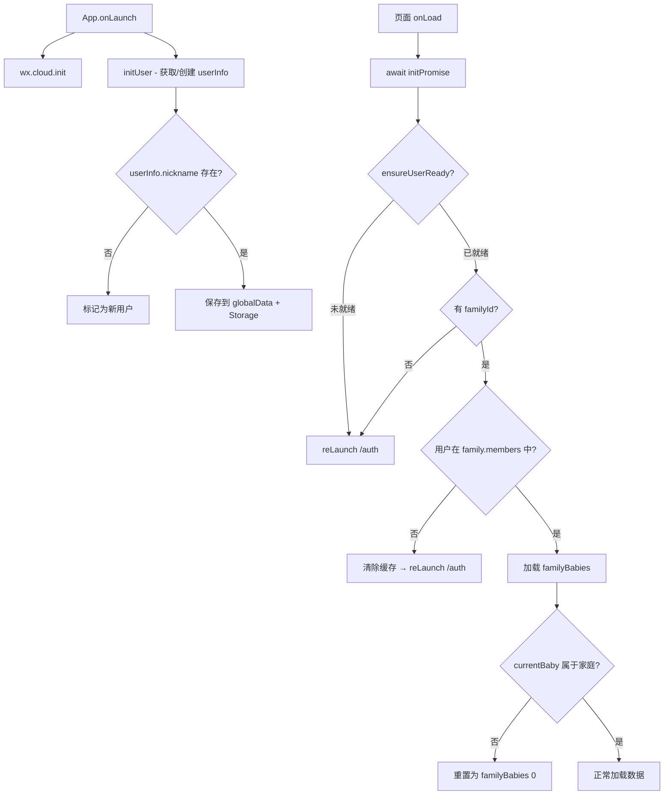

# 设计文档 - AI 屏蔽 & 分享用户认证加固（AI Shield & Share Auth Hardening）

> 版本：v3.1 | 日期：2026-04-15 | 状态：已确认

## 一、架构概览

### 1.1 整体架构图



### 1.2 技术栈表

| 层级 | 技术 | 备注 |
|------|------|------|
| 身份识别 | 微信云开发 `_openid` 自动注入 | 无需手动获取 |
| 用户管理 | CloudBase NoSQL `users` 集合 | 安全规则：创建者可读写 |
| 家庭数据 | CloudBase NoSQL `families` 集合 | 安全规则：创建者可写，所有人可读 |
| 前端校验 | `app.js#ensureUserReady()` | 各页面统一调用 |
| AI 屏蔽 | 代码级入口移除 | 不引入运行时开关 |

---

## 二、数据流设计

### 2.1 分享链接打开流程（重设计后）

```
用户点击分享链接（path: /pages/home/home）
    │
    ▼
App.onLaunch()
    ├─ wx.cloud.init()
    └─ initUser() → 查询 users 集合
        ├─ 已有记录 → 返回 userInfo（含 _id, nickname, familyId）
        └─ 无记录 → 创建新用户（nickname 为空）
    │
    ▼
home.js onLoad() → init()
    ├─ await app.globalData.initPromise
    ├─ userInfo = StorageUtil.getUserInfo()
    │
    ├─ 检查点 1: userInfo 存在且 nickname 不为空?
    │   └─ 否 → redirectTo('/pages/auth/auth') ← 新用户强制引导
    │
    ├─ 检查点 2: userInfo.familyId 存在?
    │   └─ 否 → redirectTo('/pages/auth/auth') ← 未加入家庭
    │
    ├─ 检查点 3: 查询 familyInfo，验证 members 包含 userInfo._id
    │   └─ 否 → 清除缓存 → redirectTo('/pages/auth/auth') ← 被踢出
    │
    ├─ 检查点 4: getBabiesByFamilyId(familyInfo._id)
    │   └─ 空 → redirectTo('/pages/baby-create/baby-create')
    │
    ├─ 检查点 5: currentBaby 属于 familyBabies?
    │   └─ 否 → currentBaby = familyBabies[0]
    │
    └─ 通过所有检查 → loadData()
```

### 2.2 邀请码分享链接流程（重设计后）

```
用户点击邀请码分享（path: /pages/auth/auth?inviteCode=XXXXXX）
    │
    ▼
auth.js onLoad(options)
    ├─ 保存 inviteCode 到 data
    └─ tryAutoLogin()
        │
        ├─ getUserInfo() 获取/创建用户
        │
        ├─ 有 nickname（老用户）?
        │   ├─ 有 inviteCode?
        │   │   ├─ 是 → validateInviteCode()
        │   │   │   ├─ 已是该家庭成员 → Toast("已是成员") → switchTab(/home)
        │   │   │   ├─ 有效 → showModal("是否加入 XX 家庭?")
        │   │   │   │   ├─ 确认 → joinByInviteCode() → switchTab(/home)
        │   │   │   │   └─ 取消 → switchTab(/home)（回自己家庭）
        │   │   │   └─ 无效/过期 → Toast("邀请码无效") → switchTab(/home)
        │   │   └─ 否 → switchTab(/home)（正常自动登录）
        │   └─ 无 inviteCode → switchTab(/home)
        │
        └─ 无 nickname（新用户）
            └─ 显示引导流程（步骤1: 欢迎页）
                └─ 完成引导后，如有 inviteCode → 自动加入家庭
```

---

## 三、各模块详细设计

### 3.1 FR-1：AI 能力全面屏蔽

#### 3.1.1 首页 AI 洞察屏蔽

**home.js 修改：**
```javascript
// 删除 loadAiInsight() 的调用（约第 532-535 行）
// 原代码：
// if (totalTodayCount > 0) {
//   this.loadAiInsight();
// }
// 改为：不调用（直接删除这 3 行）
```

**home.wxml 修改：**
```xml
<!-- 删除整个 AI 洞察区块（约第 249-279 行） -->
<!-- 原来的 insight-v4 区域全部移除 -->
```

#### 3.1.2 发现页 AI 入口移除

**discover.js 修改：**
```javascript
// toolItems 数组移除最后一项 AI 助手
// 从 4 个变为 3 个
toolItems: [
  { /* 疫苗追踪 */ },
  { /* 生长曲线 */ },
  { /* 发育里程碑 */ }
  // AI 助手项移除
]
```

#### 3.1.3 成长报告 AI 建议屏蔽

**report-popup.wxml 修改：**
```xml
<!-- 移除 AI 育儿建议卡片（第 201-208 行） -->
```

**report-popup.js 修改：**
```javascript
// generateAIComment() 方法保留但不调用
// buildReport() 中跳过 aiComment 赋值
// briefAIAdvice 设为空字符串
```

**share-canvas.js 修改：**
```javascript
// _drawAIAdvice() 方法保留但 _drawAllModules() 中跳过调用
// 高度计算中排除 AI 建议区域
```

#### 3.1.4 引导页 AI 介绍移除

**guide.js 修改：**
```javascript
// guides 数组移除 AI 助手板块（第 55-63 行的对象）
```

#### 3.1.5 AI 助手页面处理

**ai-assistant.js 修改：**
```javascript
// 在 onLoad 中增加功能关闭提示
onLoad() {
  wx.showModal({
    title: '功能暂未开放',
    content: 'AI 育儿助手功能正在升级中，敬请期待。',
    showCancel: false,
    success: () => {
      wx.navigateBack();
    }
  });
}
```

---

### 3.2 FR-2 + FR-3：统一用户校验与路由分发

#### 3.2.1 app.js 新增 ensureUserReady()（Review R2 加强版）

```javascript
/**
 * 统一用户就绪检查（含缓存穿透机制）
 * 各页面 init() 中调用，返回校验结果
 * 
 * @returns {Object} { ready, userInfo, familyInfo, redirectUrl, reason }
 */
async ensureUserReady() {
  // 1. 等待 initUser 完成
  if (this.globalData.initPromise) {
    await this.globalData.initPromise;
  }
  
  // 2. 获取用户信息
  const userInfo = StorageUtil.getUserInfo();
  if (!userInfo || !userInfo._id || !userInfo.nickname) {
    return { ready: false, redirectUrl: '/pages/auth/auth' };
  }
  
  // 3. 检查家庭信息
  if (!userInfo.familyId) {
    return { ready: false, redirectUrl: '/pages/auth/auth' };
  }
  
  // 4. 获取 familyInfo（含缓存穿透）
  let familyInfo = StorageUtil.getFamilyInfo();
  const lastFetchTs = StorageUtil.get('_family_fetch_ts') || 0;
  const REFRESH_INTERVAL = 5 * 60 * 1000; // 5 分钟
  const needsRefresh = !familyInfo 
    || familyInfo._id !== userInfo.familyId 
    || (Date.now() - lastFetchTs > REFRESH_INTERVAL);
  
  if (needsRefresh) {
    try {
      // D-1: 使用 getInstance 避免重复实例化
      const FamilyService = require('./services/family');
      const familyService = FamilyService.getInstance();
      const freshFamily = await familyService.getFamilyDetail(userInfo.familyId);
      
      if (freshFamily) {
        familyInfo = freshFamily;
        StorageUtil.saveFamilyInfo(freshFamily);
        StorageUtil.set('_family_fetch_ts', Date.now());
      } else {
        // 家庭已被解散
        this._clearFamilyData(userInfo);
        return { ready: false, redirectUrl: '/pages/auth/auth', reason: 'family_dissolved' };
      }
    } catch (err) {
      // 网络失败：如果有缓存就降级使用，没缓存则报错
      if (!familyInfo) {
        return { ready: false, redirectUrl: '/pages/auth/auth', reason: 'network_error' };
      }
      // 有缓存，降级使用（不阻断使用）
    }
  }
  
  if (!familyInfo) {
    return { ready: false, redirectUrl: '/pages/auth/auth' };
  }
  
  // 5. 验证用户仍在家庭成员中
  if (!familyInfo.members || !familyInfo.members.includes(userInfo._id)) {
    this._clearFamilyData(userInfo);
    return { ready: false, redirectUrl: '/pages/auth/auth', reason: 'removed' };
  }
  
  return { ready: true, userInfo, familyInfo };
},

/**
 * onShow 轻量校验（FR-5.6）
 * TabBar 页面 onShow 中调用，仅检查缓存时效性
 * 不发起网络请求，仅在缓存过期时标记需要在下次 init 中刷新
 * 
 * @returns {boolean} 是否需要强制重新 init
 */
checkFamilyStale() {
  const userInfo = StorageUtil.getUserInfo();
  if (!userInfo || !userInfo.familyId) return true;
  
  const familyInfo = StorageUtil.getFamilyInfo();
  if (!familyInfo) return true;
  
  // 检查缓存时效
  const lastFetchTs = StorageUtil.get('_family_fetch_ts') || 0;
  const REFRESH_INTERVAL = 5 * 60 * 1000;
  return (Date.now() - lastFetchTs > REFRESH_INTERVAL);
},

/**
 * 清除家庭相关本地数据
 * @private
 */
_clearFamilyData(userInfo) {
  StorageUtil.saveFamilyInfo(null);
  StorageUtil.saveCurrentBaby(null);
  StorageUtil.remove('_family_fetch_ts');
  const updated = { ...userInfo };
  delete updated.familyId;
  delete updated.familyRole;
  StorageUtil.saveUserInfo(updated);
  // D-3: 同步到 globalData
  this.globalData.userInfo = updated;
  this.globalData.familyInfo = null;
  this.globalData.currentBaby = null;
}
```

**TabBar 页面 onShow 轻量校验使用模式（FR-5.6）：**

```javascript
// home.js / record.js 的 onShow 中增加
onShow() {
  this._applyTheme();
  
  // FR-5.6: 轻量校验 — 缓存过期时强制重新 init
  const app = getApp();
  if (app.checkFamilyStale()) {
    this.init(); // 重新走完整 ensureUserReady 流程
    return;
  }
  
  // 原有节流逻辑...
  const now = Date.now();
  if (this._lastLoadTime && now - this._lastLoadTime < 30000) return;
  this._lastLoadTime = now;
  this.loadData();
}
```

#### 3.2.2 页面统一使用模式（Review R1 加强：覆盖全部页面）

```javascript
// 所有页面（TabBar + 分包）的 init() 统一模式
// Review R2-2: 统一使用 reLaunch 而非 redirectTo
async init() {
  const app = getApp();
  const check = await app.ensureUserReady();
  
  if (!check.ready) {
    if (check.reason === 'removed') {
      wx.showModal({
        title: '提示',
        content: '您已被移除出该家庭，请重新加入或创建新家庭。',
        showCancel: false,
        success: () => wx.reLaunch({ url: check.redirectUrl })
      });
    } else {
      wx.reLaunch({ url: check.redirectUrl });
    }
    return;
  }
  
  const { userInfo, familyInfo } = check;
  // 继续正常初始化...
}
```

**需覆盖的页面清单（共 16 个，auth 除外）：**

| 页面分类 | 页面 | 当前状态 | 改动说明 |
|----------|------|----------|----------|
| **TabBar** | home.js | ✅ 已有校验 | 重构为调用 ensureUserReady() |
| **TabBar** | record.js | ⚠️ 仅检查 baby | 增加 ensureUserReady() |
| **TabBar** | discover.js | ⚠️ 仅检查 baby，且缺 initPromise | 增加 ensureUserReady() |
| **TabBar** | profile.js | ❌ 无校验，缺 initPromise | 增加 ensureUserReady() |
| **主包** | baby-create.js | ⚠️ 部分校验 | 增加 ensureUserReady() |
| **主包** | baby-list.js | ❌ 无校验 | 增加 ensureUserReady() |
| **主包** | guide.js | ❌ 无校验（低风险） | 增加轻量校验 |
| **Growth 分包** | growth.js | ❌ 无校验 | 增加 ensureUserReady() |
| **Growth 分包** | vaccine.js | ❌ 无校验 | 增加 ensureUserReady() |
| **Growth 分包** | milestone.js | ❌ 无校验 | 增加 ensureUserReady() |
| **Growth 分包** | baby-detail.js | ❌ 无校验，接收任意 id | 增加 ensureUserReady() + familyId 归属校验 |
| **Social 分包** | family.js | ❌ 无校验 | 增加 ensureUserReady() |
| **Social 分包** | family-join.js | ❌ 无校验 | 增加 ensureUserReady() |
| **Social 分包** | export.js | ❌ 无校验 | 增加 ensureUserReady() |
| **Social 分包** | settings.js | ❌ 无校验 | 增加 ensureUserReady() |
| **Social 分包** | ai-assistant.js | ❌ 无校验 | FR-1 已处理（功能关闭提示） |

---

### 3.3 FR-4：邀请码分享链接处理优化

**auth.js tryAutoLogin() 重设计：**

```javascript
async tryAutoLogin() {
  this.setData({ loading: true, loadingText: '加载中...' });
  
  try {
    const authService = new AuthService();
    const userInfo = await authService.getUserInfo();
    
    if (userInfo && userInfo.nickname) {
      // 老用户
      StorageUtil.saveUserInfo(userInfo);
      getApp().globalData.userInfo = userInfo;
      
      // ★ 新增：优先处理邀请码
      if (this.data.inviteCode) {
        await this._handleInviteCodeForExistingUser(userInfo);
        return;
      }
      
      // 无邀请码，正常自动登录
      if (userInfo.familyId) {
        await this.loadFamilyInfo(userInfo.familyId);
      }
      await this.loadCurrentBaby();
      wx.switchTab({ url: '/pages/home/home' });
      return;
    }
    
    // 新用户，显示引导流程
    // ...（保持原逻辑不变）
  } catch (error) {
    // ...
  }
}

// 新增方法
async _handleInviteCodeForExistingUser(userInfo) {
  const familyService = new FamilyService();
  
  try {
    const validation = await familyService.validateInviteCode(this.data.inviteCode);
    
    if (!validation.valid) {
      wx.showToast({ title: validation.reason, icon: 'none' });
      this._goToHome(userInfo);
      return;
    }
    
    // 检查是否已是该家庭成员
    if (userInfo.familyId === validation.familyId) {
      wx.showToast({ title: '您已是该家庭成员', icon: 'success' });
      this._goToHome(userInfo);
      return;
    }
    
    // 弹窗确认是否加入
    const hasExistingFamily = !!userInfo.familyId;
    let content = `是否加入「${validation.familyName}」家庭？`;
    if (hasExistingFamily) {
      content += '\n注意：加入新家庭将离开当前家庭';
    }
    
    const res = await wx.showModal({
      title: '加入家庭',
      content,
      confirmText: '加入'
    });
    
    if (res.confirm) {
      // Review R2-3: 如果已有家庭，先退出（处理唯一管理员边界）
      if (hasExistingFamily) {
        const leaveResult = await familyService.leaveFamily(userInfo.familyId, userInfo._id);
        if (!leaveResult.success && leaveResult.needTransfer) {
          // 唯一管理员不能直接退出
          wx.showModal({
            title: '无法加入',
            content: '您是当前家庭的唯一管理员，请先在「家庭管理」中转让管理员权限，再加入新家庭。',
            showCancel: false
          });
          this._goToHome(userInfo);
          return;
        }
      }
      await this.setData({ inviteCode: this.data.inviteCode });
      await this.joinFamily();
    } else {
      this._goToHome(userInfo);
    }
  } catch (error) {
    console.error('处理邀请码失败:', error);
    wx.showToast({ title: '邀请码处理失败', icon: 'none' });
    this._goToHome(userInfo);
  }
}

// D-7: _goToHome 辅助方法实现
async _goToHome(userInfo) {
  this.setData({ loading: false, isAutoLoggingIn: false });
  if (userInfo.familyId) {
    await this.loadFamilyInfo(userInfo.familyId);
  }
  await this.loadCurrentBaby();
  wx.switchTab({ url: '/pages/home/home' });
}
```

**FR-9.5：createFamily 检查已有家庭：**

```javascript
// auth.js createFamily() 头部增加检查
async createFamily() {
  const userInfo = StorageUtil.getUserInfo();
  if (userInfo && userInfo.familyId) {
    wx.showModal({
      title: '提示',
      content: '您已属于一个家庭，创建新家庭将离开当前家庭。是否继续？',
      success: async (res) => {
        if (res.confirm) {
          const familyService = new FamilyService();
          const leaveResult = await familyService.leaveFamily(userInfo.familyId, userInfo._id);
          if (!leaveResult.success && leaveResult.needTransfer) {
            wx.showToast({ title: '请先转让管理权限', icon: 'none' });
            return;
          }
          // 清除旧家庭后继续创建
          await this._doCreateFamily();
        }
      }
    });
    return;
  }
  await this._doCreateFamily();
}
// 原 createFamily 逻辑提取到 _doCreateFamily()
```

---

### 3.4 FR-6：userId 标识统一

**record.js 修改关键点（Review R3-1 修正）：**

```javascript
// 原代码（双重错误）：
// 1. members 是 string[]，不是 Object[]，.find(m => m.userId) 永远返回 undefined
// 2. 使用 openid 而非 _id
const familyMember = familyInfo?.members?.find(m => m.userId === userInfo?.openid);
createdBy: { userId: userInfo?.openid || '', ... }

// 修改为（使用 memberDetails + _id）：
const familyMember = familyInfo?.memberDetails?.find(m => m.userId === userInfo?._id);
createdBy: { userId: userInfo?._id || '', ... }
creatorId: userInfo?._id || null,
```

**family.js 第 50 行修正（Review R3-2）：**

```javascript
// 原代码：
currentUserId: userInfo?._id || userInfo?.openid || ''
// 修改为：
currentUserId: userInfo?._id || ''
```

**PermissionUtil.canDeleteRecord() 兼容处理（Review R3-3）：**

```javascript
static canDeleteRecord(userId, family, record) {
  const role = this.getUserRole(userId, family);
  if (role === 'viewer') return false;
  if (role === 'admin') return true;
  
  // Editor: 兼容新旧 userId 格式
  const recordCreatorId = record.createdBy?.userId || record.creatorId || '';
  // 同时匹配 _id 和可能的旧 openid 格式
  return recordCreatorId === userId;
  // 注：旧记录的 creatorId 可能是 openid 格式，此时比较会失败
  // 这是可接受的降级：editor 无法删除旧格式记录，admin 仍可删除
}
```

---

### 3.5 FR-7：分包页面登录守卫（Review R1 新增）

所有分包页面统一在 `onLoad` 头部增加 `ensureUserReady()` 调用。以 `growth.js` 为例：

```javascript
// packageGrowth/pages/growth/growth.js
onLoad() {
  this._lastShowTime = 0;
  this._initPromise = this._guardedInit();
},

async _guardedInit() {
  const app = getApp();
  const check = await app.ensureUserReady();
  if (!check.ready) {
    wx.reLaunch({ url: check.redirectUrl || '/pages/auth/auth' });
    return;
  }
  // 原有初始化逻辑
  this.loadBabyInfo(() => {
    this.loadGrowthRecords();
  });
}
```

**baby-detail.js 额外的归属校验：**

```javascript
async loadBaby(babyId) {
  const babyService = new BabyService();
  const baby = await babyService.getBabyById(babyId);
  
  // Review R1-2: 归属校验
  const userInfo = StorageUtil.getUserInfo();
  if (baby.familyId !== userInfo?.familyId) {
    wx.showToast({ title: '无权限查看', icon: 'none' });
    setTimeout(() => wx.navigateBack(), 1000);
    return;
  }
  
  // 原有逻辑...
}
```

---

## 四、CSS 变量规范

本次迭代不涉及新增 CSS 变量，无 UI 新设计。

---

## 五、文件变更清单

| 文件路径 | 改动类型 | 主要变更说明 |
|----------|----------|-------------|
| `miniprogram/app.js` | 增量 | 新增 `ensureUserReady()` + `_clearFamilyData()` |
| `miniprogram/pages/home/home.js` | 小改 | 移除 AI 洞察，重构 init 使用 ensureUserReady |
| `miniprogram/pages/home/home.wxml` | 小改 | 移除 AI 洞察区块 |
| `miniprogram/pages/record/record.js` | 小改 | 增加 ensureUserReady + baby 归属校验 |
| `miniprogram/pages/discover/discover.js` | 小改 | 移除 AI 入口，增加 ensureUserReady |
| `miniprogram/pages/profile/profile.js` | 小改 | 增加 ensureUserReady |
| `miniprogram/pages/auth/auth.js` | 大改 | 重构邀请码流程，增加唯一管理员边界 |
| `miniprogram/pages/guide/guide.js` | 小改 | 移除 AI 介绍 |
| `miniprogram/pages/baby-create/baby-create.js` | 小改 | 增加 userInfo 验证 |
| `miniprogram/pages/baby-list/baby-list.js` | 小改 | 增加 ensureUserReady |
| `miniprogram/packageGrowth/pages/growth/growth.js` | 小改 | 增加登录守卫 |
| `miniprogram/packageGrowth/pages/vaccine/vaccine.js` | 小改 | 增加登录守卫 |
| `miniprogram/packageGrowth/pages/milestone/milestone.js` | 小改 | 增加登录守卫 |
| `miniprogram/packageGrowth/pages/baby-detail/baby-detail.js` | 小改 | 增加登录守卫 + familyId 归属校验 |
| `miniprogram/packageSocial/pages/family/family.js` | 小改 | 增加登录守卫 + 修正 currentUserId |
| `miniprogram/packageSocial/pages/family-join/family-join.js` | 小改 | 增加登录守卫 |
| `miniprogram/packageSocial/pages/export/export.js` | 小改 | 增加登录守卫 |
| `miniprogram/packageSocial/pages/settings/settings.js` | 小改 | 增加登录守卫 |
| `miniprogram/components/report-popup/report-popup.js` | 小改 | 屏蔽 AI 评语 |
| `miniprogram/components/report-popup/report-popup.wxml` | 小改 | 移除 AI 卡片 |
| `miniprogram/services/share-canvas.js` | 小改 | 跳过 AI 建议绘制 |
| `miniprogram/services/record.js` | 小改 | userId → _id + memberDetails 查找 |
| `miniprogram/services/family.js` | 大改 | joinByInviteCode 安全加固 + dissolveFamily 成员清理 + updateMemberRole 乐观锁 + _clearUserFamilyInfo 修正 |
| `miniprogram/utils/permission.js` | 小改 | canDeleteRecord 兼容新旧 userId |
| `miniprogram/packageSocial/pages/ai-assistant/ai-assistant.js` | 小改 | 功能关闭提示 |

---

## 六、关键设计决策

### 决策 1：AI 屏蔽策略——移除入口 vs 运行时开关

- **方案 A（选定）：移除入口，保留代码文件**
- **方案 B（弃用）：全局运行时开关**
- **理由**：方案 A 更简洁，不引入运行时开销

### 决策 2：用户校验位置——app.js 统一函数 vs 各页面独立

- **方案 A（选定）：app.js 提供 `ensureUserReady()`，各页面调用**
- **方案 B（弃用）：各页面独立实现**
- **理由**：DRY 原则，16 个页面统一模式

### 决策 3：分享路径策略——携带参数 vs 纯净路径

- **方案 A（选定）：分享路径不携带 babyId/familyId**
- **方案 B（弃用）：携带 familyId**
- **理由**：安全优先，避免 ID 泄露

### 决策 4（Review R2 新增）：校验失败跳转——redirectTo vs reLaunch

- **方案 A（选定）：统一使用 `wx.reLaunch('/pages/auth/auth')`**
  - 清空页面栈，避免从 auth 完成后返回残留的未校验页面
  - 用户从 auth 完成后通过 switchTab 进入干净的首页
- **方案 B（弃用）：使用 `wx.redirectTo`**
  - TabBar 页面替换可能失败，分包页面残留在栈中
- **理由**：reLaunch 保证页面栈干净

### 决策 5（Review R2 新增）：familyInfo 缓存策略——纯缓存 vs 定时穿透

- **方案 A（选定）：5 分钟定时穿透刷新**
  - 缓存 5 分钟内直接使用，超过则强制从云端拉取
  - 网络失败时降级使用缓存
- **方案 B（弃用）：仅在 familyId 不匹配时刷新**
  - 被踢出场景下 familyId 仍匹配，永远不会刷新
- **理由**：被踢出检测需要新数据，5 分钟是性能与安全的合理平衡

### 决策 6（Review R4 新增）：多家庭架构——本次单家庭 vs 全面重构

- **方案 A（选定）：保持单家庭模型，修复加入安全问题**
  - `users.familyId` 保持 string 单值
  - `joinByInviteCode` 增加旧家庭清理逻辑
  - 多家庭支持延后到 v4.2 独立 spec
- **方案 B（延后）：改造为多家庭模型**
  - `users.familyIds: string[]` + `users.familyRoles: { [familyId]: role }`
  - 估计 15-20h 工时，远超本次范围
- **理由**：先确保单家庭模型的数据一致性，为多家庭重构奠定安全基础

### 决策 7（Review R5 新增）：memberDetails 并发处理策略

- **方案 A（选定）：重试 + 告警**
  - `updateMemberRole`/`transferAdmin` 保持读-改-写模式
  - 写入前检查 `updatedAt` 是否变化，变化则重新读取重试（最多 2 次）
  - 并发冲突时记录告警日志
- **方案 B（弃用）：迁移到云函数做原子操作**
  - 需要新建云函数，改动范围大
- **理由**：家庭管理操作频率极低（每周甚至每月一次），并发概率极小，重试方案投入产出比最优

---

## 七、FR-9/10/11 详细设计（Review R4-R6 新增）

### 7.1 FR-9：joinByInviteCode 安全加固

```javascript
async joinByInviteCode(inviteCode, memberInfo) {
  const { userId, userName, relation } = memberInfo;
  
  // ... 邀请码验证（保持不变）...
  
  // ★ 新增：检查用户是否已属于其他家庭
  const existingFamily = await this.getFamilyByUserId(userId);
  if (existingFamily && existingFamily._id !== family._id) {
    // 检查是否是唯一管理员
    if (PermissionUtil.isAdmin(userId, existingFamily) 
        && !PermissionUtil.hasOtherAdmin(existingFamily, userId)) {
      throw new Error('您是当前家庭的唯一管理员，请先转让管理权限或解散旧家庭再加入新家庭');
    }
    // D-4: 先从旧家庭移除，如果后续加入新家庭失败，用户变成无家庭状态
    // 这是可接受的降级——用户下次打开会被引导到 auth 页重新加入
    await this._removeSelfFromFamily(existingFamily._id, userId);
  }
  
  // ... 添加到新家庭（保持不变）...
}
```

### 7.2 FR-10：dissolveFamily 成员清理

```javascript
async dissolveFamily(familyId, userId) {
  const family = await this.getFamilyDetail(familyId);
  if (family.creatorId !== userId) {
    throw new Error('只有创建者才能解散家庭');
  }
  
  // D-6: 先删除家庭文档，再清理成员
  // 这样其他成员读取时会立即得到"家庭不存在"，触发 home.js 降级处理
  await this.familyCollection.doc(familyId).remove();
  
  // ★ 异步批量清除所有成员的 familyId/familyRole（不阻断）
  if (family.members && family.members.length > 0) {
    for (const memberId of family.members) {
      try {
        await this.userCollection.doc(memberId).update({
          data: {
            familyId: this.db.command.remove(),
            familyRole: this.db.command.remove(),
            updatedAt: new Date().toISOString()
          }
        });
      } catch (err) {
        console.warn(`清除成员 ${memberId} 家庭信息失败:`, err);
        // 不阻断——成员下次打开时 ensureUserReady 会检测到家庭不存在并清理
      }
    }
  }
}
```

### 7.3 FR-11：updateMemberRole 同步 + 乐观锁重试

```javascript
async updateMemberRole(familyId, userId, targetUserId, role, _retryCount = 0) {
  const family = await this.getFamilyDetail(familyId);
  if (family.creatorId !== userId) {
    throw new Error('只有创建者才能修改成员权限');
  }
  
  const memberDetails = family.memberDetails.map(m => {
    if (m.userId === targetUserId) return { ...m, role };
    return m;
  });
  
  // D-5: 乐观锁——写入时校验 updatedAt 未变化
  const prevUpdatedAt = family.updatedAt;
  
  try {
    const result = await this.familyCollection.doc(familyId).update({
      data: {
        memberDetails,
        updatedAt: new Date().toISOString()
      }
    });
    
    // 如果 stats.updated === 0 说明文档被并发修改，需重试
    if (result.stats && result.stats.updated === 0 && _retryCount < 2) {
      console.warn('[updateMemberRole] 并发冲突，重试', _retryCount + 1);
      return this.updateMemberRole(familyId, userId, targetUserId, role, _retryCount + 1);
    }
  } catch (err) {
    if (_retryCount < 2) {
      console.warn('[updateMemberRole] 写入失败，重试', _retryCount + 1);
      return this.updateMemberRole(familyId, userId, targetUserId, role, _retryCount + 1);
    }
    throw err;
  }
  
  // ★ 同步 users.familyRole
  try {
    await this.userCollection.doc(targetUserId).update({
      data: { familyRole: role, updatedAt: new Date().toISOString() }
    });
  } catch (err) {
    console.warn('同步用户角色失败:', err);
  }
}
```

### 7.4 _clearUserFamilyInfo 修正

```javascript
// 原代码使用 where({ _openid: userId })，可能匹配不到
// 修改为使用 doc(userId).update（直接按 _id 更新）
async _clearUserFamilyInfo(userId) {
  try {
    await this.userCollection.doc(userId).update({
      data: {
        familyId: this.db.command.remove(),
        familyRole: this.db.command.remove(),
        updatedAt: new Date().toISOString()
      }
    });
  } catch (err) {
    console.warn('清除用户家庭信息失败:', err);
  }
}
```

> 注意：`removeMember` 中清除被移除用户的逻辑也需从 `where({ _openid })` 改为 `doc(targetUserId).update`。
