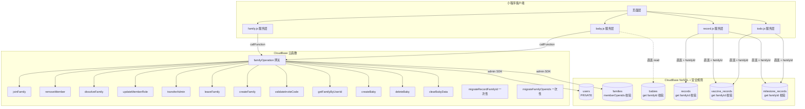

# 设计文档 - 云函数网关 & 安全规则治理（Cloud Function Gateway & Security Rule Governance）

> 版本：v1.1 | 日期：2026-04-17 | 状态：待确认

## 一、架构概览

### 1.1 整体架构图



### 1.2 技术栈表

| 层级 | 技术 | 备注 |
|------|------|------|
| 身份识别（写操作） | `cloud.getWXContext().OPENID` | 云函数内，不可伪造 |
| 身份识别（读操作） | CloudBase 安全规则 `auth.openid` | 自动注入 |
| 家庭成员校验 | `families.memberOpenids[]` | 安全规则 `auth.openid in doc.memberOpenids` |
| 跨集合校验 | `get('database.families.' + doc.familyId)` | 安全规则内置函数 |
| 跨用户写 | `familyOperation` 云函数 | admin SDK 绕过安全规则 |
| 客户端读 | 直连数据库 + 安全规则校验 | 无需经过云函数 |

---

## 二、数据流设计

### 2.1 写操作数据流（跨用户）

```
客户端 family.js
    │
    │  wx.cloud.callFunction({
    │    name: 'familyOperation',
    │    data: { action: 'joinFamily', params: { inviteCode, userName, relation } }
    │  })
    │
    ▼
familyOperation 云函数
    │
    ├─ 1. getWXContext().OPENID → 获取调用者 openid
    ├─ 2. users.where({ _openid: OPENID }) → 获取 userId (_id)
    ├─ 3. 权限校验（isAdmin / creatorId / 成员归属等）
    ├─ 4. 业务逻辑（push/pull members、更新 users.familyId 等）
    ├─ 5. 同步维护 memberOpenids（push/pull openid）
    │
    ▼
返回 { success: true/false, data/error }
    │
    ▼
客户端接收结果 → 更新本地缓存 → 刷新 UI
```

### 2.2 读操作数据流（安全规则校验）

```
客户端 record.js
    │
    │  db.collection('records')
    │    .where({ babyId, familyId, ... })  ← 必须附加 familyId
    │    .get()
    │
    ▼
CloudBase 安全规则引擎
    │
    ├─ 1. 提取查询条件中的 familyId
    ├─ 2. get('database.families.' + familyId) → 获取 family 文档
    ├─ 3. 检查 auth.openid in family.memberOpenids
    │     ├─ 通过 → 执行查询，返回结果
    │     └─ 拒绝 → PERMISSION_DENIED
    │
    ▼
返回查询结果或权限错误
```

### 2.3 存量数据迁移流程

```
Phase 2 执行顺序：

1. 部署 migrateFamilyOpenids 云函数
   │
   ▼
2. 执行：遍历 families → 查 members 对应的 users._openid → 写入 memberOpenids
   │
   ▼
3. 验证：所有 families 文档有 memberOpenids 字段
   │
   ▼
4. 部署 migrateRecordFamilyId 云函数
   │
   ▼
5. 执行：遍历 records → 通过 babyId 查 babies.familyId → 写入 familyId
   │
   ▼
6. 验证：所有 records 文档有 familyId 字段
   │
   ▼
7. ⚠️ 确认全量覆盖后，才能配置安全规则
```

---

## 三、各模块详细设计

### 3.1 FR-1: 云函数 `familyOperation` 基础框架

**文件**：`cloudfunctions/familyOperation/index.js`

```javascript
const cloud = require('wx-server-sdk');
cloud.init({ env: cloud.DYNAMIC_CURRENT_ENV });

const db = cloud.database();
const _ = db.command;

// 限流 Map（实例级别，重启清零）
const rateLimitMap = new Map();

exports.main = async (event, context) => {
  const { OPENID } = cloud.getWXContext();
  const { action, params = {} } = event;

  try {
    // 1. 通过 OPENID 获取用户信息
    const userRes = await db.collection('users')
      .where({ _openid: OPENID })
      .limit(1)
      .get();
    
    if (userRes.data.length === 0) {
      return { success: false, error: { code: 'USER_NOT_FOUND', message: '用户不存在' } };
    }
    
    const user = userRes.data[0];
    const userId = user._id;

    // 2. 分发 action
    switch (action) {
      case 'createFamily':
        return await createFamily(db, _, userId, OPENID, user, params);
      case 'joinFamily':
        return await joinFamily(db, _, userId, OPENID, user, params);
      case 'removeMember':
        return await removeMember(db, _, userId, OPENID, params);
      case 'dissolveFamily':
        return await dissolveFamily(db, _, userId, OPENID, params);
      case 'updateMemberRole':
        return await updateMemberRole(db, _, userId, OPENID, params);
      case 'transferAdmin':
        return await transferAdmin(db, _, userId, OPENID, params);
      case 'leaveFamily':
        return await leaveFamily(db, _, userId, OPENID, params);
      case 'refreshInviteCode':
        return await refreshInviteCode(db, _, userId, OPENID, params);
      case 'validateInviteCode':
        return await validateInviteCode(db, _, userId, OPENID, params);
      case 'getFamilyByUserId':
        return await getFamilyByUserId(db, _, userId, OPENID);
      case 'createBaby':
        return await createBaby(db, _, userId, OPENID, params);
      case 'deleteBaby':
        return await deleteBaby(db, _, userId, OPENID, params);
      case 'clearBabyData':
        return await clearBabyData(db, _, userId, OPENID, params);
      default:
        return { success: false, error: { code: 'INVALID_ACTION', message: `未知操作: ${action}` } };
    }
  } catch (error) {
    console.error(`[familyOperation] action=${action} error:`, error);
    return {
      success: false,
      error: { code: 'INTERNAL_ERROR', message: error.message || '服务器内部错误' }
    };
  }
};
```

**package.json**：
```json
{
  "name": "familyOperation",
  "version": "1.0.0",
  "dependencies": {
    "wx-server-sdk": "~2.6.3"
  }
}
```

**config.json**：
```json
{
  "permissions": {
    "openapi": []
  },
  "timeout": 20
}
```

---

### 3.2 FR-2: `joinFamily` action

从 `family.js` 第 81-152 行平移，增加 `memberOpenids` 维护和限流。

```javascript
async function joinFamily(db, _, userId, openid, user, params) {
  const { inviteCode, userName, relation } = params;

  // 限流：60s 内最多 5 次
  const limitKey = `invite_${openid}`;
  const now = Date.now();
  const attempts = rateLimitMap.get(limitKey) || [];
  const recentAttempts = attempts.filter(ts => now - ts < 60000);
  if (recentAttempts.length >= 5) {
    return { success: false, error: { code: 'RATE_LIMITED', message: '验证次数过多，请1分钟后再试' } };
  }
  recentAttempts.push(now);
  rateLimitMap.set(limitKey, recentAttempts);

  // 1. 查询家庭
  const familyRes = await db.collection('families')
    .where({ inviteCode: inviteCode.toUpperCase() })
    .get();

  if (familyRes.data.length === 0) {
    return { success: false, error: { code: 'INVALID_CODE', message: '邀请码无效' } };
  }

  const family = familyRes.data[0];

  // 2. 检查过期
  if (family.inviteCodeExpiry && new Date(family.inviteCodeExpiry) < new Date()) {
    return { success: false, error: { code: 'CODE_EXPIRED', message: '邀请码已过期' } };
  }

  // 3. 检查是否已是成员
  if (family.members && family.members.includes(userId)) {
    return { success: false, error: { code: 'ALREADY_MEMBER', message: '已经是家庭成员' } };
  }

  // 4. [v4.1 FR-9] 幽灵成员防护
  const existingFamilyRes = await db.collection('families')
    .where({ members: userId })
    .limit(1)
    .get();

  if (existingFamilyRes.data.length > 0) {
    const existingFamily = existingFamilyRes.data[0];
    if (existingFamily._id !== family._id) {
      // 检查是否唯一管理员
      const memberDetail = existingFamily.memberDetails?.find(m => m.userId === userId);
      const isAdmin = memberDetail?.role === 'admin';
      const hasOtherAdmin = existingFamily.memberDetails?.some(
        m => m.role === 'admin' && m.userId !== userId
      );

      if (isAdmin && !hasOtherAdmin) {
        return {
          success: false,
          error: { code: 'SOLE_ADMIN', message: '您是当前家庭的唯一管理员，请先转让管理权限或解散旧家庭再加入新家庭' }
        };
      }

      // 从旧家庭移除
      await db.collection('families').doc(existingFamily._id).update({
        data: {
          members: _.pull(userId),
          memberDetails: _.pull({ userId }),
          memberOpenids: _.pull(openid),
          updatedAt: new Date().toISOString()
        }
      });

      // 清除用户的旧家庭信息
      await db.collection('users').doc(userId).update({
        data: {
          familyId: _.remove(),
          familyRole: _.remove(),
          updatedAt: new Date().toISOString()
        }
      });
    }
  }

  // 5. 加入新家庭
  const nowStr = new Date().toISOString();
  const newMemberDetail = {
    userId,
    name: userName,
    relation: relation || '家人',
    role: 'editor',
    joinedAt: nowStr
  };

  await db.collection('families').doc(family._id).update({
    data: {
      members: _.push(userId),
      memberDetails: _.push(newMemberDetail),
      memberOpenids: _.push(openid),
      updatedAt: nowStr
    }
  });

  // 6. 更新用户 familyId
  await db.collection('users').doc(userId).update({
    data: {
      familyId: family._id,
      familyRole: 'editor',
      updatedAt: nowStr
    }
  });

  return {
    success: true,
    data: { familyId: family._id, familyName: family.name }
  };
}
```

---

### 3.3 FR-3: `removeMember` action

```javascript
async function removeMember(db, _, userId, openid, params) {
  const { familyId, targetUserId } = params;

  const family = await getFamily(db, familyId);
  if (!family) return familyNotFound();

  // 权限校验
  if (!isAdmin(userId, family)) {
    return permissionDenied('只有管理员才能移除成员');
  }
  if (userId === targetUserId) {
    return { success: false, error: { code: 'CANNOT_REMOVE_SELF', message: '不能移除自己，请使用退出家庭功能' } };
  }
  if (isAdmin(targetUserId, family)) {
    return { success: false, error: { code: 'CANNOT_REMOVE_ADMIN', message: '不能移除管理员，请先修改其权限' } };
  }

  // 获取被移除用户的 openid
  const targetUser = await db.collection('users').doc(targetUserId).get();
  const targetOpenid = targetUser.data._openid;

  // pull 成员 + memberOpenids
  await db.collection('families').doc(familyId).update({
    data: {
      members: _.pull(targetUserId),
      memberDetails: _.pull({ userId: targetUserId }),
      memberOpenids: _.pull(targetOpenid),
      updatedAt: new Date().toISOString()
    }
  });

  // 清除被移除用户的家庭信息（admin SDK，可靠执行）
  await db.collection('users').doc(targetUserId).update({
    data: {
      familyId: _.remove(),
      familyRole: _.remove(),
      updatedAt: new Date().toISOString()
    }
  });

  return { success: true, data: { removedUserId: targetUserId } };
}
```

---

### 3.4 FR-4: `dissolveFamily` action

```javascript
async function dissolveFamily(db, _, userId, openid, params) {
  const { familyId } = params;

  const family = await getFamily(db, familyId);
  if (!family) return familyNotFound();

  if (family.creatorId !== userId) {
    return permissionDenied('只有创建者才能解散家庭');
  }

  // 先删除家庭文档（其他成员读取时立即得到"不存在"）
  await db.collection('families').doc(familyId).remove();

  // 批量清除成员的 familyId/familyRole
  let membersCleared = 0, membersFailed = 0;
  if (family.members && family.members.length > 0) {
    for (const memberId of family.members) {
      try {
        await db.collection('users').doc(memberId).update({
          data: {
            familyId: _.remove(),
            familyRole: _.remove(),
            updatedAt: new Date().toISOString()
          }
        });
        membersCleared++;
      } catch (err) {
        membersFailed++;
        console.warn(`清除成员 ${memberId} 家庭信息失败:`, err);
      }
    }
  }

  return {
    success: true,
    data: { dissolvedFamilyId: familyId, membersCleared, membersFailed }
  };
}
```

---

### 3.5 FR-5: `updateMemberRole` action

```javascript
async function updateMemberRole(db, _, userId, openid, params, retryCount = 0) {
  const { familyId, targetUserId, role } = params;

  const family = await getFamily(db, familyId);
  if (!family) return familyNotFound();

  if (family.creatorId !== userId) {
    return permissionDenied('只有创建者才能修改成员权限');
  }

  if (!family.memberDetails) {
    return { success: false, error: { code: 'NO_MEMBER_DATA', message: '家庭成员数据不存在' } };
  }

  // 构建新 memberDetails
  const memberDetails = family.memberDetails.map(m => {
    if (m.userId === targetUserId) return { ...m, role };
    return m;
  });

  // 乐观锁写入
  const result = await db.collection('families').doc(familyId).update({
    data: { memberDetails, updatedAt: new Date().toISOString() }
  });

  if (result.stats && result.stats.updated === 0 && retryCount < 2) {
    return updateMemberRole(db, _, userId, openid, params, retryCount + 1);
  }

  // 同步 users.familyRole
  await db.collection('users').doc(targetUserId).update({
    data: { familyRole: role, updatedAt: new Date().toISOString() }
  });

  return { success: true, data: { targetUserId, newRole: role } };
}
```

---

### 3.6 FR-6: `transferAdmin` action

```javascript
async function transferAdmin(db, _, userId, openid, params) {
  const { familyId, newAdminId } = params;

  const family = await getFamily(db, familyId);
  if (!family) return familyNotFound();

  if (!isAdmin(userId, family)) {
    return permissionDenied('只有管理员才能转让管理员权限');
  }

  const newAdmin = family.memberDetails?.find(m => m.userId === newAdminId);
  if (!newAdmin) {
    return { success: false, error: { code: 'NOT_MEMBER', message: '目标用户不是家庭成员' } };
  }

  const memberDetails = family.memberDetails.map(m => {
    if (m.userId === userId) return { ...m, role: 'editor' };
    if (m.userId === newAdminId) return { ...m, role: 'admin' };
    return m;
  });

  await db.collection('families').doc(familyId).update({
    data: { memberDetails, creatorId: newAdminId, updatedAt: new Date().toISOString() }
  });

  // 同步双方 familyRole
  await db.collection('users').doc(userId).update({
    data: { familyRole: 'editor', updatedAt: new Date().toISOString() }
  });
  await db.collection('users').doc(newAdminId).update({
    data: { familyRole: 'admin', updatedAt: new Date().toISOString() }
  });

  return { success: true, data: { oldAdminId: userId, newAdminId } };
}
```

---

### 3.7 FR-7: `leaveFamily` action

```javascript
async function leaveFamily(db, _, userId, openid, params) {
  const { familyId } = params;

  const family = await getFamily(db, familyId);
  if (!family) return { success: true, data: { familyNotFound: true, message: '家庭已不存在' } };

  if (!family.members || !family.members.includes(userId)) {
    return { success: true, data: { notMember: true, message: '您不是该家庭成员' } };
  }

  const adminRole = isAdmin(userId, family);
  const hasOther = family.memberDetails?.some(m => m.role === 'admin' && m.userId !== userId);

  if (adminRole) {
    const otherMembers = family.members.filter(id => id !== userId);
    if (otherMembers.length > 0 && !hasOther) {
      return {
        success: false,
        data: {
          needTransfer: true,
          otherMembers: family.memberDetails?.filter(m => m.userId !== userId) || [],
          message: '您是唯一管理员，退出前请先转让管理员权限或解散家庭'
        }
      };
    }
    if (otherMembers.length === 0) {
      // 最后一个成员，解散家庭
      await db.collection('families').doc(familyId).remove();
      await clearUserFamily(db, _, userId);
      return { success: true, data: { familyDissolved: true, message: '家庭已解散' } };
    }
  }

  // 正常退出
  await db.collection('families').doc(familyId).update({
    data: {
      members: _.pull(userId),
      memberDetails: _.pull({ userId }),
      memberOpenids: _.pull(openid),
      updatedAt: new Date().toISOString()
    }
  });
  await clearUserFamily(db, _, userId);

  return { success: true, data: { message: '已退出家庭' } };
}
```

---

### 3.8 FR-11: `createFamily` action + memberOpenids 初始化

```javascript
async function createFamily(db, _, userId, openid, user, params) {
  const { name } = params;
  const creatorName = user.nickname || '';

  const inviteCode = generateInviteCode();
  const now = new Date();
  const inviteExpiry = new Date(now.getTime() + 7 * 24 * 60 * 60 * 1000);

  const familyData = {
    name,
    creatorId: userId,
    creatorName,
    members: [userId],
    memberDetails: [{
      userId,
      name: creatorName,
      role: 'admin',
      joinedAt: now.toISOString()
    }],
    memberOpenids: [openid],  // ★ FR-11: 初始化 memberOpenids
    inviteCode,
    inviteCodeExpiry: inviteExpiry.toISOString(),
    createdAt: now.toISOString(),
    updatedAt: now.toISOString()
  };

  const res = await db.collection('families').add({ data: familyData });

  return {
    success: true,
    data: { _id: res._id, ...familyData }
  };
}

function generateInviteCode() {
  const chars = 'ABCDEFGHJKLMNPQRSTUVWXYZ23456789';
  let code = '';
  for (let i = 0; i < 6; i++) {
    code += chars.charAt(Math.floor(Math.random() * chars.length));
  }
  return code;
}
```

---

### 3.9 FR-8 补充: `refreshInviteCode` action

```javascript
async function refreshInviteCode(db, _, userId, openid, params) {
  const { familyId } = params;

  const family = await getFamily(db, familyId);
  if (!family) return familyNotFound();

  if (!isAdmin(userId, family)) {
    return permissionDenied('只有管理员才能生成邀请码');
  }

  const inviteCode = generateInviteCode();
  const now = new Date();
  const inviteExpiry = new Date(now.getTime() + 7 * 24 * 60 * 60 * 1000);

  await db.collection('families').doc(familyId).update({
    data: {
      inviteCode,
      inviteCodeExpiry: inviteExpiry.toISOString(),
      updatedAt: now.toISOString()
    }
  });

  return { success: true, data: { inviteCode } };
}
```

---

### 3.10 FR-12: `validateInviteCode` + `getFamilyByUserId` actions

```javascript
async function validateInviteCode(db, _, userId, openid, params) {
  const { inviteCode } = params;

  const familyRes = await db.collection('families')
    .where({ inviteCode: inviteCode.toUpperCase() })
    .get();

  if (familyRes.data.length === 0) {
    return { success: true, data: { valid: false, reason: '邀请码无效' } };
  }

  const family = familyRes.data[0];
  if (family.inviteCodeExpiry && new Date(family.inviteCodeExpiry) < new Date()) {
    return { success: true, data: { valid: false, reason: '邀请码已过期' } };
  }

  return {
    success: true,
    data: {
      valid: true,
      familyId: family._id,
      familyName: family.name,
      memberCount: family.members?.length || 0,
      creatorName: family.creatorName || ''
    }
  };
}

async function getFamilyByUserId(db, _, userId, openid) {
  const res = await db.collection('families')
    .where({ members: userId })
    .limit(1)
    .get();

  return {
    success: true,
    data: res.data.length > 0 ? res.data[0] : null
  };
}
```

---

### 3.10 FR-13: `createBaby` + `deleteBaby` actions

```javascript
async function createBaby(db, _, userId, openid, params) {
  const { familyId, name, gender, birthDate, avatar } = params;

  const family = await getFamily(db, familyId);
  if (!family) return familyNotFound();

  // 校验操作者是家庭成员
  if (!family.members || !family.members.includes(userId)) {
    return permissionDenied('不是家庭成员');
  }

  const now = new Date();
  const babyData = {
    familyId,
    name,
    gender: gender || 'male',
    birthDate: birthDate ? new Date(birthDate) : now,
    avatar: avatar || '',
    createdAt: now.toISOString(),
    updatedAt: now.toISOString()
  };

  const res = await db.collection('babies').add({ data: babyData });
  const babyId = res._id;

  // 更新 families.babies 数组（admin SDK 绕过安全规则）
  await db.collection('families').doc(familyId).update({
    data: {
      babies: _.push(babyId),
      updatedAt: now.toISOString()
    }
  });

  return { success: true, data: { _id: babyId, ...babyData } };
}

async function deleteBaby(db, _, userId, openid, params) {
  const { babyId, familyId } = params;

  const family = await getFamily(db, familyId);
  if (!family) return familyNotFound();

  // 校验操作者是家庭成员
  if (!family.members || !family.members.includes(userId)) {
    return permissionDenied('不是家庭成员');
  }

  // 从 families.babies 数组 pull
  await db.collection('families').doc(familyId).update({
    data: {
      babies: _.pull(babyId),
      updatedAt: new Date().toISOString()
    }
  });

  // 删除 babies 文档
  await db.collection('babies').doc(babyId).remove();

  return { success: true, data: { deletedBabyId: babyId } };
}
```

---

### 3.11 FR-14: `clearBabyData` action

```javascript
async function clearBabyData(db, _, userId, openid, params) {
  const { babyId, familyId } = params;

  const family = await getFamily(db, familyId);
  if (!family) return familyNotFound();

  // 校验操作者是 admin
  if (!isAdmin(userId, family)) {
    return permissionDenied('只有管理员才能清除数据');
  }

  const stats = { records: 0, vaccine: 0, milestone: 0 };

  // 1. 批量删除 records（包括其他成员创建的）
  const recordsDocs = await getAllDocs(db.collection('records').where({ babyId }), 100);
  for (const doc of recordsDocs) {
    await db.collection('records').doc(doc._id).remove();
    stats.records++;
  }

  // 2. 批量删除 vaccine_records
  const vaccineDocs = await getAllDocs(db.collection('vaccine_records').where({ babyId }), 100);
  for (const doc of vaccineDocs) {
    await db.collection('vaccine_records').doc(doc._id).remove();
    stats.vaccine++;
  }

  // 3. 批量删除 milestone_records
  const milestoneDocs = await getAllDocs(db.collection('milestone_records').where({ babyId }), 100);
  for (const doc of milestoneDocs) {
    await db.collection('milestone_records').doc(doc._id).remove();
    stats.milestone++;
  }

  // 4. 删除 babies 文档
  await db.collection('babies').doc(babyId).remove();

  // 5. 从 families.babies pull
  await db.collection('families').doc(familyId).update({
    data: {
      babies: _.pull(babyId),
      updatedAt: new Date().toISOString()
    }
  });

  // 6. 检查家庭是否还有宝宝
  const remainingBabies = await db.collection('babies').where({ familyId }).get();
  let familyDeleted = false;

  if (remainingBabies.data.length === 0) {
    // 无宝宝，解散家庭
    await db.collection('families').doc(familyId).remove();
    familyDeleted = true;

    // 清除所有成员的 familyId
    for (const memberId of (family.members || [])) {
      try {
        await db.collection('users').doc(memberId).update({
          data: {
            familyId: _.remove(),
            familyRole: _.remove(),
            updatedAt: new Date().toISOString()
          }
        });
      } catch (e) {
        console.warn(`清除成员 ${memberId} familyId 失败:`, e);
      }
    }
  }

  return { success: true, data: { ...stats, familyDeleted } };
}

// getAllDocs 复用 migrateRecordFamilyId 中的同名函数
async function getAllDocs(query, batchSize = 100) {
  let all = [], skip = 0;
  while (true) {
    const res = await query.skip(skip).limit(batchSize).get();
    if (res.data.length === 0) break;
    all = all.concat(res.data);
    skip += batchSize;
  }
  return all;
}
```

---

### 3.12 FR-15: `family.js` 页面层直接 DB 操作修正

**涉及文件**：`miniprogram/packageSocial/pages/family/family.js`

**修改点 1 — 第 136-157 行（自动生成邀请码）**：

```javascript
// 改造前
if (!inviteCode) {
  try {
    inviteCode = this.generateInviteCode();
    const now = new Date();
    const inviteExpiry = new Date(now.getTime() + 7 * 24 * 60 * 60 * 1000);
    await db.collection('families').doc(familyInfo._id).update({ ... });
  } catch (err) { ... }
}

// 改造后
if (!inviteCode) {
  try {
    const result = await this.familyService.refreshInviteCode(
      familyInfo._id, this.data.currentUserId
    );
    inviteCode = result; // refreshInviteCode 返回新邀请码
    // 从云函数返回后重新加载家庭信息
    await this.loadFamilyInfo();
    return; // loadFamilyInfo 会重新设置所有 data
  } catch (err) {
    console.error('自动生成邀请码失败:', err);
  }
}
```

**修改点 2 — 第 260-296 行（手动重新生成邀请码）**：

```javascript
// 改造前
async regenerateCode() {
  const newCode = this.generateInviteCode();
  const db = wx.cloud.database();
  await db.collection('families').doc(this.data.familyInfo._id).update({ ... });
  // ...
}

// 改造后
async regenerateCode() {
  if (!this.data.isAdmin) { ... }
  wx.showModal({
    ...,
    success: async (res) => {
      if (res.confirm) {
        try {
          const newCode = await this.familyService.refreshInviteCode(
            this.data.familyInfo._id, this.data.currentUserId
          );
          // 刷新页面数据
          await this.loadFamilyInfo();
          wx.showToast({ title: '生成成功', icon: 'success' });
        } catch (error) { ... }
      }
    }
  });
}
```

**修改点 3**：删除 `generateInviteCode()` 方法（第 302-309 行），改为依赖 `familyService.refreshInviteCode()`。

---

### 3.13 FR-13: `baby.js` 客户端改造

**涉及文件**：`miniprogram/services/baby.js`

```javascript
// createBaby() 改造
async createBaby(familyId, name, gender, birthDate, avatar = '') {
  try {
    const res = await wx.cloud.callFunction({
      name: 'familyOperation',
      data: {
        action: 'createBaby',
        params: { familyId, name, gender, birthDate: birthDate.toISOString(), avatar }
      }
    });
    const result = res.result;
    if (!result.success) throw new Error(result.error?.message || '创建宝宝失败');
    return result.data;
  } catch (error) {
    console.error('创建宝宝档案失败:', error);
    throw error;
  }
}

// deleteBaby() 改造
async deleteBaby(babyId, familyId) {
  try {
    const res = await wx.cloud.callFunction({
      name: 'familyOperation',
      data: {
        action: 'deleteBaby',
        params: { babyId, familyId }
      }
    });
    const result = res.result;
    if (!result.success) throw new Error(result.error?.message || '删除宝宝失败');
    return result.data;
  } catch (error) {
    console.error('删除宝宝档案失败:', error);
    throw error;
  }
}
```

---

### 3.14 FR-13: `baby-list.js` deleteBaby 修复

**涉及文件**：`miniprogram/pages/baby-list/baby-list.js`

```javascript
// 改造前（第 151-152 行）
const db = wx.cloud.database();
await db.collection('babies').doc(id).remove();

// 改造后
const BabyService = require('../../services/baby');
const babyService = new BabyService();
const familyInfo = StorageUtil.getFamilyInfo();
await babyService.deleteBaby(id, familyInfo._id);
```

---

### 3.15 FR-14: `settings.js` clearAllCloudData 改造

**涉及文件**：`miniprogram/packageSocial/pages/settings/settings.js`

```javascript
// 改造前（第 208-258 行）：逐条删除 records/vaccine/milestone/babies/families
// 问题：1) 只能删自己创建的记录 2) babies.remove() 被安全规则阻止

// 改造后
async clearAllCloudData() {
  // ... 二次确认弹窗不变 ...

  wx.showLoading({ title: '删除中...', mask: true });
  try {
    const currentBaby = StorageUtil.getCurrentBaby();
    const babyId = currentBaby._id;
    const familyId = currentBaby.familyId;

    const res = await wx.cloud.callFunction({
      name: 'familyOperation',
      data: {
        action: 'clearBabyData',
        params: { babyId, familyId }
      }
    });

    const result = res.result;
    if (!result.success) throw new Error(result.error?.message || '删除失败');

    // 清除本地缓存
    wx.clearStorageSync();

    wx.hideLoading();
    wx.showToast({ title: '删除成功', icon: 'success' });

    setTimeout(() => {
      if (result.data.familyDeleted) {
        wx.reLaunch({ url: '/pages/auth/auth' });
      } else {
        wx.reLaunch({ url: '/pages/baby-create/baby-create' });
      }
    }, 1500);
  } catch (error) {
    wx.hideLoading();
    console.error('清除云端数据失败:', error);
    wx.showToast({ title: '删除失败', icon: 'none' });
  }
}
```

---

### 3.16 FR-8: `family.js` 客户端改造（适配器模式）

**改造模式**：方法签名不变，内部实现替换为 `callFunction`。

```javascript
// 改造前
async joinByInviteCode(inviteCode, memberInfo) {
  const { userId, userName, relation } = memberInfo;
  // ... 直接操作 db ...
}

// 改造后
async joinByInviteCode(inviteCode, memberInfo) {
  const { userName, relation } = memberInfo;
  try {
    const res = await wx.cloud.callFunction({
      name: 'familyOperation',
      data: {
        action: 'joinFamily',
        params: { inviteCode, userName, relation }
      }
    });
    
    const result = res.result;
    if (!result.success) {
      throw new Error(result.error?.message || '加入家庭失败');
    }
    return result.data;
  } catch (error) {
    console.error('加入家庭失败:', error);
    throw error;
  }
}
```

**family.js 同模式改造的方法清单**（共 10 个）：

| 方法 | action | 参数映射 |
|------|--------|---------|
| `createFamily(options)` | `createFamily` | `{ name: options.name }` |
| `joinByInviteCode(code, info)` | `joinFamily` | `{ inviteCode, userName, relation }` |
| `removeMember(fId, uId, tId)` | `removeMember` | `{ familyId, targetUserId }` |
| `dissolveFamily(fId, uId)` | `dissolveFamily` | `{ familyId }` |
| `updateMemberRole(fId, uId, tId, role)` | `updateMemberRole` | `{ familyId, targetUserId, role }` |
| `transferAdmin(fId, curId, newId)` | `transferAdmin` | `{ familyId, newAdminId }` |
| `leaveFamily(fId, uId)` | `leaveFamily` | `{ familyId }` |
| `refreshInviteCode(fId, uId)` | `refreshInviteCode` | `{ familyId }` |
| `validateInviteCode(code)` | `validateInviteCode` | `{ inviteCode }` |
| `getFamilyByUserId(userId)` | `getFamilyByUserId` | 无参数（openid 自动识别） |

**baby.js 改造方法**（共 2 个，FR-13）：

| 方法 | action | 参数映射 |
|------|--------|---------|
| `createBaby(fId, name, gender, birthDate, avatar)` | `createBaby` | `{ familyId, name, gender, birthDate, avatar }` |
| `deleteBaby(babyId, familyId)` | `deleteBaby` | `{ babyId, familyId }` |

**保留不改的方法**（客户端直连，安全规则允许成员读取）：
- `getFamilyDetail(familyId)` — 成员调用，安全规则允许
- `getFamilyMembers(familyId)` — 内部调用 getFamilyDetail
- `checkMembership(userId, familyId)` — 内部调用 getFamilyDetail
- `getBabiesByFamilyId(familyId)` — 安全规则 `get()` 校验通过（查询条件含 familyId）
- `getBabyById(babyId)` — doc 级查询，安全规则先读文档再校验
- `updateBaby(babyId, data)` — 安全规则 `doc._openid == auth.openid`（仅创建者可改）

---

### 3.11 FR-9: 安全规则配置

**通过 CloudBase 控制台配置，或使用 MCP 工具 `writeSecurityRule`：**

| 集合 | aclTag | rule |
|------|--------|------|
| `users` | `PRIVATE` | — |
| `families` | `CUSTOM` | `{"read":"auth.openid in doc.memberOpenids","create":"auth != null","update":false,"delete":false}` |
| `babies` | `CUSTOM` | `{"read":"auth.openid in get('database.families.' + doc.familyId).memberOpenids","create":"auth != null","update":"doc._openid == auth.openid","delete":false}` |
| `records` | `CUSTOM` | `{"read":"auth.openid in get('database.families.' + doc.familyId).memberOpenids","create":"auth != null","update":"doc._openid == auth.openid","delete":"doc._openid == auth.openid"}` |
| `vaccine_records` | `CUSTOM` | 同 `records` |
| `milestone_records` | `CUSTOM` | 同 `records` |

---

### 3.12 FR-10: records familyId 写入 + 查询改造

#### 3.12.1 `createRecord()` 新增 familyId

```javascript
// record.js createRecord() 中 cloudRecord 对象增加：
const userInfo = StorageUtil.getUserInfo();

const cloudRecord = {
  babyId: recordData.babyId,
  familyId: userInfo?.familyId || '',  // ★ FR-10: 新增 familyId
  recordType: recordData.recordType,
  // ... 其余字段不变
};
```

离线队列和降级路径同样增加 `familyId`。

#### 3.12.2 查询改造（9 处）

**通用模式**：在 `where` 条件中附加 `familyId`。

```javascript
// 改造前
db.collection('records').where({ babyId })

// 改造后
const userInfo = StorageUtil.getUserInfo();
db.collection('records').where({ babyId, familyId: userInfo.familyId })
```

**改造清单**：

| # | 文件 | 位置 | 原 where | 新增 |
|---|------|------|---------|------|
| 1 | `record.js` (service) | `getRecords()` 第 362 行 | `{ babyId }` | `+ familyId` |
| 2 | `record.js` (page) | `calculateFilterCounts()` 第 476 行 | `{ babyId }` | `+ familyId` |
| 3 | `growth.js` | `loadGrowthRecords()` 第 185 行 | `{ babyId, recordType:'growth' }` | `+ familyId` |
| 4 | `report-popup.js` | records 查询 第 368 行 | `{ babyId, recordType:'growth' }` | `+ familyId` |
| 5 | `report-popup.js` | vaccine_records 查询 第 376 行 | `{ babyId }` | `+ familyId` |
| 6 | `report-popup.js` | milestone_records 查询 第 382 行 | `{ babyId }` | `+ familyId` |
| 7 | `todo.js` | vaccine_records 第 140 行 | `{ babyId }` | `+ familyId` |
| 8 | `todo.js` | milestone_records 第 200 行 | `{ babyId }` | `+ familyId` |
| 9 | `vaccine.js` | `loadVaccineList()` 第 121 行 | `{ babyId }` | `+ familyId` |
| 10 | `milestone.js` | `loadMilestones()` 第 113 行 | `{ babyId }` | `+ familyId` |
| 11 | `export.js` | 第 62 行 + 第 137 行 | `{ babyId }` | `+ familyId` |
| 12 | `settings.js` | `_getAllDocuments` 3 处 第 215-229 行 | `{ babyId }` | `+ familyId` |

> **注意**：实际查询改造点为 12 处（比需求文档中估计的 9 处多 3 处，因为 report-popup.js 有 3 处独立查询，export.js 有 2 处，settings.js 有 3 处）。

#### 3.12.3 familyId 获取方式

所有页面在 `init()` 中已通过 `ensureUserReady()` 获取了 `userInfo`，`familyId` 从 `userInfo.familyId` 获取。对于 Service 层（`record.js`、`todo.js`），从 `StorageUtil.getUserInfo().familyId` 获取。

---

### 3.13 FR-10: 存量迁移云函数 `migrateRecordFamilyId`

```javascript
// cloudfunctions/migrateRecordFamilyId/index.js
const cloud = require('wx-server-sdk');
cloud.init({ env: cloud.DYNAMIC_CURRENT_ENV });

exports.main = async (event, context) => {
  const db = cloud.database();
  const _ = db.command;

  // Step 1: 构建 babyId → familyId 映射
  const babies = await getAllDocs(db.collection('babies'), 100);
  const babyFamilyMap = new Map();
  babies.forEach(b => { if (b.familyId) babyFamilyMap.set(b._id, b.familyId); });

  // Step 2: 分批扫描 records
  let skip = event.startFrom || 0;
  const batchSize = 100;
  let stats = { scanned: 0, migrated: 0, skipped: 0, notFound: 0, failed: 0 };

  while (true) {
    const batch = await db.collection('records').skip(skip).limit(batchSize).get();
    if (batch.data.length === 0) break;

    for (const record of batch.data) {
      stats.scanned++;
      if (record.familyId) { stats.skipped++; continue; }
      if (record._familyIdMigratedAt) { stats.skipped++; continue; }

      const familyId = babyFamilyMap.get(record.babyId);
      if (!familyId) { stats.notFound++; continue; }

      try {
        await db.collection('records').doc(record._id).update({
          data: { familyId, _familyIdMigratedAt: new Date() }
        });
        stats.migrated++;
      } catch (e) { stats.failed++; }

      await sleep(50);
    }
    skip += batchSize;
  }

  return { success: true, stats };
};

async function getAllDocs(query, batchSize = 100) {
  let all = [], skip = 0;
  while (true) {
    const res = await query.skip(skip).limit(batchSize).get();
    if (res.data.length === 0) break;
    all = all.concat(res.data);
    skip += batchSize;
  }
  return all;
}

function sleep(ms) { return new Promise(r => setTimeout(r, ms)); }
```

---

### 3.20 FR-11: 存量迁移云函数 `migrateFamilyOpenids`

```javascript
// cloudfunctions/migrateFamilyOpenids/index.js
const cloud = require('wx-server-sdk');
cloud.init({ env: cloud.DYNAMIC_CURRENT_ENV });

exports.main = async (event, context) => {
  const db = cloud.database();

  let skip = event.startFrom || 0;
  const batchSize = 50;
  let stats = { scanned: 0, migrated: 0, skipped: 0, failed: 0, warnings: [] };

  while (true) {
    const batch = await db.collection('families').skip(skip).limit(batchSize).get();
    if (batch.data.length === 0) break;

    for (const family of batch.data) {
      stats.scanned++;
      if (family.memberOpenids && family.memberOpenids.length > 0) {
        stats.skipped++;
        continue;
      }

      const memberOpenids = [];
      for (const memberId of (family.members || [])) {
        try {
          const userDoc = await db.collection('users').doc(memberId).get();
          if (userDoc.data._openid) {
            memberOpenids.push(userDoc.data._openid);
          } else {
            stats.warnings.push(`User ${memberId} has no _openid`);
          }
        } catch (e) {
          stats.warnings.push(`User ${memberId} not found: ${e.message}`);
        }
      }

      try {
        await db.collection('families').doc(family._id).update({
          data: {
            memberOpenids,
            _openidsMigratedAt: new Date()
          }
        });
        stats.migrated++;
      } catch (e) {
        stats.failed++;
      }
    }
    skip += batchSize;
  }

  return { success: true, stats };
};
```

---

## 四、云函数工具函数

```javascript
// 在 familyOperation/index.js 中的公共工具函数

async function getFamily(db, familyId) {
  try {
    const res = await db.collection('families').doc(familyId).get();
    return res.data;
  } catch (e) {
    if (e.errMsg?.includes('cannot find document')) return null;
    throw e;
  }
}

function isAdmin(userId, family) {
  const member = family.memberDetails?.find(m => m.userId === userId);
  if (member?.role === 'admin') return true;
  if (family.creatorId === userId) return true;
  return false;
}

async function clearUserFamily(db, _, userId) {
  await db.collection('users').doc(userId).update({
    data: {
      familyId: _.remove(),
      familyRole: _.remove(),
      updatedAt: new Date().toISOString()
    }
  });
}

function familyNotFound() {
  return { success: false, error: { code: 'FAMILY_NOT_FOUND', message: '家庭不存在' } };
}

function permissionDenied(message) {
  return { success: false, error: { code: 'PERMISSION_DENIED', message } };
}
```

---

## 五、文件变更清单

| 文件路径 | 改动类型 | 主要变更说明 |
|----------|----------|-------------|
| `cloudfunctions/familyOperation/index.js` | **新增** | 云函数网关，13 个 action + 工具函数 |
| `cloudfunctions/familyOperation/package.json` | **新增** | wx-server-sdk 依赖 |
| `cloudfunctions/familyOperation/config.json` | **新增** | timeout: 20 |
| `cloudfunctions/migrateRecordFamilyId/index.js` | **新增** | records familyId 迁移脚本 |
| `cloudfunctions/migrateRecordFamilyId/package.json` | **新增** | wx-server-sdk 依赖 |
| `cloudfunctions/migrateRecordFamilyId/config.json` | **新增** | timeout: 60 |
| `cloudfunctions/migrateFamilyOpenids/index.js` | **新增** | families memberOpenids 迁移脚本 |
| `cloudfunctions/migrateFamilyOpenids/package.json` | **新增** | wx-server-sdk 依赖 |
| `cloudfunctions/migrateFamilyOpenids/config.json` | **新增** | timeout: 60 |
| `miniprogram/services/family.js` | **大改** | 10 个方法内部替换为 callFunction（FR-8/FR-12），保留 3 个直连方法 |
| `miniprogram/services/baby.js` | **中改** | createBaby/deleteBaby 改为 callFunction（FR-13） |
| `miniprogram/services/record.js` | 中改 | createRecord 加 familyId，getRecords where 加 familyId |
| `miniprogram/pages/record/record.js` | 小改 | calculateFilterCounts where 加 familyId |
| `miniprogram/pages/baby-list/baby-list.js` | 小改 | deleteBaby 改为调用 babyService（FR-13） |
| `miniprogram/pages/baby-create/baby-create.js` | 无变更 | createBaby 已通过 babyService 调用，自动走云函数 |
| `miniprogram/packageGrowth/pages/growth/growth.js` | 小改 | loadGrowthRecords where 加 familyId |
| `miniprogram/packageGrowth/pages/vaccine/vaccine.js` | 小改 | loadVaccineList where 加 familyId |
| `miniprogram/packageGrowth/pages/milestone/milestone.js` | 小改 | loadMilestones where 加 familyId |
| `miniprogram/components/report-popup/report-popup.js` | 小改 | 3 处 where 加 familyId |
| `miniprogram/services/todo.js` | 小改 | 2 处 where 加 familyId |
| `miniprogram/packageSocial/pages/export/export.js` | 小改 | 2 处 where 加 familyId |
| `miniprogram/packageSocial/pages/settings/settings.js` | **中改** | clearAllCloudData 改为 callFunction（FR-14）+ 3 处 where 加 familyId |
| `miniprogram/packageSocial/pages/family/family.js` | 小改 | 第 142/266 行改为 familyService 调用（FR-15）

---

## 六、关键设计决策

### 决策 1：安全规则方案选择
- **方案 A（宽松读 `auth != null`）**：弃用 — 非家庭成员猜到 babyId 即可读取数据
- **方案 B（`get()` 交叉校验）**：✅ 选定 — 严格按家庭成员隔离，数据泄露风险为零
- 理由：安全性优先，`get()` 额外费用可控

### 决策 2：`createFamily` 迁移到云函数
- 方案 A：客户端 add 时手动写入 `memberOpenids`，需先获取 openid
- **方案 B：迁移到云函数**：✅ 选定 — 云函数中 `getWXContext().OPENID` 自动获取，统一入口
- 理由：避免客户端需要额外调用 `getOpenId` 云函数获取 openid

### 决策 3：`refreshInviteCode` 迁移
- 方案 A：保留客户端直连（但 `"update": false` 会阻止）
- **方案 B：迁移到云函数**：✅ 选定 — 安全规则禁止客户端 update families
- 理由：安全规则配置后客户端无法 update families 文档

### 决策 4：存量迁移时机
- **先迁移数据 → 再配安全规则**：✅ 选定 — 避免存量数据缺少字段导致安全规则校验失败
- 理由：如果先配安全规则，缺少 familyId 的存量记录将无法被读取，造成数据"消失"

### 决策 5：`createBaby`/`deleteBaby` 迁移到云函数（FR-13）
- 方案 A：保留客户端直连，放开 families 安全规则的 update
- **方案 B：迁移到云函数**：✅ 选定 — families `"update": false` 是核心安全策略，不应为单一功能放开
- 理由：`createBaby` 和 `deleteBaby` 中的 `families.doc().update()` 是对 families 集合的写操作，必须走云函数

### 决策 6：`clearBabyData` 迁移到云函数（FR-14）
- 方案 A：保持客户端逐条删除（受安全规则限制只能删自己创建的记录）
- **方案 B：迁移到云函数使用 admin SDK**：✅ 选定 — 可以删除包括其他成员创建的记录
- 理由：家庭协作场景下，admin 应该能彻底清除该宝宝的所有数据，而非只清除自己创建的部分

### 决策 7：`babies` 安全规则的 `update` 策略
- 方案 A：`"doc._openid == auth.openid"` — 仅创建者可编辑宝宝信息
- 方案 B：`"auth.openid in get('database.families.' + doc.familyId).memberOpenids"` — 同家庭成员都能编辑
- **当前选择方案 A**：✅ 保守选择 — 宝宝基本信息修改频率低，创建者权限足够
- 如需升级方案 B，仅需修改安全规则配置，无需改代码

### 决策 8：`getFamilyMembers` 兼容旧数据查询（P2，暂不处理）
- `family.js` 第 227-233 行有 `users.where({ _id: in(members) })` 查询
- PRIVATE 安全规则下只返回当前用户自己 — 旧数据路径功能降级
- 新数据已有 `memberDetails`，不走此路径
- **暂不处理**：旧数据兼容路径极少触发，且有 memberDetails 兜底

### 决策 9：`sync.js` 离线队列中的 create 操作需附加 `familyId`
- `executeOperation()` 中 `case 'create'` 直接 `db.collection(collection).add({ data })`
- `data` 来源于离线队列中缓存的记录数据
- **需确保 `record.js` 在构造离线记录时写入 `familyId`**（FR-10 已覆盖）
- `sync.js` 本身无需修改，因为 `data` 是 `createRecord()` 组装好的完整数据

---

*文档维护：本文档随开发进展同步更新。*
