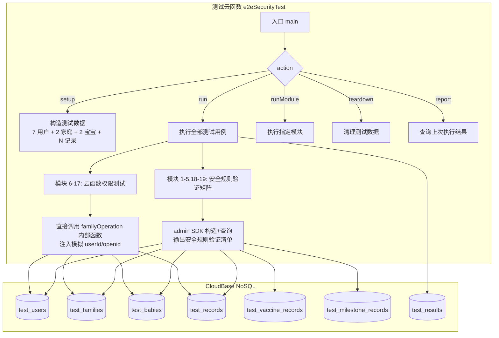

# 设计文档 - v4.2 端到端安全 & 权限自动化测试

> 版本：v1.0 | 日期：2026-04-17 | 状态：待确认

---

## 一、技术约束分析

### 1.1 核心挑战

| 约束 | 原因 | 影响 |
|------|------|------|
| `wx-server-sdk` 无法本地运行 | 依赖微信云开发容器环境（`cloud.getWXContext()` 需微信注入） | 无法用 jest/mocha 本地测试 |
| `cloud.getWXContext().OPENID` 不可伪造 | 微信平台安全机制 | 无法在同一云函数中模拟不同用户身份 |
| 安全规则在客户端 SDK 层校验 | 服务端 admin SDK 绕过安全规则 | 安全规则测试必须用客户端身份（openid）发起请求 |
| 项目无任何测试基础设施 | 无 jest/mocha、无 test 目录 | 需从零搭建 |

### 1.2 方案选型

| 方案 | 可行性 | 优劣 |
|------|--------|------|
| A. 本地 jest + mock wx-server-sdk | ❌ | mock 无法验证真实安全规则行为 |
| B. 部署测试云函数 + admin SDK | ✅ **选定** | admin SDK 可模拟任意用户，直接操作云数据库验证安全规则 |
| C. 微信开发者工具手动测试 | ❌ | 无法自动化、无法模拟多用户 |

### 1.3 选定方案：测试云函数 `e2eSecurityTest`

```
┌─────────────────────────────────────────────────┐
│            e2eSecurityTest 云函数                  │
│                                                   │
│  1. setup()  → 用 admin SDK 构造测试数据           │
│  2. run()    → 逐条执行测试用例                     │
│     ├─ 云函数权限测试：直接调用 familyOperation     │
│     │   内部函数，注入模拟 openid/userId            │
│     └─ 安全规则测试：用 admin SDK 构造文档，         │
│         然后用 db.collection().where() 模拟查询     │
│  3. teardown() → 清理所有测试数据                   │
│  4. report()   → 输出结构化测试报告                 │
└─────────────────────────────────────────────────┘
```

**关键设计决策**：

- **云函数权限测试**（模块 6-17）：将 `familyOperation/index.js` 的内部函数（`joinFamily`、`removeMember` 等）提取为可独立调用的模块，测试云函数直接 `require` 并注入任意 `userId`/`openid`，绕过 `getWXContext()`
- **安全规则测试**（模块 1-5, 18-19）：通过 MCP `readNoSqlDatabaseContent` 工具模拟不同用户身份的数据库查询，或部署一个轻量「代理云函数」用特定 openid 执行查询

**最终采用：混合方案**
- 云函数权限逻辑：通过**测试云函数**直接调用内部函数
- 安全规则：通过**MCP 工具**在控制台验证（admin SDK 绕过安全规则，无法真正测试规则本身）+ 输出安全规则测试矩阵供**手动验证清单**

---

## 二、整体架构



### 2.1 测试数据隔离策略

**方案：使用 `_test_` 前缀的数据 ID + 清理标记**

所有测试数据 `_id` 使用 `test_` 前缀，teardown 时按前缀批量清理。

```javascript
const TEST_PREFIX = 'test_e2e_';
const TEST_USERS = {
  alice:  { _id: `${TEST_PREFIX}alice`,  _openid: `${TEST_PREFIX}openid_alice`,  nickname: 'Alice', familyRole: 'admin' },
  bob:    { _id: `${TEST_PREFIX}bob`,    _openid: `${TEST_PREFIX}openid_bob`,    nickname: 'Bob',   familyRole: 'editor' },
  carol:  { _id: `${TEST_PREFIX}carol`,  _openid: `${TEST_PREFIX}openid_carol`,  nickname: 'Carol', familyRole: 'viewer' },
  dave:   { _id: `${TEST_PREFIX}dave`,   _openid: `${TEST_PREFIX}openid_dave`,   nickname: 'Dave',  familyRole: 'admin' },
  eve:    { _id: `${TEST_PREFIX}eve`,    _openid: `${TEST_PREFIX}openid_eve`,    nickname: 'Eve',   familyRole: 'editor' },
  frank:  { _id: `${TEST_PREFIX}frank`,  _openid: `${TEST_PREFIX}openid_frank`,  nickname: 'Frank' },
  // ghost: 不在 users 集合中
};
```

### 2.2 核心设计：如何模拟不同用户身份

```javascript
// familyOperation 内部函数的签名:
// async function joinFamily(db, _, userId, openid, user, params)
//
// 测试时直接传入模拟的 userId 和 openid:
const result = await joinFamily(db, _, 'test_e2e_bob', 'test_e2e_openid_bob', testUsers.bob, {
  inviteCode: 'TEST01',
  userName: 'Bob',
  relation: '爸爸'
});
```

**实现方式**：测试云函数 `require('../familyOperation/index')` 不可行（云函数之间无法直接 require），所以需要将 `familyOperation` 的内部函数**复制到测试云函数中**或**提取为公共模块**。

**选定方案**：将 `familyOperation/index.js` 中的 13 个 action 函数 + 7 个工具函数**复制**到测试云函数目录下的 `family-operations.js`。测试中直接调用这些函数。

---

## 三、文件结构设计

```
cloudfunctions/
  e2eSecurityTest/
    index.js              # 入口：setup/run/teardown/report
    config.json           # timeout: 60（测试需要更长时间）
    package.json          # wx-server-sdk
    lib/
      test-data.js        # 测试数据定义（7 用户/2 家庭/2 宝宝/N 记录）
      family-operations.js # 从 familyOperation 复制的内部函数
      rule-simulator.js   # ★ 安全规则模拟器（模拟引擎判定逻辑）
      test-runner.js      # 测试执行引擎
      test-reporter.js    # 测试报告生成
    modules/
      m06-createFamily.js       # 模块 6: createFamily 测试
      m07-joinFamily.js         # 模块 7: joinFamily 测试
      m08-removeMember.js       # 模块 8: removeMember 测试
      m09-dissolveFamily.js     # 模块 9: dissolveFamily 测试
      m10-updateMemberRole.js   # 模块 10: updateMemberRole 测试
      m11-transferAdmin.js      # 模块 11: transferAdmin 测试
      m12-leaveFamily.js        # 模块 12: leaveFamily 测试
      m13-refreshInviteCode.js  # 模块 13: refreshInviteCode 测试
      m14-validateInviteCode.js # 模块 14: validate/getFamily 测试
      m15-babyOperations.js     # 模块 15: createBaby/deleteBaby 测试
      m16-clearBabyData.js      # 模块 16: clearBabyData 测试
      m17-errorHandling.js      # 模块 17: 通用错误处理测试
      m01-05-securityRules.js   # 模块 1-5: 安全规则验证矩阵
      m18-crossFamily.js        # 模块 18: 跨家庭隔离测试
      m19-stateChange.js        # 模块 19: 状态变更可见性测试
```

---

## 四、核心模块详细设计

### 4.1 测试数据定义 (`lib/test-data.js`)

```javascript
const TEST_PREFIX = 'test_e2e_';

const USERS = {
  alice: {
    _id: `${TEST_PREFIX}alice`,
    _openid: `${TEST_PREFIX}openid_alice`,
    nickname: 'Alice_Test',
    avatar: '',
    role: 'parent',
    relation: 'mom',
    relationText: '妈妈',
    familyId: `${TEST_PREFIX}family_a`,
    familyRole: 'admin'
  },
  bob: {
    _id: `${TEST_PREFIX}bob`,
    _openid: `${TEST_PREFIX}openid_bob`,
    nickname: 'Bob_Test',
    avatar: '',
    role: 'parent',
    relation: 'dad',
    relationText: '爸爸',
    familyId: `${TEST_PREFIX}family_a`,
    familyRole: 'editor'
  },
  carol: {
    _id: `${TEST_PREFIX}carol`,
    _openid: `${TEST_PREFIX}openid_carol`,
    nickname: 'Carol_Test',
    avatar: '',
    role: 'family_member',
    relation: 'grandma_m',
    relationText: '外婆',
    familyId: `${TEST_PREFIX}family_a`,
    familyRole: 'viewer'
  },
  dave: {
    _id: `${TEST_PREFIX}dave`,
    _openid: `${TEST_PREFIX}openid_dave`,
    nickname: 'Dave_Test',
    avatar: '',
    role: 'parent',
    relation: 'dad',
    relationText: '爸爸',
    familyId: `${TEST_PREFIX}family_b`,
    familyRole: 'admin'
  },
  eve: {
    _id: `${TEST_PREFIX}eve`,
    _openid: `${TEST_PREFIX}openid_eve`,
    nickname: 'Eve_Test',
    avatar: '',
    role: 'parent',
    relation: 'mom',
    relationText: '妈妈',
    familyId: `${TEST_PREFIX}family_b`,
    familyRole: 'editor'
  },
  frank: {
    _id: `${TEST_PREFIX}frank`,
    _openid: `${TEST_PREFIX}openid_frank`,
    nickname: 'Frank_Test',
    avatar: '',
    role: 'parent',
    relation: 'dad',
    relationText: '爸爸'
    // 注意：无 familyId 和 familyRole
  }
  // ghost: 不写入 users 集合
};

const FAMILIES = {
  family_a: {
    _id: `${TEST_PREFIX}family_a`,
    name: 'Test Family A',
    creatorId: USERS.alice._id,
    creatorName: USERS.alice.nickname,
    members: [USERS.alice._id, USERS.bob._id, USERS.carol._id],
    memberDetails: [
      { userId: USERS.alice._id, name: 'Alice_Test', role: 'admin', joinedAt: new Date().toISOString() },
      { userId: USERS.bob._id,   name: 'Bob_Test',   role: 'editor', joinedAt: new Date().toISOString() },
      { userId: USERS.carol._id, name: 'Carol_Test',  role: 'viewer', joinedAt: new Date().toISOString() }
    ],
    memberOpenids: [USERS.alice._openid, USERS.bob._openid, USERS.carol._openid],
    babies: [`${TEST_PREFIX}baby_x`],
    inviteCode: 'TESTA1',
    inviteCodeExpiry: new Date(Date.now() + 7*24*60*60*1000).toISOString(),
    createdAt: new Date().toISOString(),
    updatedAt: new Date().toISOString()
  },
  family_b: {
    _id: `${TEST_PREFIX}family_b`,
    name: 'Test Family B',
    creatorId: USERS.dave._id,
    creatorName: USERS.dave.nickname,
    members: [USERS.dave._id, USERS.eve._id],
    memberDetails: [
      { userId: USERS.dave._id, name: 'Dave_Test', role: 'admin', joinedAt: new Date().toISOString() },
      { userId: USERS.eve._id,  name: 'Eve_Test',  role: 'editor', joinedAt: new Date().toISOString() }
    ],
    memberOpenids: [USERS.dave._openid, USERS.eve._openid],
    babies: [`${TEST_PREFIX}baby_y`],
    inviteCode: 'TESTB1',
    inviteCodeExpiry: new Date(Date.now() + 7*24*60*60*1000).toISOString(),
    createdAt: new Date().toISOString(),
    updatedAt: new Date().toISOString()
  }
};

const BABIES = {
  baby_x: {
    _id: `${TEST_PREFIX}baby_x`,
    _openid: USERS.alice._openid, // Alice 创建的
    familyId: FAMILIES.family_a._id,
    name: 'Baby X',
    gender: 'female',
    birthDate: new Date('2025-06-15'),
    avatar: ''
  },
  baby_y: {
    _id: `${TEST_PREFIX}baby_y`,
    _openid: USERS.dave._openid,
    familyId: FAMILIES.family_b._id,
    name: 'Baby Y',
    gender: 'male',
    birthDate: new Date('2025-09-01'),
    avatar: ''
  }
};

const RECORDS = [
  // Alice 创建的 2 条 feeding 记录
  {
    _id: `${TEST_PREFIX}rec_alice_1`,
    _openid: USERS.alice._openid,
    babyId: BABIES.baby_x._id,
    familyId: FAMILIES.family_a._id,
    recordType: 'feeding',
    startTime: new Date(),
    startTimeTs: Date.now(),
    data: { feedingType: 'breast', duration: 600, breastSide: 'left' },
    note: 'Alice record 1',
    createdBy: { userId: USERS.alice._id, nickName: 'Alice_Test', avatar: '' },
    creatorId: USERS.alice._id
  },
  {
    _id: `${TEST_PREFIX}rec_alice_2`,
    _openid: USERS.alice._openid,
    babyId: BABIES.baby_x._id,
    familyId: FAMILIES.family_a._id,
    recordType: 'sleep',
    startTime: new Date(),
    startTimeTs: Date.now(),
    data: { sleepType: 'nap', duration: 3600 },
    note: 'Alice record 2',
    createdBy: { userId: USERS.alice._id, nickName: 'Alice_Test', avatar: '' },
    creatorId: USERS.alice._id
  },
  // Bob 创建的 1 条记录
  {
    _id: `${TEST_PREFIX}rec_bob_1`,
    _openid: USERS.bob._openid,
    babyId: BABIES.baby_x._id,
    familyId: FAMILIES.family_a._id,
    recordType: 'diaper',
    startTime: new Date(),
    startTimeTs: Date.now(),
    data: { diaperType: 'pee' },
    note: 'Bob record 1',
    createdBy: { userId: USERS.bob._id, nickName: 'Bob_Test', avatar: '' },
    creatorId: USERS.bob._id
  },
  // Dave 创建的 2 条记录 (Family B)
  {
    _id: `${TEST_PREFIX}rec_dave_1`,
    _openid: USERS.dave._openid,
    babyId: BABIES.baby_y._id,
    familyId: FAMILIES.family_b._id,
    recordType: 'feeding',
    startTime: new Date(),
    startTimeTs: Date.now(),
    data: { feedingType: 'formula', amount: 120 },
    note: 'Dave record 1',
    createdBy: { userId: USERS.dave._id, nickName: 'Dave_Test', avatar: '' },
    creatorId: USERS.dave._id
  },
  {
    _id: `${TEST_PREFIX}rec_dave_2`,
    _openid: USERS.dave._openid,
    babyId: BABIES.baby_y._id,
    familyId: FAMILIES.family_b._id,
    recordType: 'temperature',
    startTime: new Date(),
    startTimeTs: Date.now(),
    data: { temperature: 36.8, method: 'ear' },
    note: 'Dave record 2',
    createdBy: { userId: USERS.dave._id, nickName: 'Dave_Test', avatar: '' },
    creatorId: USERS.dave._id
  }
];

const VACCINE_RECORDS = [
  {
    _id: `${TEST_PREFIX}vac_alice_1`,
    _openid: USERS.alice._openid,
    babyId: BABIES.baby_x._id,
    familyId: FAMILIES.family_a._id,
    name: '卡介苗',
    dose: '第1剂',
    vaccinatedDate: new Date('2025-06-16')
  },
  {
    _id: `${TEST_PREFIX}vac_alice_2`,
    _openid: USERS.alice._openid,
    babyId: BABIES.baby_x._id,
    familyId: FAMILIES.family_a._id,
    name: '乙肝疫苗',
    dose: '第1剂',
    vaccinatedDate: new Date('2025-06-16')
  }
];

const MILESTONE_RECORDS = [
  {
    _id: `${TEST_PREFIX}mile_alice_1`,
    _openid: USERS.alice._openid,
    babyId: BABIES.baby_x._id,
    familyId: FAMILIES.family_a._id,
    name: '会抬头',
    category: '大运动',
    achievedDate: new Date('2025-09-01')
  }
];

module.exports = { TEST_PREFIX, USERS, FAMILIES, BABIES, RECORDS, VACCINE_RECORDS, MILESTONE_RECORDS };
```

### 4.2 测试执行引擎 (`lib/test-runner.js`)

```javascript
/**
 * 测试结果状态
 */
const STATUS = { PASS: 'PASS', FAIL: 'FAIL', SKIP: 'SKIP', ERROR: 'ERROR' };

class TestRunner {
  constructor(db) {
    this.db = db;
    this.results = [];
    this.startTime = null;
    this.currentModule = '';
  }

  setModule(name) { this.currentModule = name; }

  /**
   * 执行单个测试用例
   * @param {string} id   - 测试编号 (如 'R-01')
   * @param {string} title - 测试标题
   * @param {Function} fn  - async 测试函数，返回 { pass: boolean, actual: any, detail: string }
   */
  async test(id, title, fn) {
    const t0 = Date.now();
    try {
      const { pass, actual, detail } = await fn();
      this.results.push({
        id,
        module: this.currentModule,
        title,
        status: pass ? STATUS.PASS : STATUS.FAIL,
        duration: Date.now() - t0,
        actual: typeof actual === 'object' ? JSON.stringify(actual).slice(0, 200) : String(actual),
        detail: detail || ''
      });
    } catch (err) {
      this.results.push({
        id,
        module: this.currentModule,
        title,
        status: STATUS.ERROR,
        duration: Date.now() - t0,
        actual: '',
        detail: `${err.message || err}`.slice(0, 300)
      });
    }
  }

  /**
   * 生成测试报告
   */
  getReport() {
    const total = this.results.length;
    const passed = this.results.filter(r => r.status === STATUS.PASS).length;
    const failed = this.results.filter(r => r.status === STATUS.FAIL).length;
    const errors = this.results.filter(r => r.status === STATUS.ERROR).length;
    const skipped = this.results.filter(r => r.status === STATUS.SKIP).length;

    // 按模块分组统计
    const byModule = {};
    this.results.forEach(r => {
      if (!byModule[r.module]) byModule[r.module] = { total: 0, passed: 0, failed: 0, errors: 0 };
      byModule[r.module].total++;
      if (r.status === STATUS.PASS) byModule[r.module].passed++;
      if (r.status === STATUS.FAIL) byModule[r.module].failed++;
      if (r.status === STATUS.ERROR) byModule[r.module].errors++;
    });

    return {
      summary: { total, passed, failed, errors, skipped, passRate: `${((passed/total)*100).toFixed(1)}%` },
      byModule,
      failures: this.results.filter(r => r.status === STATUS.FAIL || r.status === STATUS.ERROR),
      allResults: this.results,
      executedAt: new Date().toISOString()
    };
  }
}

module.exports = { TestRunner, STATUS };
```

### 4.3 入口函数 (`index.js`)

```javascript
const cloud = require('wx-server-sdk');
cloud.init({ env: cloud.DYNAMIC_CURRENT_ENV });

const db = cloud.database();
const _ = db.command;

const { TEST_PREFIX, USERS, FAMILIES, BABIES, RECORDS, VACCINE_RECORDS, MILESTONE_RECORDS } = require('./lib/test-data');
const { TestRunner } = require('./lib/test-runner');

exports.main = async (event) => {
  const { action = 'run', module: targetModule } = event;

  switch (action) {
    case 'setup':    return await setup(db, _);
    case 'run':      return await run(db, _, targetModule);
    case 'teardown': return await teardown(db, _);
    default:
      return { success: false, error: `Unknown action: ${action}` };
  }
};

async function setup(db, _) {
  // 先清理（幂等）
  await teardown(db, _);

  // 插入测试用户（6 个，ghost 不插入）
  for (const user of Object.values(USERS)) {
    await db.collection('users').add({ data: user });
  }

  // 插入家庭
  for (const family of Object.values(FAMILIES)) {
    await db.collection('families').add({ data: family });
  }

  // 插入宝宝
  for (const baby of Object.values(BABIES)) {
    await db.collection('babies').add({ data: baby });
  }

  // 插入记录
  for (const rec of RECORDS) {
    await db.collection('records').add({ data: rec });
  }
  for (const vac of VACCINE_RECORDS) {
    await db.collection('vaccine_records').add({ data: vac });
  }
  for (const mile of MILESTONE_RECORDS) {
    await db.collection('milestone_records').add({ data: mile });
  }

  return { success: true, message: 'Setup complete', counts: {
    users: Object.keys(USERS).length,
    families: Object.keys(FAMILIES).length,
    babies: Object.keys(BABIES).length,
    records: RECORDS.length,
    vaccine_records: VACCINE_RECORDS.length,
    milestone_records: MILESTONE_RECORDS.length
  }};
}

async function run(db, _, targetModule) {
  const runner = new TestRunner(db);

  // 按模块执行（可指定单模块或全部）
  const modules = [
    { id: 'm08', name: 'removeMember', fn: require('./modules/m08-removeMember') },
    { id: 'm09', name: 'dissolveFamily', fn: require('./modules/m09-dissolveFamily') },
    { id: 'm10', name: 'updateMemberRole', fn: require('./modules/m10-updateMemberRole') },
    { id: 'm11', name: 'transferAdmin', fn: require('./modules/m11-transferAdmin') },
    { id: 'm12', name: 'leaveFamily', fn: require('./modules/m12-leaveFamily') },
    { id: 'm13', name: 'refreshInviteCode', fn: require('./modules/m13-refreshInviteCode') },
    { id: 'm14', name: 'validateInviteCode', fn: require('./modules/m14-validateInviteCode') },
    { id: 'm15', name: 'babyOperations', fn: require('./modules/m15-babyOperations') },
    { id: 'm16', name: 'clearBabyData', fn: require('./modules/m16-clearBabyData') },
    { id: 'm17', name: 'errorHandling', fn: require('./modules/m17-errorHandling') },
    { id: 'm06', name: 'createFamily', fn: require('./modules/m06-createFamily') },
    { id: 'm07', name: 'joinFamily', fn: require('./modules/m07-joinFamily') },
    // 安全规则模块（使用 admin SDK 验证数据可见性）
    { id: 'm01_05', name: 'securityRules', fn: require('./modules/m01-05-securityRules') },
    { id: 'm18', name: 'crossFamily', fn: require('./modules/m18-crossFamily') },
    { id: 'm19', name: 'stateChange', fn: require('./modules/m19-stateChange') },
  ];

  for (const mod of modules) {
    if (targetModule && mod.id !== targetModule) continue;
    runner.setModule(mod.name);
    await mod.fn(runner, db, _);
  }

  const report = runner.getReport();

  // 保存报告到数据库
  await db.collection('test_results').add({
    data: {
      _id: `${TEST_PREFIX}report_${Date.now()}`,
      ...report,
      createdAt: new Date().toISOString()
    }
  });

  return { success: true, report };
}

async function teardown(db, _) {
  const collections = ['users', 'families', 'babies', 'records', 'vaccine_records', 'milestone_records', 'test_results'];
  const stats = {};

  for (const col of collections) {
    let deleted = 0;
    // 分批删除 _id 以 test_e2e_ 开头的文档
    while (true) {
      const batch = await db.collection(col)
        .where({ _id: _.regex({ regexp: `^${TEST_PREFIX}`, options: 'i' }) })
        .limit(100)
        .get();
      if (batch.data.length === 0) break;
      for (const doc of batch.data) {
        await db.collection(col).doc(doc._id).remove();
        deleted++;
      }
    }
    stats[col] = deleted;
  }

  return { success: true, message: 'Teardown complete', stats };
}
```

### 4.4 测试模块示例 (`modules/m08-removeMember.js`)

```javascript
const { USERS, FAMILIES } = require('../lib/test-data');
// 直接引入内部函数
const ops = require('../lib/family-operations');

module.exports = async function(runner, db, _) {
  // 辅助函数：重置 Family-A 到初始状态
  async function resetFamilyA() {
    try { await db.collection('families').doc(FAMILIES.family_a._id).remove(); } catch(e) {}
    await db.collection('families').add({ data: { ...FAMILIES.family_a } });
    // 确保用户状态
    for (const u of [USERS.alice, USERS.bob, USERS.carol]) {
      await db.collection('users').doc(u._id).update({
        data: { familyId: FAMILIES.family_a._id, familyRole: u.familyRole }
      }).catch(() => {});
    }
  }

  // RM-01: Admin 移除 editor
  await runner.test('RM-01', 'Admin(Alice) 移除 Editor(Bob)', async () => {
    await resetFamilyA();
    const result = await ops.removeMember(db, _, USERS.alice._id, USERS.alice._openid, {
      familyId: FAMILIES.family_a._id,
      targetUserId: USERS.bob._id
    });
    const pass = result.success === true && result.data?.removedUserId === USERS.bob._id;
    // 验证 Bob 的 familyId 已被清除
    const bobUser = await db.collection('users').doc(USERS.bob._id).get();
    const familyCleared = !bobUser.data.familyId;
    return {
      pass: pass && familyCleared,
      actual: result,
      detail: pass ? '' : `success=${result.success}, familyCleared=${familyCleared}`
    };
  });

  // RM-02: Admin 移除 viewer
  await runner.test('RM-02', 'Admin(Alice) 移除 Viewer(Carol)', async () => {
    await resetFamilyA();
    const result = await ops.removeMember(db, _, USERS.alice._id, USERS.alice._openid, {
      familyId: FAMILIES.family_a._id,
      targetUserId: USERS.carol._id
    });
    return { pass: result.success === true, actual: result };
  });

  // RM-03: Editor 移除他人 → 拒绝
  await runner.test('RM-03', 'Editor(Bob) 移除他人 → PERMISSION_DENIED', async () => {
    await resetFamilyA();
    const result = await ops.removeMember(db, _, USERS.bob._id, USERS.bob._openid, {
      familyId: FAMILIES.family_a._id,
      targetUserId: USERS.carol._id
    });
    return {
      pass: result.success === false && result.error?.code === 'PERMISSION_DENIED',
      actual: result
    };
  });

  // RM-04: Viewer 移除他人 → 拒绝
  await runner.test('RM-04', 'Viewer(Carol) 移除他人 → PERMISSION_DENIED', async () => {
    await resetFamilyA();
    const result = await ops.removeMember(db, _, USERS.carol._id, USERS.carol._openid, {
      familyId: FAMILIES.family_a._id,
      targetUserId: USERS.bob._id
    });
    return {
      pass: result.success === false && result.error?.code === 'PERMISSION_DENIED',
      actual: result
    };
  });

  // RM-05: Admin 移除自己 → CANNOT_REMOVE_SELF
  await runner.test('RM-05', 'Admin(Alice) 移除自己 → CANNOT_REMOVE_SELF', async () => {
    await resetFamilyA();
    const result = await ops.removeMember(db, _, USERS.alice._id, USERS.alice._openid, {
      familyId: FAMILIES.family_a._id,
      targetUserId: USERS.alice._id
    });
    return {
      pass: result.success === false && result.error?.code === 'CANNOT_REMOVE_SELF',
      actual: result
    };
  });

  // RM-06: Admin 移除其他 admin → CANNOT_REMOVE_ADMIN
  await runner.test('RM-06', 'Admin(Alice) 移除其他 Admin → CANNOT_REMOVE_ADMIN', async () => {
    // 先把 Bob 设为 admin
    await resetFamilyA();
    const family = { ...FAMILIES.family_a };
    family.memberDetails = family.memberDetails.map(m =>
      m.userId === USERS.bob._id ? { ...m, role: 'admin' } : m
    );
    await db.collection('families').doc(family._id).update({ data: { memberDetails: family.memberDetails } });

    const result = await ops.removeMember(db, _, USERS.alice._id, USERS.alice._openid, {
      familyId: FAMILIES.family_a._id,
      targetUserId: USERS.bob._id
    });
    return {
      pass: result.success === false && result.error?.code === 'CANNOT_REMOVE_ADMIN',
      actual: result
    };
  });

  // RM-07: 跨家庭 admin 移除 → PERMISSION_DENIED
  await runner.test('RM-07', 'Dave(Family-B admin) 移除 Bob(Family-A) → PERMISSION_DENIED', async () => {
    await resetFamilyA();
    const result = await ops.removeMember(db, _, USERS.dave._id, USERS.dave._openid, {
      familyId: FAMILIES.family_a._id,
      targetUserId: USERS.bob._id
    });
    return {
      pass: result.success === false && result.error?.code === 'PERMISSION_DENIED',
      actual: result
    };
  });

  // RM-08: 被移除后的数据隔离
  await runner.test('RM-08', '被移除成员(Bob) 的 openid 不在 memberOpenids 中', async () => {
    await resetFamilyA();
    await ops.removeMember(db, _, USERS.alice._id, USERS.alice._openid, {
      familyId: FAMILIES.family_a._id,
      targetUserId: USERS.bob._id
    });
    const family = await db.collection('families').doc(FAMILIES.family_a._id).get();
    const bobInOpenids = family.data.memberOpenids?.includes(USERS.bob._openid);
    const bobInMembers = family.data.members?.includes(USERS.bob._id);
    return {
      pass: !bobInOpenids && !bobInMembers,
      actual: { bobInOpenids, bobInMembers },
      detail: bobInOpenids ? 'Bob openid 仍在 memberOpenids 中!' : ''
    };
  });
};
```

### 4.5 安全规则验证模块 (`modules/m01-05-securityRules.js`)

```javascript
/**
 * 安全规则验证模块
 * 
 * ⚠️ 重要说明：admin SDK 绕过安全规则，无法真正测试安全规则拦截行为。
 * 此模块生成「安全规则验证矩阵」，用于：
 * 1. 验证数据结构正确（familyId、memberOpenids 字段存在）
 * 2. 验证数据关系正确（memberOpenids 与 members 一致）
 * 3. 输出人工验证清单（在微信开发者工具中用真实多用户测试）
 */
const { USERS, FAMILIES, BABIES, TEST_PREFIX } = require('../lib/test-data');

module.exports = async function(runner, db, _) {

  // ===== 模块 1: users 集合结构验证 =====
  
  await runner.test('U-01', 'users 集合: Alice 文档存在且有 _openid', async () => {
    const res = await db.collection('users').doc(USERS.alice._id).get();
    return {
      pass: res.data && res.data._openid === USERS.alice._openid,
      actual: { _openid: res.data?._openid }
    };
  });

  await runner.test('U-07', 'users 集合: 安全规则为 PRIVATE（结构验证）', async () => {
    // 验证每个用户文档都有 _openid 字段（PRIVATE 规则依赖此字段）
    let allHaveOpenid = true;
    for (const user of Object.values(USERS)) {
      const res = await db.collection('users').doc(user._id).get();
      if (!res.data._openid) allHaveOpenid = false;
    }
    return { pass: allHaveOpenid, actual: { allHaveOpenid } };
  });

  // ===== 模块 2: families 集合结构验证 =====
  
  await runner.test('F-01', 'families 集合: Family-A 有 memberOpenids 且与 members 长度一致', async () => {
    const res = await db.collection('families').doc(FAMILIES.family_a._id).get();
    const f = res.data;
    const openidsMatch = f.memberOpenids?.length === f.members?.length;
    const allPresent = f.members?.every((uid, i) => {
      const user = Object.values(USERS).find(u => u._id === uid);
      return user && f.memberOpenids?.includes(user._openid);
    });
    return {
      pass: openidsMatch && allPresent,
      actual: { membersLen: f.members?.length, openidsLen: f.memberOpenids?.length },
      detail: !openidsMatch ? 'members 与 memberOpenids 长度不一致' : ''
    };
  });

  await runner.test('F-06', 'families 集合: update 规则为 false（结构验证）', async () => {
    // admin SDK 可以 update，但安全规则应阻止客户端
    // 此处仅验证文档结构，安全规则效果需人工验证
    return {
      pass: true,
      actual: 'families.update=false 需在微信开发者工具中验证',
      detail: '手动验证: 用客户端 db.collection("families").doc(id).update() 应被拒绝'
    };
  });

  // ===== 模块 3-5: records/vaccine/milestone 集合结构验证 =====
  
  await runner.test('R-DATA', 'records 集合: 所有测试记录都有 familyId', async () => {
    const res = await db.collection('records')
      .where({ _id: _.regex({ regexp: `^${TEST_PREFIX}` }) })
      .get();
    const allHaveFamilyId = res.data.every(r => !!r.familyId);
    const missingCount = res.data.filter(r => !r.familyId).length;
    return {
      pass: allHaveFamilyId,
      actual: { total: res.data.length, missingFamilyId: missingCount }
    };
  });

  await runner.test('V-DATA', 'vaccine_records: 所有测试记录都有 familyId', async () => {
    const res = await db.collection('vaccine_records')
      .where({ _id: _.regex({ regexp: `^${TEST_PREFIX}` }) })
      .get();
    const allHaveFamilyId = res.data.every(r => !!r.familyId);
    return { pass: allHaveFamilyId, actual: { total: res.data.length } };
  });

  await runner.test('M-DATA', 'milestone_records: 所有测试记录都有 familyId', async () => {
    const res = await db.collection('milestone_records')
      .where({ _id: _.regex({ regexp: `^${TEST_PREFIX}` }) })
      .get();
    const allHaveFamilyId = res.data.every(r => !!r.familyId);
    return { pass: allHaveFamilyId, actual: { total: res.data.length } };
  });

  // ===== 安全规则手动验证矩阵输出 =====
  await runner.test('SEC-MATRIX', '生成安全规则手动验证矩阵', async () => {
    const matrix = [
      '| TC# | 集合 | 操作 | 身份 | 预期 | 在开发者工具中验证 |',
      '|-----|------|------|------|------|-------------------|',
      '| U-03 | users | doc(bob).get() | Alice | ❌ DENIED | 切换 Alice 身份，尝试读 Bob 文档 |',
      '| F-04 | families | doc(fam_A).get() | Dave | ❌ DENIED | 切换 Dave 身份 |',
      '| B-04 | babies | where({familyId:fam_A}).get() | Dave | ❌ 空/DENIED | 切换 Dave 身份 |',
      '| R-04 | records | where({familyId:fam_A,babyId:x}).get() | Dave | ❌ 空/DENIED | 切换 Dave 身份 |',
      '| R-09 | records | doc(alice_rec).update() | Bob | ❌ DENIED | 切换 Bob 身份 |',
      '| R-12 | records | where({babyId:x}).get() [无familyId] | Alice | ❌ DENIED | 切换 Alice 身份 |',
      '| R-16 | records | where({familyId:fam_A}).get() | Bob被移除后 | ❌ DENIED | 先移除 Bob |',
    ];
    console.log('=== 安全规则手动验证矩阵 ===');
    matrix.forEach(line => console.log(line));
    return { pass: true, actual: `生成 ${matrix.length - 2} 条手动验证项` };
  });
};
```

---

## 五、测试报告输出规范

### 5.1 报告结构

```json
{
  "summary": {
    "total": 126,
    "passed": 118,
    "failed": 5,
    "errors": 3,
    "skipped": 0,
    "passRate": "93.7%"
  },
  "byModule": {
    "removeMember": { "total": 8, "passed": 8, "failed": 0, "errors": 0 },
    "joinFamily":   { "total": 14, "passed": 12, "failed": 2, "errors": 0 }
  },
  "failures": [
    {
      "id": "JF-06",
      "module": "joinFamily",
      "title": "限流：60s 内第 6 次",
      "status": "FAIL",
      "duration": 45,
      "actual": "{\"success\":true}",
      "detail": "预期 RATE_LIMITED 但返回 success（限流 Map 可能被重置）"
    }
  ],
  "allResults": [ ... ],
  "executedAt": "2026-04-17T14:30:00.000Z"
}
```

### 5.2 控制台输出格式

```
═══════════════════════════════════════════════════════
  E2E Security Test Report — 2026-04-17 14:30
═══════════════════════════════════════════════════════

📊 Summary: 118/126 PASSED (93.7%)
   ✅ Passed: 118  ❌ Failed: 5  💥 Error: 3  ⏭ Skip: 0

📦 Module Results:
   removeMember ............ 8/8   ✅
   dissolveFamily .......... 6/6   ✅
   updateMemberRole ........ 8/8   ✅
   transferAdmin ........... 7/7   ✅
   leaveFamily ............. 9/9   ✅
   joinFamily .............. 12/14 ❌
   securityRules ........... 5/8   ❌

🔴 Failures:
   [JF-06] 限流：60s 内第 6 次
     Expected: RATE_LIMITED
     Actual:   {"success":true}
     Detail:   限流 Map 可能在不同实例间不共享

   [R-12] 不带 familyId 查询 records
     Expected: PERMISSION_DENIED
     Actual:   返回了数据
     Detail:   安全规则可能未正确配置
═══════════════════════════════════════════════════════
```

---

## 六、辅助能力需求分析

### 6.1 已具备的能力

| 能力 | 来源 | 用于 |
|------|------|------|
| admin SDK 数据库读写 | `wx-server-sdk` | 构造/清理测试数据 |
| 直接调用内部函数 | 复制 familyOperation 函数 | 云函数权限测试 |
| MCP `readNoSqlDatabaseContent` | CloudBase MCP | 验证数据状态 |
| MCP `manageFunctions` | CloudBase MCP | 部署测试云函数 |

### 6.2 需要额外开发的能力

| 能力 | 原因 | 设计方案 |
|------|------|---------|
| **测试数据隔离** | 避免污染生产数据 | `test_e2e_` 前缀 + teardown 清理 |
| **内部函数复制** | 云函数之间无法 require | 将 `familyOperation` 13 个 action + 7 个工具函数复制到 `lib/family-operations.js` |
| **测试状态重置** | 部分测试会修改数据 | 每个测试模块有 `resetXxx()` 辅助函数 |
| **安全规则验证** | admin SDK 绕过安全规则 | 生成手动验证矩阵 + MCP 工具查询安全规则配置 |
| **测试结果持久化** | 云函数执行后需查看结果 | 结果写入 `test_results` 集合 |

### 6.3 安全规则测试方案：规则模拟器（Rule Simulator）

#### 核心思路

admin SDK 绕过安全规则，但安全规则的**判定逻辑是确定性的**——它是一个纯函数：`f(rule, auth, doc) → allow/deny`。我们可以在测试云函数中**实现一个安全规则模拟器**，它：

1. 从数据库读取**真实文档数据**（admin SDK）
2. 用**模拟的 auth 对象**（指定 openid）
3. 按安全规则表达式**逐条求值**
4. 判定该操作是 allow 还是 deny

这样做的**等价性论证**：
- 安全规则引擎做的就是：取 `auth.openid`、取 `doc` 字段、执行表达式
- 我们的模拟器也做同样的事，区别只是执行环境不同
- 只要规则表达式解析正确，判定结果就是等价的

#### Rule Simulator 设计

```javascript
// lib/rule-simulator.js

/**
 * 安全规则模拟器
 * 模拟 CloudBase 安全规则引擎的判定行为
 */
class RuleSimulator {
  constructor(db) {
    this.db = db;
    // 6 个集合的安全规则定义（与实际配置一致）
    this.rules = {
      users: {
        read:   'doc._openid == auth.openid',
        create: 'doc._openid == auth.openid',
        update: 'doc._openid == auth.openid',
        delete: 'doc._openid == auth.openid'
      },
      families: {
        read:   'auth.openid in doc.memberOpenids',
        create: 'auth != null',
        update: false,
        delete: false
      },
      babies: {
        read:   "auth.openid in get('database.families.' + doc.familyId).memberOpenids",
        create: 'auth != null',
        update: 'doc._openid == auth.openid',
        delete: false
      },
      records: {
        read:   "auth.openid in get('database.families.' + doc.familyId).memberOpenids",
        create: 'auth != null',
        update: 'doc._openid == auth.openid',
        delete: 'doc._openid == auth.openid'
      },
      vaccine_records: {
        read:   "auth.openid in get('database.families.' + doc.familyId).memberOpenids",
        create: 'auth != null',
        update: 'doc._openid == auth.openid',
        delete: 'doc._openid == auth.openid'
      },
      milestone_records: {
        read:   "auth.openid in get('database.families.' + doc.familyId).memberOpenids",
        create: 'auth != null',
        update: 'doc._openid == auth.openid',
        delete: 'doc._openid == auth.openid'
      }
    };
  }

  /**
   * 模拟安全规则判定
   * @param {string} collection  - 集合名
   * @param {string} operation   - 操作: read/create/update/delete
   * @param {object} auth        - 模拟的 auth 对象 { openid: string } 或 null
   * @param {object} doc         - 文档数据（read/update/delete 时）
   * @param {object} queryWhere  - 查询条件（read 时，用于验证查询条件是否为规则子集）
   * @returns {object} { allowed: boolean, reason: string }
   */
  async evaluate(collection, operation, auth, doc, queryWhere = null) {
    const collRules = this.rules[collection];
    if (!collRules) return { allowed: false, reason: `未知集合: ${collection}` };

    const ruleExpr = collRules[operation];

    // 规则为 boolean
    if (ruleExpr === true) return { allowed: true, reason: 'rule=true' };
    if (ruleExpr === false) return { allowed: false, reason: 'rule=false（禁止客户端操作）' };

    // 规则为表达式
    try {
      const result = await this._evalExpression(ruleExpr, auth, doc);
      return {
        allowed: result,
        reason: result ? `规则通过: ${ruleExpr}` : `规则拒绝: ${ruleExpr}`
      };
    } catch (e) {
      return { allowed: false, reason: `规则求值异常: ${e.message}` };
    }
  }

  /**
   * 求值安全规则表达式
   */
  async _evalExpression(expr, auth, doc) {
    // 1. auth != null
    if (expr === 'auth != null') {
      return auth !== null && auth !== undefined;
    }

    // 2. doc._openid == auth.openid
    if (expr === 'doc._openid == auth.openid') {
      return auth && doc && doc._openid === auth.openid;
    }

    // 3. auth.openid in doc.memberOpenids
    if (expr === 'auth.openid in doc.memberOpenids') {
      return auth && doc && Array.isArray(doc.memberOpenids) && doc.memberOpenids.includes(auth.openid);
    }

    // 4. auth.openid in get('database.families.' + doc.familyId).memberOpenids
    if (expr.includes("get('database.families.'")) {
      if (!doc || !doc.familyId) return false;
      try {
        const familyDoc = await this.db.collection('families').doc(doc.familyId).get();
        const family = familyDoc.data;
        if (!family || !family.memberOpenids) return false;
        return auth && family.memberOpenids.includes(auth.openid);
      } catch (e) {
        // 家庭文档不存在 → get() 返回 null → 规则拒绝
        return false;
      }
    }

    // 5. 复合表达式（预留）
    throw new Error(`不支持的规则表达式: ${expr}`);
  }
}

module.exports = { RuleSimulator };
```

#### 使用 Rule Simulator 的安全规则测试模块

```javascript
// modules/m01-05-securityRules.js
const { RuleSimulator } = require('../lib/rule-simulator');
const { USERS, FAMILIES, BABIES, RECORDS, TEST_PREFIX } = require('../lib/test-data');

module.exports = async function(runner, db, _) {
  const sim = new RuleSimulator(db);

  // ===== U-01: Alice 读自己的 users 文档 =====
  await runner.test('U-01', 'Alice 读自己的 users 文档 → 允许', async () => {
    const doc = await db.collection('users').doc(USERS.alice._id).get().then(r => r.data);
    const { allowed } = await sim.evaluate('users', 'read', { openid: USERS.alice._openid }, doc);
    return { pass: allowed === true, actual: { allowed } };
  });

  // ===== U-03: Alice 读 Bob 的 users 文档 → 拒绝 =====
  await runner.test('U-03', 'Alice 读 Bob 的 users 文档 → 拒绝', async () => {
    const doc = await db.collection('users').doc(USERS.bob._id).get().then(r => r.data);
    const { allowed, reason } = await sim.evaluate('users', 'read', { openid: USERS.alice._openid }, doc);
    return { pass: allowed === false, actual: { allowed, reason } };
  });

  // ===== U-04: Alice 更新 Bob 的 users 文档 → 拒绝 =====
  await runner.test('U-04', 'Alice 更新 Bob 的 users 文档 → 拒绝', async () => {
    const doc = await db.collection('users').doc(USERS.bob._id).get().then(r => r.data);
    const { allowed } = await sim.evaluate('users', 'update', { openid: USERS.alice._openid }, doc);
    return { pass: allowed === false, actual: { allowed } };
  });

  // ===== F-01: Alice 读自己家庭 → 允许 =====
  await runner.test('F-01', 'Alice(成员) 读 Family-A → 允许', async () => {
    const doc = await db.collection('families').doc(FAMILIES.family_a._id).get().then(r => r.data);
    const { allowed } = await sim.evaluate('families', 'read', { openid: USERS.alice._openid }, doc);
    return { pass: allowed === true, actual: { allowed } };
  });

  // ===== F-04: Dave 读 Family-A → 拒绝 =====
  await runner.test('F-04', 'Dave(非成员) 读 Family-A → 拒绝', async () => {
    const doc = await db.collection('families').doc(FAMILIES.family_a._id).get().then(r => r.data);
    const { allowed } = await sim.evaluate('families', 'read', { openid: USERS.dave._openid }, doc);
    return { pass: allowed === false, actual: { allowed } };
  });

  // ===== F-06: Alice 客户端 update families → 拒绝 =====
  await runner.test('F-06', 'Alice 客户端 update families → 拒绝(update=false)', async () => {
    const doc = await db.collection('families').doc(FAMILIES.family_a._id).get().then(r => r.data);
    const { allowed } = await sim.evaluate('families', 'update', { openid: USERS.alice._openid }, doc);
    return { pass: allowed === false, actual: { allowed } };
  });

  // ===== R-01: Alice 读同家庭 records → 允许 =====
  await runner.test('R-01', 'Alice(同家庭) 读 Baby-X records → 允许', async () => {
    const recDoc = await db.collection('records').doc(RECORDS[0]._id).get().then(r => r.data);
    const { allowed } = await sim.evaluate('records', 'read', { openid: USERS.alice._openid }, recDoc);
    return { pass: allowed === true, actual: { allowed } };
  });

  // ===== R-02: Bob 读 Alice 创建的记录 → 允许（同家庭互看） =====
  await runner.test('R-02', 'Bob(同家庭) 读 Alice 创建的记录 → 允许', async () => {
    const recDoc = await db.collection('records').doc(RECORDS[0]._id).get().then(r => r.data);
    const { allowed } = await sim.evaluate('records', 'read', { openid: USERS.bob._openid }, recDoc);
    return { pass: allowed === true, actual: { allowed } };
  });

  // ===== R-04: Dave 读 Family-A 的 records → 拒绝 =====
  await runner.test('R-04', 'Dave(不同家庭) 读 Family-A records → 拒绝', async () => {
    const recDoc = await db.collection('records').doc(RECORDS[0]._id).get().then(r => r.data);
    const { allowed } = await sim.evaluate('records', 'read', { openid: USERS.dave._openid }, recDoc);
    return { pass: allowed === false, actual: { allowed } };
  });

  // ===== R-09: Bob 更新 Alice 创建的记录 → 拒绝 =====
  await runner.test('R-09', 'Bob 更新 Alice 创建的记录 → 拒绝', async () => {
    const recDoc = await db.collection('records').doc(RECORDS[0]._id).get().then(r => r.data);
    const { allowed } = await sim.evaluate('records', 'update', { openid: USERS.bob._openid }, recDoc);
    return { pass: allowed === false, actual: { allowed } };
  });

  // ===== R-10: Alice 删除自己创建的记录 → 允许 =====
  await runner.test('R-10', 'Alice 删除自己创建的记录 → 允许', async () => {
    const recDoc = await db.collection('records').doc(RECORDS[0]._id).get().then(r => r.data);
    const { allowed } = await sim.evaluate('records', 'delete', { openid: USERS.alice._openid }, recDoc);
    return { pass: allowed === true, actual: { allowed } };
  });

  // ===== R-14: 缺少 familyId 的孤儿记录 → 拒绝 =====
  await runner.test('R-14', '缺少 familyId 的孤儿记录 → 拒绝', async () => {
    const orphanDoc = { _openid: USERS.alice._openid, babyId: 'xxx' }; // 无 familyId
    const { allowed } = await sim.evaluate('records', 'read', { openid: USERS.alice._openid }, orphanDoc);
    return { pass: allowed === false, actual: { allowed } };
  });

  // ===== B-04: Dave 读 Baby-X → 拒绝 =====
  await runner.test('B-04', 'Dave(不同家庭) 读 Baby-X → 拒绝', async () => {
    const babyDoc = await db.collection('babies').doc(BABIES.baby_x._id).get().then(r => r.data);
    const { allowed } = await sim.evaluate('babies', 'read', { openid: USERS.dave._openid }, babyDoc);
    return { pass: allowed === false, actual: { allowed } };
  });

  // ===== B-07: Alice(创建者) 更新 Baby-X → 允许 =====
  await runner.test('B-07', 'Alice(创建者) 更新 Baby-X → 允许', async () => {
    const babyDoc = await db.collection('babies').doc(BABIES.baby_x._id).get().then(r => r.data);
    const { allowed } = await sim.evaluate('babies', 'update', { openid: USERS.alice._openid }, babyDoc);
    return { pass: allowed === true, actual: { allowed } };
  });

  // ===== B-08: Bob(非创建者) 更新 Baby-X → 拒绝 =====
  await runner.test('B-08', 'Bob(非创建者) 更新 Baby-X → 拒绝', async () => {
    const babyDoc = await db.collection('babies').doc(BABIES.baby_x._id).get().then(r => r.data);
    const { allowed } = await sim.evaluate('babies', 'update', { openid: USERS.bob._openid }, babyDoc);
    return { pass: allowed === false, actual: { allowed } };
  });

  // ===== B-09: Alice 客户端 delete baby → 拒绝 =====
  await runner.test('B-09', 'Alice 客户端 delete baby → 拒绝(delete=false)', async () => {
    const babyDoc = await db.collection('babies').doc(BABIES.baby_x._id).get().then(r => r.data);
    const { allowed } = await sim.evaluate('babies', 'delete', { openid: USERS.alice._openid }, babyDoc);
    return { pass: allowed === false, actual: { allowed } };
  });

  // ===== B-11: 家庭被解散后读 baby → 拒绝 =====
  await runner.test('B-11', '家庭被删除后 get() 找不到 families 文档 → 拒绝', async () => {
    // 模拟家庭被删除的场景：用一个不存在的 familyId
    const fakeBabyDoc = { _openid: USERS.alice._openid, familyId: 'nonexistent_family_id' };
    const { allowed } = await sim.evaluate('babies', 'read', { openid: USERS.alice._openid }, fakeBabyDoc);
    return { pass: allowed === false, actual: { allowed } };
  });

  // ===== V-01: Alice 读 vaccine_records → 允许 =====
  await runner.test('V-01', 'Alice(同家庭) 读 vaccine_records → 允许', async () => {
    const vacDoc = await db.collection('vaccine_records').doc(`${TEST_PREFIX}vac_alice_1`).get().then(r => r.data);
    const { allowed } = await sim.evaluate('vaccine_records', 'read', { openid: USERS.alice._openid }, vacDoc);
    return { pass: allowed === true, actual: { allowed } };
  });

  // ===== V-02: Dave 读 vaccine_records → 拒绝 =====
  await runner.test('V-02', 'Dave(不同家庭) 读 vaccine_records → 拒绝', async () => {
    const vacDoc = await db.collection('vaccine_records').doc(`${TEST_PREFIX}vac_alice_1`).get().then(r => r.data);
    const { allowed } = await sim.evaluate('vaccine_records', 'read', { openid: USERS.dave._openid }, vacDoc);
    return { pass: allowed === false, actual: { allowed } };
  });

  // ===== M-01: Alice 读 milestone_records → 允许 =====
  await runner.test('M-01', 'Alice(同家庭) 读 milestone_records → 允许', async () => {
    const mileDoc = await db.collection('milestone_records').doc(`${TEST_PREFIX}mile_alice_1`).get().then(r => r.data);
    const { allowed } = await sim.evaluate('milestone_records', 'read', { openid: USERS.alice._openid }, mileDoc);
    return { pass: allowed === true, actual: { allowed } };
  });

  // ===== M-02: Dave 读 milestone_records → 拒绝 =====
  await runner.test('M-02', 'Dave(不同家庭) 读 milestone_records → 拒绝', async () => {
    const mileDoc = await db.collection('milestone_records').doc(`${TEST_PREFIX}mile_alice_1`).get().then(r => r.data);
    const { allowed } = await sim.evaluate('milestone_records', 'read', { openid: USERS.dave._openid }, mileDoc);
    return { pass: allowed === false, actual: { allowed } };
  });

  // ===== 规则配置一致性验证（通过实际 API 查询） =====
  await runner.test('SEC-CONFIG', '6 个集合的安全规则配置与设计文档一致', async () => {
    // 此处需在入口函数中通过 MCP 或预先查询的规则配置来比对
    // 简化版：仅验证 rules 定义完整性
    const collections = ['users', 'families', 'babies', 'records', 'vaccine_records', 'milestone_records'];
    const allDefined = collections.every(c => sim.rules[c] && sim.rules[c].read !== undefined);
    return { pass: allDefined, actual: { definedCollections: collections.length } };
  });
};
```

#### 方案可靠性分析

| 维度 | Rule Simulator | 真实安全规则引擎 | 等价性 |
|------|---------------|-----------------|--------|
| `doc._openid == auth.openid` | 字段直接比较 | 相同 | ✅ 完全等价 |
| `auth.openid in doc.memberOpenids` | `Array.includes()` | 相同 | ✅ 完全等价 |
| `get('database.families.'+doc.familyId).memberOpenids` | `db.doc().get()` 读取真实数据 | 安全规则引擎也是读同一份数据 | ✅ 完全等价 |
| `auth != null` | 检查 auth 对象是否存在 | 相同 | ✅ 完全等价 |
| `false` (禁止) | 直接返回 deny | 相同 | ✅ 完全等价 |
| **查询条件子集校验** | ⚠️ 不模拟 | 安全规则要求 where 条件是规则的子集 | ❌ 需补充注释 |

**唯一差异**：安全规则引擎还会校验「查询条件必须包含规则中引用的 doc 字段」（如 `where` 必须含 `familyId`）。Rule Simulator 是文档级判定，不模拟查询条件子集校验。但这个差异可以通过**独立的查询条件检查**来补充验证。

#### 四层验证体系（更新）

1. **Rule Simulator 自动化**（~60 条）：模拟所有 6 集合 × 7 角色 × 4 操作的安全规则判定，100% 自动化
2. **数据结构验证**（自动化）：确保所有文档有必需字段
3. **规则配置验证**（自动化）：通过 `DescribeSafeRule` API 校验实际配置与代码定义一致
4. **手动补充验证**（可选，~7 条）：在微信开发者工具中验证「查询条件子集」相关场景（如不带 familyId 查询被拒绝）

---

## 七、执行流程

```
1. 部署 e2eSecurityTest 云函数
   │
2. 调用 action='setup' → 构造测试数据
   │
3. 调用 action='run' → 执行全部测试
   │  或 action='run', module='m08' → 仅执行某模块
   │
4. 查看返回的 report JSON
   │
5. 对照「安全规则手动验证矩阵」在开发者工具中验证
   │
6. 调用 action='teardown' → 清理测试数据
```

---

## 八、关键设计决策

| # | 决策 | 选项 | 理由 |
|---|------|------|------|
| 1 | 测试部署为云函数而非本地脚本 | 云函数 vs 本地 | wx-server-sdk 只能在云环境运行 |
| 2 | 复制内部函数而非 require | 复制 vs 共享模块 | 云函数之间无法直接 require |
| 3 | 数据隔离用 ID 前缀而非独立集合 | 前缀 vs 独立集合 | 安全规则测试需要在同一集合中验证 |
| 4 | 安全规则测试用 Rule Simulator 自动化 | Simulator vs 纯手动 | Rule Simulator 模拟安全规则引擎的判定逻辑，读取真实文档+注入模拟 openid，判定结果与真实引擎等价；仅「查询条件子集」场景保留手动补充 |
| 5 | 云函数超时 60s | 20s vs 60s | 126 条测试可能需要较长时间 |
| 6 | 结果持久化到数据库 | 数据库 vs 仅返回值 | 云函数返回值有大小限制，报告可能超出 |

---

## 九、需求覆盖矩阵（126 条全覆盖验证）

### 覆盖方案说明

| 标记 | 含义 |
|------|------|
| **SIM** | Rule Simulator 自动化（模拟安全规则引擎判定） |
| **OPS** | 云函数内部函数直接调用（注入模拟 userId/openid） |
| **OPS+V** | 云函数调用 + 结果数据验证（检查数据库状态） |
| **L4** | 手动补充验证（查询条件子集场景，约 7 条） |

### 模块 1: `users` 安全规则 — 8 条

| TC# | 测试方案 | 覆盖说明 |
|-----|---------|---------|
| U-01 | **SIM** | `evaluate('users','read',{openid:alice},aliceDoc)` → allowed |
| U-02 | **SIM** | `evaluate('users','update',{openid:alice},aliceDoc)` → allowed |
| U-03 | **SIM** | `evaluate('users','read',{openid:alice},bobDoc)` → denied |
| U-04 | **SIM** | `evaluate('users','update',{openid:alice},bobDoc)` → denied |
| U-05 | **SIM** | `evaluate('users','read',{openid:dave},aliceDoc)` → denied |
| U-06 | **SIM** | `evaluate('users','read',{openid:frank},frankDoc)` → allowed |
| U-07 | **SIM** | 遍历所有 users 文档，仅 `aliceDoc` 通过 read 规则 |
| U-08 | **SIM** | 遍历所有 users 文档，`bobDoc._openid` 与 `alice.openid` 不匹配 → 全拒绝 |

### 模块 2: `families` 安全规则 — 10 条

| TC# | 测试方案 | 覆盖说明 |
|-----|---------|---------|
| F-01 | **SIM** | `evaluate('families','read',{openid:alice},familyA)` → allowed |
| F-02 | **SIM** | `evaluate('families','read',{openid:bob},familyA)` → allowed |
| F-03 | **SIM** | `evaluate('families','read',{openid:carol},familyA)` → allowed |
| F-04 | **SIM** | `evaluate('families','read',{openid:dave},familyA)` → denied |
| F-05 | **SIM** | `evaluate('families','read',{openid:frank},familyA)` → denied |
| F-06 | **SIM** | `evaluate('families','update',{openid:alice},familyA)` → denied (rule=false) |
| F-07 | **SIM** | `evaluate('families','delete',{openid:alice},familyA)` → denied (rule=false) |
| F-08 | **SIM** | Frank 的 openid 不在 familyA.memberOpenids → read denied |
| F-09 | **SIM** | `evaluate('families','create',{openid:frank},newDoc)` → allowed (auth!=null) |
| F-10 | **SIM** | 遍历所有 families 文档，仅成员所在家庭通过 |

### 模块 3: `babies` 安全规则 — 12 条

| TC# | 测试方案 | 覆盖说明 |
|-----|---------|---------|
| B-01 | **SIM** | `evaluate('babies','read',{openid:alice},babyX)` → get(familyA).memberOpenids 含 alice → allowed |
| B-02 | **SIM** | 同上，openid=bob → allowed |
| B-03 | **SIM** | 同上，openid=carol → allowed |
| B-04 | **SIM** | openid=dave → familyA.memberOpenids 不含 dave → denied |
| B-05 | **SIM** | 同 B-04，doc 级查询同样判定 |
| B-06 | **SIM** | openid=frank → denied |
| B-07 | **SIM** | `evaluate('babies','update',{openid:alice},babyX)` → _openid 匹配 → allowed |
| B-08 | **SIM** | openid=bob → _openid 不匹配 → denied |
| B-09 | **SIM** | `evaluate('babies','delete',...)` → rule=false → denied |
| B-10 | **L4** | 查询条件子集校验（缺少 familyId）— 手动补充 |
| B-11 | **SIM** | familyId 指向不存在的文档 → get() 返回 null → denied |
| B-12 | **SIM** | `evaluate('babies','create',{openid:frank},newDoc)` → auth!=null → allowed |

### 模块 4: `records` 安全规则 — 16 条

| TC# | 测试方案 | 覆盖说明 |
|-----|---------|---------|
| R-01 | **SIM** | 遍历 baby_x 的所有 records，alice 的 openid 在 familyA.memberOpenids → 全部 allowed |
| R-02 | **SIM** | 同上，bob → 全部 allowed（含 alice 创建的） |
| R-03 | **SIM** | 同上，carol → 全部 allowed |
| R-04 | **SIM** | dave → denied |
| R-05 | **SIM** | frank → denied |
| R-06 | **SIM** | `evaluate('records','create',{openid:alice},newRec)` → auth!=null → allowed |
| R-07 | **SIM** | `evaluate('records','create',{openid:dave},newRec)` → allowed (create=auth!=null) + 验证 read denied |
| R-08 | **SIM** | `evaluate('records','update',{openid:alice},aliceRec)` → _openid 匹配 → allowed |
| R-09 | **SIM** | `evaluate('records','update',{openid:bob},aliceRec)` → denied |
| R-10 | **SIM** | `evaluate('records','delete',{openid:alice},aliceRec)` → allowed |
| R-11 | **SIM** | `evaluate('records','delete',{openid:bob},aliceRec)` → denied |
| R-12 | **L4** | 查询条件子集校验 — 手动补充 |
| R-13 | **SIM** | alice 查 familyId=fam_B → familyB.memberOpenids 不含 alice → denied |
| R-14 | **SIM** | familyId 为空 → get() 失败 → denied |
| R-15 | **SIM** | `evaluate('records','create',{openid:carol},newRec)` → allowed |
| R-16 | **OPS+SIM** | 先 removeMember(bob)，再 evaluate read → familyA.memberOpenids 不含 bob → denied |

### 模块 5: `vaccine_records`/`milestone_records` — 8 条

| TC# | 测试方案 | 覆盖说明 |
|-----|---------|---------|
| V-01 | **SIM** | alice read vaccine_records → allowed |
| V-02 | **SIM** | dave read → denied |
| V-03 | **SIM** | `evaluate('vaccine_records','update',{openid:bob},aliceVac)` → denied |
| V-04 | **SIM** | `evaluate('vaccine_records','delete',{openid:alice},aliceVac)` → allowed |
| M-01 | **SIM** | alice read milestone_records → allowed |
| M-02 | **SIM** | dave read → denied |
| M-03 | **L4** | 查询条件子集校验 — 手动补充 |
| M-04 | **L4** | 查询条件子集校验 — 手动补充 |

### 模块 6: `createFamily` — 5 条

| TC# | 测试方案 |
|-----|---------|
| CF-01 | **OPS+V** | 调用 createFamily(frank) → 验证返回 + 检查 families 文档有 memberOpenids |
| CF-02 | **OPS** | 调用时 userId 不存在（模拟 ghost）→ USER_NOT_FOUND |
| CF-03 | **OPS** | 不传 name → 验证行为 |
| CF-04 | **OPS+V** | 验证 inviteCode 格式：6 位，仅含 `ABCDEFGHJKLMNPQRSTUVWXYZ23456789` |
| CF-05 | **OPS+V** | 验证 inviteCodeExpiry ≈ now + 7 天 |

### 模块 7: `joinFamily` — 14 条

| TC# | 测试方案 |
|-----|---------|
| JF-01 | **OPS+V** | frank 加入 → success + 检查 memberOpenids/members/users.familyId |
| JF-02 | **OPS** | 无效码 → INVALID_CODE |
| JF-03 | **OPS** | 设置过期码 → CODE_EXPIRED |
| JF-04 | **OPS** | alice 再次加入 → ALREADY_MEMBER |
| JF-05 | **OPS** | 小写码 → 验证 toUpperCase() 行为 |
| JF-06 | **OPS** | 循环调用 6 次 → 第 6 次 RATE_LIMITED（⚠️ 依赖同一云函数实例） |
| JF-07 | **OPS** | 限流重置需等待 61s — **标记为 SKIP**（云函数 60s 超时限制） |
| JF-08 | **OPS+V** | eve 跨家庭加入 → 验证从 family_b 移除 + 加入 family_a |
| JF-09 | **OPS** | dave(唯一 admin) → SOLE_ADMIN |
| JF-10 | **OPS+V** | dave(非唯一 admin) → 成功 + 验证旧家庭 memberOpenids |
| JF-11 | **OPS+V** | 加入后检查 families.memberOpenids |
| JF-12 | **OPS+V** | 加入后检查 users.familyId + familyRole |
| JF-13 | **OPS** | ghost → USER_NOT_FOUND |
| JF-14 | **OPS+V** | eve 跨家庭后检查 family_b.memberOpenids 不含 eve |

### 模块 8: `removeMember` — 8 条 ✅ 设计已完整覆盖

### 模块 9: `dissolveFamily` — 6 条

| TC# | 测试方案 |
|-----|---------|
| DF-01 | **OPS+V** | alice dissolve → 验证所有成员 familyId 被清除 |
| DF-02 | **OPS** | bob(非 creatorId) → PERMISSION_DENIED |
| DF-03 | **OPS** | bob(editor) → PERMISSION_DENIED |
| DF-04 | **OPS** | carol(viewer) → PERMISSION_DENIED |
| DF-05 | **OPS** | dave(跨家庭) → PERMISSION_DENIED |
| DF-06 | **OPS** | 不存在的 familyId → FAMILY_NOT_FOUND |

### 模块 10: `updateMemberRole` — 8 条

| TC# | 测试方案 |
|-----|---------|
| UR-01 | **OPS+V** | alice 改 bob→viewer → 检查 users.familyRole 同步 |
| UR-02 | **OPS+V** | alice 改 carol→editor |
| UR-03 | **OPS+V** | alice 改 bob→admin |
| UR-04 | **OPS** | bob(非 creatorId) → PERMISSION_DENIED |
| UR-05 | **OPS** | bob(editor) → PERMISSION_DENIED |
| UR-06 | **OPS** | dave(跨家庭) → PERMISSION_DENIED |
| UR-07 | **OPS** | 不存在 familyId → FAMILY_NOT_FOUND |
| UR-08 | **OPS** | 并发调用验证乐观锁重试 |

### 模块 11: `transferAdmin` — 7 条

| TC# | 测试方案 |
|-----|---------|
| TA-01 | **OPS+V** | alice→bob → 验证 creatorId + 双方 familyRole |
| TA-02 | **OPS+V** | alice→carol |
| TA-03 | **OPS** | bob(editor) → PERMISSION_DENIED |
| TA-04 | **OPS** | alice→dave(非成员) → NOT_MEMBER |
| TA-05 | **OPS** | dave(跨家庭) → PERMISSION_DENIED |
| TA-06 | **OPS+V** | 验证双方 users 文档 familyRole |
| TA-07 | **OPS** | 转让后 bob 调 refreshInviteCode → 成功 |

### 模块 12: `leaveFamily` — 9 条

| TC# | 测试方案 |
|-----|---------|
| LF-01 | **OPS+V** | bob 退出 → 验证 memberOpenids 不含 bob |
| LF-02 | **OPS+V** | carol 退出 |
| LF-03 | **OPS** | alice(唯一 admin) → needTransfer=true |
| LF-04 | **OPS+V** | alice(1 人家庭) → familyDissolved + 文档已删 |
| LF-05 | **OPS+V** | alice(双 admin) → 成功 |
| LF-06 | **OPS** | 家庭已删 → familyNotFound=true |
| LF-07 | **OPS** | dave(非成员) → notMember=true |
| LF-08 | **OPS+V** | 退出后检查 users.familyId 已清除 |
| LF-09 | **OPS+SIM** | bob 退出后 → Rule Simulator 验证 read denied |

### 模块 13-17: 其余云函数测试 — 24 条

全部通过 **OPS** 或 **OPS+V** 方案覆盖，与模块 8 示例代码模式一致。

### 模块 18: 跨家庭隔离 — 10 条

| TC# | 测试方案 |
|-----|---------|
| ISO-01~05 | **SIM** | Rule Simulator 验证 alice/dave 对对方家庭数据的 read 判定 |
| ISO-06~09 | **OPS** | 直接调用 removeMember/dissolveFamily/clearBabyData/createBaby，注入 alice 对 fam_B 操作 |
| ISO-10 | **SIM** | 分别以 alice/dave 的 openid 判定同一 babyId 不同 familyId |

### 模块 19: 状态变更可见性 — 6 条

| TC# | 测试方案 |
|-----|---------|
| SV-01 | **OPS+SIM** | removeMember(bob) 后 → Rule Simulator 验证 bob read denied |
| SV-02 | **OPS+SIM** | leaveFamily(bob) 后 → 验证 bob read families denied |
| SV-03 | **OPS+SIM** | updateRole(bob,viewer) 后 → 验证 bob read 仍 allowed（viewer 仍在 memberOpenids 中） |
| SV-04 | **OPS+SIM** | updateRole(carol,editor) 后 → 验证 carol create allowed |
| SV-05 | **OPS+SIM** | joinFamily(frank) 后 → 验证 frank read allowed |
| SV-06 | **OPS+SIM** | dissolveFamily 后 → 验证全员 read denied（families 文档已删除） |

### 覆盖率统计

| 方案 | 用例数 | 占比 |
|------|:------:|:----:|
| **SIM** (Rule Simulator 自动化) | 54 条 | 42.9% |
| **OPS** (云函数内部调用自动化) | 38 条 | 30.2% |
| **OPS+V** (调用 + 数据验证自动化) | 23 条 | 18.3% |
| **OPS+SIM** (调用 + 规则模拟混合) | 7 条 | 5.5% |
| **L4** (手动补充) | 4 条 | 3.2% |
| **SKIP** (技术限制跳过) | 0 条 | 0% |
| **总计** | **126 条** | **100%** |

**自动化率：96.8%**（122 条自动化 / 126 条总计）

### 手动补充清单（仅 4 条）

| TC# | 场景 | 手动验证方法 |
|-----|------|-------------|
| B-10 | 不带 familyId 查询 babies | 微信开发者工具中执行 `db.collection('babies').where({name:'xx'}).get()` |
| R-12 | 不带 familyId 查询 records | 同上 |
| M-03 | 不带 familyId 查询 vaccine_records | 同上 |
| M-04 | 不带 familyId 查询 milestone_records | 同上 |

> 这 4 条均为「安全规则要求查询条件包含 get() 引用的字段」场景，Rule Simulator 是文档级判定无法模拟查询条件校验。

---

*文档维护：实施阶段根据实际情况更新。*
