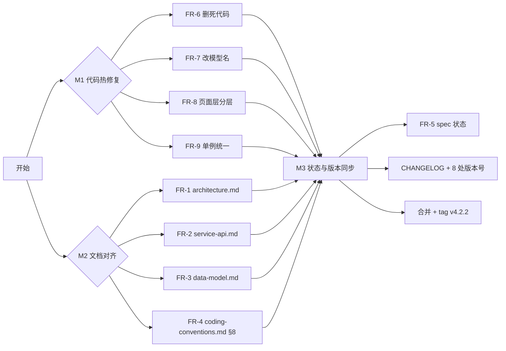

# 设计文档 - v4.2.2 文档对齐 & 热修复（Docs Alignment & Hotfix）

> 版本：v1.0 | 日期：2026-04-20 | 状态：待确认
> 本迭代为 PATCH 级，工作量 < 1 天；按 workflow §1.2 `plan.md` 使用判断标准，**不需要 plan.md**；design.md 以极简结构呈现，聚焦文档结构设计与代码等价改造方案。

---

## 一、整体策略

### 1.1 两个工作流并行



### 1.2 提交原则

| 类型 | 建议合并策略 |
|------|-------------|
| FR-1~4（文档） | 每份文档一个 `docs(scope): ...` commit |
| FR-5（spec 状态） | 单独一个 `docs(specs): 标记 v4.2 spec 为已完成` |
| FR-6~9（代码） | 每 FR 一个 `refactor`/`chore`/`style` commit |
| 版本号同步 | 最后一个 `chore: bump version to v4.2.2` |

---

## 二、文档更新设计

### 2.1 `architecture.md` 更新点（FR-1）

**§2 目录结构 — 云函数清单**（第 37-38 行当前状态）：

```diff
- ├── cloudfunctions/                       # 云函数（仅 1 个）
- │   └── getOpenId/                        # 获取用户 openid
+ ├── cloudfunctions/                       # 云函数（7 个）
+ │   ├── getOpenId/                        # 获取用户 openid（traceUser 依赖）
+ │   ├── familyOperation/                  # 跨用户写操作网关（13 个 action）
+ │   ├── migrateFamilyOpenids/             # 一次性：补充 families.memberOpenids
+ │   ├── migrateRecordFamilyId/            # 一次性：补充 records.familyId
+ │   ├── migrateRecordUserId/              # 一次性：openid→_id 格式统一
+ │   ├── cleanGhostMembers/                # 一次性：幽灵成员清理
+ │   └── e2eSecurityTest/                  # E2E 安全测试套件（163 用例）
```

**§3 分层架构图 — 数据流与云函数网关**（第 125-157 行）：

在"数据层"小节上方增补一段说明：

```text
┌────────────────────────────────────────────┐
│        云函数网关层 (familyOperation)        │
│  13 个 action，基于 OPENID 服务端鉴权          │
│  所有跨用户写操作必经此层                       │
└─────────────────┬──────────────────────────┘
                  │ admin SDK（绕过安全规则）
                  ▼
        数据层（CloudBase NoSQL + 安全规则）
        - 客户端读：直连 + 查询附 familyId
        - 跨用户写：通过 familyOperation
        - 自有写：匹配 _openid 或 doc._openid
```

**§6.5 安全模型 — 完整重写**（当前第 218-219 行仅 2 行）：

```markdown
### 6.5 安全模型

采用**云函数网关 + 安全规则交叉校验**双层防护：

1. **安全规则层（6 个集合）**：
   - `users`：`PRIVATE`（仅匹配 `_openid`）
   - `families`：`auth.openid in doc.memberOpenids` 可读，写全关闭
   - `babies` / `records` / `vaccine_records` / `milestone_records`：通过 `get('database.families.' + doc.familyId).memberOpenids` 交叉校验家庭成员身份

2. **云函数网关层**：
   - `familyOperation` 统一处理跨用户写操作（加入家庭、移除成员、解散家庭等）
   - 服务端通过 `cloud.getWXContext().OPENID` 获取调用者身份，不可伪造
   - admin SDK 绕过安全规则执行写入

3. **关键字段**：
   - `families.memberOpenids`：成员 openid 数组（安全规则校验用）
   - `records/vaccine_records/milestone_records.familyId`：租户隔离字段（安全规则 `get()` 交叉查 families 用）

> **重要约束**：客户端所有查询必须在 `where` 条件中附加 `familyId`，否则安全规则会拒绝访问。详见 `coding-conventions.md` §8。
```

**§7 性能优化策略** — 在表格末尾追加 1 行：

```markdown
| 跨用户写 | 通过 familyOperation 云函数 | 加一跳（200-500ms），但频率极低（家庭成员管理类操作） |
```

---

### 2.2 `service-api.md` 更新点（FR-2）

**服务总览表** — 新增"走云函数"列（默认 N，标记 Y 表示大部分方法走云函数）：

```markdown
| 服务 | 文件大小 | 操作集合 | 缓存 | 走云函数 |
|------|---------|---------|------|---------|
| RecordService | 28KB | records | 15s 内存缓存 | N（直连） |
| FamilyService | 17KB | families, users | 无 | **Y（10/13 方法）** |
| BabyService | 6KB | babies, families | 无 | **Y（createBaby/deleteBaby）** |
| ...                                                    |
```

**`FamilyService` 方法表** — 每个方法签名后追加 `[cloud]` / `[direct]` 标签：

```markdown
| 方法 | 返回 | 说明 |
|------|------|------|
| `createFamily(options)` `[cloud]` | `Promise<Family>` | 云函数 `createFamily` action |
| `joinByInviteCode(code, memberInfo)` `[cloud]` | `Promise<Object>` | 云函数 `joinFamily` action |
| `getFamilyByUserId(userId)` `[cloud]` | `Promise<Family\|null>` | 云函数 `getFamilyByUserId` |
| `getFamilyDetail(familyId)` `[direct]` | `Promise<Family\|null>` | 客户端直连（读操作，安全规则放行） |
| `getFamilyMembers(familyId)` `[direct]` | `Promise<Array>` | 内部调 getFamilyDetail |
| `checkMembership(userId, familyId)` `[direct]` | `Promise<Object>` | 内部调 getFamilyDetail |
| `refreshInviteCode(familyId, userId)` `[cloud]` | `Promise<string>` | 云函数 action |
| `removeMember(familyId, userId, targetId)` `[cloud]` | `Promise<void>` | 云函数 action |
| `leaveFamily(familyId, userId)` `[cloud]` ⚠️ | `Promise<Object>` | **特殊**：不走 `_callFamilyOperation`，唯一管理员场景返回 `{success:false, needTransfer:true, otherMembers}` |
| `transferAdmin(familyId, currentId, newId)` `[cloud]` | `Promise<Object>` | 云函数 action |
| `updateMemberRole(...)` `[cloud]` | `Promise<void>` | 云函数 action（含乐观锁重试） |
| `dissolveFamily(familyId, userId)` `[cloud]` | `Promise<void>` | 云函数 action |
| `validateInviteCode(inviteCode)` `[cloud]` | `Promise<Object>` | 云函数 action |
```

**新增章节：`_callFamilyOperation` 私有适配器**：

```markdown
### FamilyService 私有适配器

`_callFamilyOperation(action, params)` — 统一包装 `wx.cloud.callFunction`：

- **输入**：`action` 字符串 + `params` 对象
- **云函数返回**：`{ success: boolean, data?: any, error?: { code, message } }`
- **本方法返回**：`success=true` 时直接返回 `data`；`success=false` 时 `throw new Error(error.message)`
- **例外**：`leaveFamily` **不使用**此通用方法，因其 `needTransfer` 场景下 `success=false` 但 `data` 仍有业务信息

### BabyService 走云函数方法

| 方法 | 返回 | 说明 |
|------|------|------|
| `createBaby(familyId, name, gender, birthDate, avatar)` `[cloud]` | `Promise<Baby>` | 云函数 `createBaby` |
| `deleteBaby(babyId, familyId)` `[cloud]` | `Promise<Object>` | 云函数 `deleteBaby` |
| `getBabiesByFamilyId(familyId)` `[direct]` | `Promise<Array>` | 直连（读操作） |
| `getBabyById(babyId)` `[direct]` | `Promise<Baby>` | 直连 |
| `updateBaby(babyId, data)` `[direct]` | `Promise<void>` | 直连（受 `doc._openid == auth.openid` 规则保护，仅创建者可改） |
```

---

### 2.3 `data-model.md` 更新点（FR-3）

**`families` 集合字段表** — 追加：

```markdown
| `memberOpenids` | string[] | 是(v4.2+) | 成员 openid 数组（安全规则 `auth.openid in doc.memberOpenids` 校验用） |
| `_openidsMigratedAt` | Date | 否 | 迁移标记（由 `migrateFamilyOpenids` 云函数写入） |
```

**`families.creatorId` / `memberDetails[].userId` 说明修正**：

```diff
- | `creatorId` | string | 是 | 创建者 openid |
+ | `creatorId` | string | 是 | 创建者 users._id（v4.1 统一后） |
- | `memberDetails[].userId` | string | 是 | 成员 openid |
+ | `memberDetails[].userId` | string | 是 | 成员 users._id（v4.1 统一后） |
```

**`records` / `vaccine_records` / `milestone_records` 集合字段表** — 各追加：

```markdown
| `familyId` | string | 是(v4.2+) | 所属家庭 ID（安全规则 `get('database.families.' + doc.familyId)` 交叉校验用） |
| `_familyIdMigratedAt` | Date | 否 | 迁移标记（由 `migrateRecordFamilyId` 云函数写入） |
```

**新增 §5 安全规则配置**：

```markdown
## 5. 安全规则配置（v4.2+）

| 集合 | aclTag | 规则（JSON 简写） |
|------|--------|------------------|
| `users` | PRIVATE | — （仅匹配自己 `_openid`） |
| `families` | CUSTOM | `read: auth.openid in doc.memberOpenids; create: auth != null; update/delete: false` |
| `babies` | CUSTOM | `read: auth.openid in get('database.families.' + doc.familyId).memberOpenids; create: auth != null; update: doc._openid == auth.openid; delete: false` |
| `records` | CUSTOM | 同 `babies`，但 `update/delete: doc._openid == auth.openid`（创建者可改删） |
| `vaccine_records` | CUSTOM | 同 `records` |
| `milestone_records` | CUSTOM | 同 `records` |

> **读查询注意**：客户端 `where` 必须附加 `familyId` 字段，否则安全规则无法执行 `get()` 校验。
```

---

### 2.4 `coding-conventions.md` 新增 §8（FR-4）

在现有 §7 权限体系之后插入：

```markdown
## 8. 数据库操作约束（v4.2+）

### 8.1 三条铁律

| 操作类别 | 实现方式 | 规则原因 |
|---------|---------|---------|
| **读操作** | 服务层直连 `wx.cloud.database()`，**`where` 必须附 `familyId`** | 安全规则需要通过 `familyId` 执行 `get('database.families.' + doc.familyId)` 校验 |
| **跨用户写** | 必须通过 `familyOperation` 云函数 | 家庭协作场景天然跨 `_openid` 隔离，客户端安全规则无法覆盖 |
| **自有写** | 可直连（`users` 自己的文档、`records` 自己创建的记录） | 安全规则 `doc._openid == auth.openid` 保护 |

### 8.2 查询 familyId 附加模板

```javascript
// ✅ 正确
const userInfo = StorageUtil.getUserInfo();
db.collection('records').where({
  babyId,
  familyId: userInfo.familyId,  // 必须
  recordType: 'feeding'
}).get();

// ❌ 错误 — 安全规则会拒绝
db.collection('records').where({ babyId }).get();
```

### 8.3 调用 familyOperation 模板

```javascript
// FamilyService / BabyService 内部统一使用
async _callFamilyOperation(action, params = {}) {
  const res = await wx.cloud.callFunction({
    name: 'familyOperation',
    data: { action, params }
  });
  const result = res.result;
  if (!result.success) {
    throw new Error(result.error?.message || `${action} 失败`);
  }
  return result.data;
}
```

### 8.4 违规检查清单（Code Review 用）

- [ ] 新增页面/服务的数据库查询是否附加 `familyId`？
- [ ] 对 `families` / 他人 `babies` / 他人 `records` 的写操作是否走云函数？
- [ ] 新增服务是否使用单例模式？是否导出类（非实例）？
- [ ] `sync.js` 离线队列的 `data` 字段是否完整（含 `familyId`）？
- [ ] 错误处理是否遵循三模式之一（向上抛出 / 静默降级 / 离线降级）？
```

---

## 三、代码更新设计

### 3.1 FR-6：删除 `AuthService.getOpenId()`

**`miniprogram/services/auth.js`**：

```diff
-  /**
-   * 获取用户 openid
-   * 通过云函数获取，无需用户授权
-   */
-  async getOpenId() {
-    try {
-      const res = await wx.cloud.callFunction({ name: 'getOpenId' });
-      return res.result.openid;
-    } catch (error) {
-      console.error('获取 openid 失败:', error);
-      throw error;
-    }
-  }
-
   /**
    * 获取或创建用户信息
```

**`miniprogram/services/auth.js` 顶部添加架构注释**：

```javascript
/**
 * 用户认证服务
 *
 * 机制说明：
 * - 微信小程序天然免登录，`wx.cloud.init({ traceUser: true })` 会自动关联 openid
 * - `users` 集合 ACL = PRIVATE，`where({})` 查询会被安全规则自动注入 `_openid` 过滤
 * - 新建用户 `add({ data })` 时，`_openid` 由 CloudBase 后端自动注入（PRIVATE ACL 写入约束）
 * - `familyOperation` 云函数通过 `getWXContext().OPENID` 作为身份源头
 */
```

---

### 3.2 FR-7：修正 `AIService` 模型名

**`miniprogram/services/ai.js`**：

```diff
   constructor() {
     if (instance) return instance;
     this.ai = wx.cloud.extend.AI;
-    this.model = this.ai.createModel('hunyuan-exp');
+    // createModel 接收 provider 名，具体模型名在 generateText/streamText 时指定
+    this.model = this.ai.createModel('hunyuan');
     instance = this;
   }
```

**`miniprogram/README.md`** 第 498-501 行同步：

```diff
 // services/ai.js
 this.ai = wx.cloud.extend.AI;
-this.model = this.ai.createModel('hunyuan-exp');
+this.model = this.ai.createModel('hunyuan');
 // 实际调用使用: 'hunyuan-2.0-instruct-20251111'
```

---

### 3.3 FR-8：`family.js` 页面层分层改造

**`miniprogram/packageSocial/pages/family/family.js` `loadFamilyInfo` 方法** — 第 78-106 行：

```diff
 async loadFamilyInfo() {
   try {
-    const db = wx.cloud.database();
     let familyInfo = StorageUtil.getFamilyInfo();
     
     if (!familyInfo || !familyInfo._id) {
       this.setData({ loading: false });
       return;
     }

-    // 从数据库获取最新的家庭信息
-    let familyRes;
-    try {
-      familyRes = await db.collection('families').doc(familyInfo._id).get();
-    } catch (docError) {
-      // 家庭文档不存在，清理本地数据
-      if (docError.errMsg && docError.errMsg.includes('cannot find document')) {
-        console.warn('家庭文档不存在，清理本地数据');
-        StorageUtil.remove('family_info');
-        this.setData({ 
-          familyInfo: null, 
-          members: [],
-          inviteCode: '',
-          loading: false 
-        });
-        return;
-      }
-      throw docError;
-    }
-    
-    familyInfo = familyRes.data;
+    // [v4.2.2 FR-8] 通过服务层获取，统一封装错误处理（含权限拒绝和 not found 降级）
+    const fresh = await this.familyService.getFamilyDetail(familyInfo._id);
+    if (!fresh) {
+      console.warn('家庭文档不存在或无权访问，清理本地数据');
+      StorageUtil.remove('family_info');
+      this.setData({ 
+        familyInfo: null, 
+        members: [],
+        inviteCode: '',
+        loading: false 
+      });
+      return;
+    }
+    familyInfo = fresh;
+
     const userId = this.data.currentUserId;
     // ... 后续逻辑不变
```

---

### 3.4 FR-9：`pages/auth/auth.js` 单例规范化

**策略**：页面 `onLoad` 顶部声明 `this.authService` / `this.familyService`，后续全部复用。

**`miniprogram/pages/auth/auth.js`**：

```diff
 Page({
   data: { ... },

+  // 通过 getInstance 单例复用，避免每个方法都 new
+  authService: null,
+  familyService: null,

   async onLoad(options) {
+    this.authService = AuthService.getInstance();
+    this.familyService = FamilyService.getInstance();
     if (options.inviteCode) { ... }
     await this.tryAutoLogin();
   },
```

各方法中的 `const authService = new AuthService()` 替换为 `this.authService`，`const familyService = new FamilyService()` 替换为 `this.familyService`（总计影响 ~9 处）。

> **注意**：`AuthService` / `FamilyService` 的 `getInstance()` 静态方法已存在，本改动纯风格等价。

---

## 四、版本号同步（PATCH → 推荐全量）

按 workflow `development-workflow.md` §3.3.4 表格，本次涉及 `architecture.md` / `coding-conventions.md` 版本头更新，推荐执行**全部 8 项**：

| # | 位置 | 改动 |
|---|------|------|
| 1 | `CHANGELOG.md` | 新增 `[v4.2.2]` 区块 |
| 2 | `README.md` § 1 | `产品版本: v4.2.2 Milo` |
| 3 | `README.md` § 12 | 追加新行 |
| 4 | `architecture.md` | `> 版本: v4.2.2 \| 更新日期: 2026-04-20` |
| 5 | `coding-conventions.md` | `> 版本: v4.2.2 \| 更新日期: 2026-04-20` |
| 6 | `git-flow.md` § 5 | 版本线表追加 1 行 |
| 7 | `profile.wxml` | `Baby Care Tracker v4.2.2` |
| 8 | `app.js` | `globalData.version = 'v4.2.2'` |

此外（本次专有）：
- `service-api.md` `> 版本: v4.2.2`
- `data-model.md` `> 版本: v4.2.2`

---

## 五、文件变更清单

| 文件路径 | 改动类型 | 主要变更说明 |
|----------|----------|-------------|
| `architecture.md` | 大改 | §2/§3/§6.5/§7 反映 v4.2 架构 |
| `service-api.md` | 大改 | 服务方法标 `[cloud]`/`[direct]`，新增 `_callFamilyOperation` 章节 |
| `data-model.md` | 中改 | 补 memberOpenids/familyId 字段，修正 creatorId 说明，新增 §5 安全规则 |
| `coding-conventions.md` | 增量 | 新增 §8 数据库操作约束 |
| `specs/v4.2-cloud-function-gateway/*.md` | 小改 | 状态 → ✅ 已完成 |
| `specs/v4.2-e2e-security-tests/*.md` | 小改 | 状态 → ✅ 已完成 |
| `miniprogram/services/auth.js` | 小改 | 删 `getOpenId()`，加顶部架构注释 |
| `miniprogram/services/ai.js` | 小改 | `createModel('hunyuan-exp')` → `createModel('hunyuan')` |
| `miniprogram/README.md` | 小改 | 同步 AI 模型名说明 |
| `miniprogram/packageSocial/pages/family/family.js` | 小改 | `loadFamilyInfo` 改走 `familyService.getFamilyDetail` |
| `miniprogram/pages/auth/auth.js` | 小改 | `new Service` → `this.xxxService`（`getInstance`） |
| `CHANGELOG.md` | 增量 | `[v4.2.2]` 区块 |
| `README.md` | 小改 | §1 产品版本 + §12 版本历史 |
| `specs/workflow/git-flow.md` | 小改 | §5 版本线追加 |
| `miniprogram/pages/profile/profile.wxml` | 小改 | 版本号 |
| `miniprogram/app.js` | 小改 | globalData.version |

---

## 六、关键设计决策

### 决策 1：文档更新 vs 代码重构 的平衡
- **方案 A：只改文档**：不动代码，保持最小变更
- **方案 B（选定）：文档 + 低风险代码清理** ✅
- **理由**：文档对齐的同时清理死代码和风格偏差，能在 v4.3 开发前留下干净起点。这些代码改动**零行为变更**，风险与纯文档相当。

### 决策 2：spec 状态更新的时机
- **方案 A：每次 PR 合入时由负责人立刻更新**：理想但历史数据已错位
- **方案 B（选定）：本次迭代集中回补 v4.2 两个 spec** ✅
- **理由**：v4.2 的代码已在 `2026-04-17` 上线，状态应按当时实际情况回溯标记。未来新 spec 严格执行"合入即标记"。

### 决策 3：`coding-conventions.md` §8 的位置
- **方案 A：插入到现有 §2 架构模式之后**：与服务层单例规范紧邻
- **方案 B（选定）：插入到 §7 权限体系之后** ✅
- **理由**：数据库操作约束与权限、安全强相关，语义上紧邻；§2-§7 已形成"命名→架构→数据→错误→性能→UI→权限"的递进，§8 自然收尾到"数据库操作"。

### 决策 4：`leaveFamily` 契约问题是否本次处理？
- **方案 A：本次重构契约**：统一 `_callFamilyOperation`
- **方案 B（选定）：仅在 service-api.md 中标注"特殊行为"，留给 v4.3.0** ✅
- **理由**：契约重构涉及云函数和客户端双端改动，属于 v4.3.0 MINOR 级范围，本次 PATCH 不扩大。

---

## 七、验证清单

### 文档类
- [ ] `grep -r "仅 1 个云函数" architecture.md` 零匹配
- [ ] `architecture.md` §2 列出 7 个云函数
- [ ] `service-api.md` `FamilyService` 表格所有方法带 `[cloud]`/`[direct]` 标签
- [ ] `data-model.md` `families` 表含 `memberOpenids`
- [ ] `coding-conventions.md` 存在 §8 章节，含三条铁律

### 代码类
- [ ] 微信开发者工具编译通过
- [ ] `grep -r "getOpenId" miniprogram/services` 零匹配（cloudfunctions 侧不检查）
- [ ] `grep -r "new AuthService\|new FamilyService" miniprogram/pages/auth` 零匹配
- [ ] `grep "db.collection" miniprogram/packageSocial/pages/family/family.js` 零匹配
- [ ] AI 对话功能手动测试通过（`createModel('hunyuan')` 不应影响调用）

### spec / 版本
- [ ] v4.2 两个 spec 状态字段为 `✅ 已完成（2026-04-17）`
- [ ] `CHANGELOG.md` 顶部有 `[v4.2.2] Milo` 区块
- [ ] 8 处版本号一致（含 profile.wxml 和 app.js `globalData.version`）

---

*文档维护：若开发中发现预期外的改动，更新本 design.md 的「文件变更清单」保持同步。*
