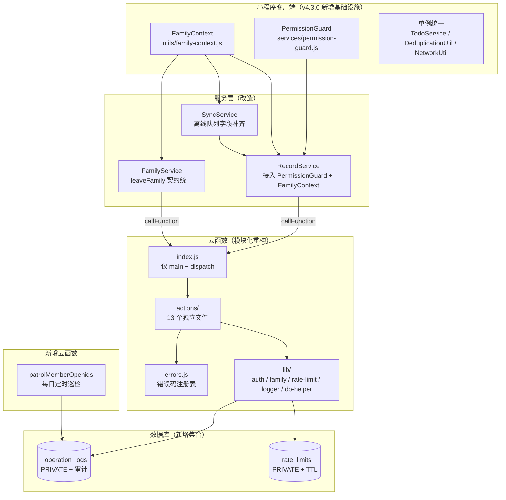

# 设计文档 - v4.3.0 稳定性加固与云函数可观测性

> 版本：v1.0 | 日期：2026-04-20 | 状态：待确认

---

## 一、架构概览

### 1.1 整体架构图



### 1.2 技术栈表

| 层级 | 技术选型 | 本版本变更 |
|------|----------|-----------|
| 客户端基础设施 | JS 静态类 / 闭包单例 | 新增 `FamilyContext` / `PermissionGuard` |
| 服务层 | 闭包单例 | 单例模式统一 |
| 云函数架构 | `wx-server-sdk` + 模块化 | 单文件 → `actions/` 目录 |
| 云函数限流 | 数据库原子操作 (`_.inc` + CAS) | 实例内存 Map → 持久化 |
| 云函数日志 | 独立集合 `_operation_logs` | 从 console 到可查询集合 |
| 定时触发 | `config.json.triggers` cron 表达式 | 新增 `patrolMemberOpenids` |

---

## 二、数据流设计

### 2.1 写入路径（FR-3 + FR-4 + FR-14 + FR-15）

```
Page.onSubmit()
    │
    ▼
RecordService.createRecord(recordData)
    │
    ├─ 1. PermissionGuard.require('record.create')   ← ★ 新增前置预检
    │     └─ 失败 → throw PermissionError('PERMISSION_DENIED')
    │
    ├─ 2. DeduplicationUtil.getInstance().check(key, 3000)
    │
    ├─ 3. const userId = FamilyContext.getUserId()    ← ★ 统一源
    │     const familyId = FamilyContext.resolve()
    │     const familyMember = familyInfo?.memberDetails?.find(m => m.userId === userId)
    │
    ├─ 4. 构造 cloudRecord { babyId, familyId, ..., createdBy: { userId, nickName, avatar } }
    │
    ├─ 5a. [在线] db.collection('records').add({ data: cloudRecord })
    │       返回 { _id, ...localVersion }
    │
    └─ 5b. [离线] StorageUtil.addToOfflineQueue({
             type: 'create',
             collection: 'records',
             data: cloudRecord,  ← ★ 含完整 createdBy（FR-4）
             tempId
           })
```

### 2.2 离线同步路径（FR-4）

```
SyncService.syncOfflineQueue()
    │
    └─ forEach operation
        │
        └─ executeOperation({ type: 'create', collection, data, tempId })
            │
            ├─ ★ 时间戳规整：
            │    - 如果 data.startTime 是字符串 → new Date(data.startTime)
            │    - 补上 data.startTime = this.db.serverDate() 覆盖（可选，保留 startTimeTs 即可）
            │    - createdAt / updatedAt 同理
            │
            ├─ db.collection(collection).add({ data })
            │
            └─ updateRecordId(tempId, realId)
```

### 2.3 云函数 action 新分发路径（FR-7）

```
wx.cloud.callFunction('familyOperation', { action, params })
    │
    ▼
index.js exports.main
    │
    ├─ const { OPENID } = cloud.getWXContext()
    ├─ const user = await lib/auth.js.getUserFromOpenid(OPENID)
    ├─ const ctx = { db, _, user, userId: user._id, openid: OPENID,
    │                logger: new OperationLogger(), rateLimiter: new RateLimiter() }
    │
    ├─ const handler = actions[action]
    ├─ if (!handler) return errors.INVALID_ACTION(action)
    │
    ├─ try {
    │    return await handler(ctx, params)
    │  } catch (e) {
    │    ctx.logger.fail(e)
    │    return errors.INTERNAL_ERROR(e)
    │  }
```

### 2.4 断点续传流程（FR-10）

```
客户端：callFunction('familyOperation', { action: 'clearBabyData', params: { babyId, familyId } })
                              ▲                                                       │
                              │                                                       ▼
                              │             云函数：actions/clearBabyData.js
                              │                      │
                              │                      ├─ 1. 权限校验 admin
                              │                      ├─ 2. logger.start('clearBabyData', { babyId })
                              │                      ├─ 3. 本轮清理最多 500 条 + 15s timeout 硬停
                              │                      │      └─ chunkedDelete(ids, concurrency=10)
                              │                      ├─ 4. 如果还有剩余 → 返回
                              │                      │      { success: true, data: { status: 'in_progress',
                              │                      │                                 cursor, progress: {...} } }
                              │                      └─ 5. 全部完成 → logger.succeed()
                              │                            返回 { status: 'succeeded', stats }
                              │                                                       │
                              │◀──────────────────────────────────────────────────────┘
  [判断 status]
      │
      ├─ in_progress → 自动再发 callFunction 带 cursor
      └─ succeeded → 结束，显示统计

本地持久化：wx.setStorageSync('_clear_baby_cursor_{babyId}', cursor)  (断网恢复用)
```

---

## 三、各模块详细设计

### 3.1 FR-1: `utils/family-context.js`

```javascript
/**
 * FamilyContext — 统一 familyId / userId / currentBaby / currentRole 读取源
 *
 * 优先级（自高到低）：
 * 1. getApp().globalData（最新内存）
 * 2. StorageUtil 本地缓存
 * 3. 传入 baby 对象的字段（仅 resolveForBaby）
 *
 * 全部为纯读取，不引入状态；不抛错，无法获得时返回 ''
 */
const StorageUtil = require('./storage');

class FamilyContext {
  /** @returns {string} familyId，无法取得时返回 '' */
  static resolve() {
    const app = getApp();
    // 1. globalData 最新
    if (app?.globalData?.familyInfo?._id) return app.globalData.familyInfo._id;
    // 2. StorageUtil 缓存
    const cachedFamily = StorageUtil.getFamilyInfo();
    if (cachedFamily?._id) return cachedFamily._id;
    // 3. userInfo.familyId 兜底
    const userInfo = StorageUtil.getUserInfo();
    return userInfo?.familyId || '';
  }

  /** 针对特定宝宝解析 familyId（优先使用 baby 自身字段） */
  static resolveForBaby(baby) {
    if (baby?.familyId) return baby.familyId;
    return this.resolve();
  }

  /** @returns {string} userId（_id） */
  static getUserId() {
    const app = getApp();
    if (app?.globalData?.userInfo?._id) return app.globalData.userInfo._id;
    const userInfo = StorageUtil.getUserInfo();
    return userInfo?._id || '';
  }

  /** @returns {'admin'|'editor'|'viewer'|''} */
  static getCurrentRole() {
    const app = getApp();
    return app?.globalData?.familyRole
        || StorageUtil.getUserInfo()?.familyRole
        || '';
  }

  /** @returns {string} 当前 babyId */
  static getCurrentBabyId() {
    const app = getApp();
    if (app?.globalData?.currentBaby?._id) return app.globalData.currentBaby._id;
    const baby = StorageUtil.getCurrentBaby();
    return baby?._id || '';
  }

  /** @returns {object|null} 当前 family 完整对象 */
  static getFamily() {
    const app = getApp();
    return app?.globalData?.familyInfo || StorageUtil.getFamilyInfo() || null;
  }

  /** 获取当前用户的 memberDetail 条目 */
  static getCurrentMemberDetail() {
    const userId = this.getUserId();
    const family = this.getFamily();
    if (!userId || !family?.memberDetails) return null;
    return family.memberDetails.find(m => m.userId === userId) || null;
  }
}

module.exports = FamilyContext;
```

### 3.2 FR-3: `services/permission-guard.js`

```javascript
const PermissionUtil = require('../utils/permission');
const FamilyContext = require('../utils/family-context');

class PermissionError extends Error {
  constructor(message, permission) {
    super(message);
    this.code = 'PERMISSION_DENIED';
    this.permission = permission;
    this.name = 'PermissionError';
  }
}

class PermissionGuard {
  /**
   * 抛出权限错误（若校验失败）
   * @param {string} permission - 权限标识（如 'record.create'）
   * @throws {PermissionError}
   */
  static require(permission) {
    const userId = FamilyContext.getUserId();
    const family = FamilyContext.getFamily();
    if (!userId || !family) {
      throw new PermissionError('用户或家庭信息不存在', permission);
    }
    if (!PermissionUtil.checkPermission(userId, family, permission)) {
      throw new PermissionError('您没有操作权限', permission);
    }
  }

  /**
   * 校验删除权限（含归属）
   * @param {object} record 记录对象
   */
  static requireCanDelete(record) {
    const userId = FamilyContext.getUserId();
    const family = FamilyContext.getFamily();
    if (!PermissionUtil.canDeleteRecord(userId, family, record)) {
      throw new PermissionError('无法删除该记录', 'record.delete');
    }
  }

  /**
   * 非抛错版本（返回 boolean，用于 UI 显隐控制）
   */
  static check(permission) {
    try {
      this.require(permission);
      return true;
    } catch {
      return false;
    }
  }
}

module.exports = { PermissionGuard, PermissionError };
```

### 3.3 FR-5: `leaveFamily` 新契约

**云函数侧 `actions/leaveFamily.js`**：

```javascript
module.exports = async (ctx, params) => {
  const { db, _, user, userId, openid, logger } = ctx;
  const { familyId } = params;

  const family = await getFamily(db, familyId);
  if (!family) return ok({ status: 'family_not_found', message: '家庭已不存在' });

  if (!family.members?.includes(userId)) {
    return ok({ status: 'not_member', message: '您不是该家庭成员' });
  }

  const isAdminRole = isAdmin(userId, family);
  const hasOther = family.memberDetails?.some(m => m.role === 'admin' && m.userId !== userId);

  // 唯一管理员需转让
  if (isAdminRole && !hasOther) {
    const otherMembers = family.members.filter(id => id !== userId);
    if (otherMembers.length > 0) {
      return ok({
        status: 'need_transfer',
        otherMembers: family.memberDetails.filter(m => m.userId !== userId),
        message: '您是唯一管理员，请先转让管理员权限或解散家庭'
      });
    }
    // 最后一个成员，解散
    await db.collection('families').doc(familyId).remove();
    await clearUserFamily(db, _, userId);
    return ok({ status: 'dissolved', message: '家庭已解散' });
  }

  // 正常退出
  await db.collection('families').doc(familyId).update({
    data: {
      members: _.pull(userId),
      memberDetails: _.pull({ userId }),
      memberOpenids: _.pull(openid),
      updatedAt: new Date(),   // FR-13: Date 而非 ISO 字符串
      updatedAtTs: Date.now()
    }
  });
  await clearUserFamily(db, _, userId);
  return ok({ status: 'ok', message: '已退出家庭' });
};

function ok(data) { return { success: true, data }; }
```

**客户端 `family.js` 调用方**：

```javascript
async leaveFamily(familyId, userId) {
  try {
    const data = await this._callFamilyOperation('leaveFamily', { familyId });
    // 新契约：所有业务分支都在 data.status 中
    return {
      status: data.status,   // 'ok' | 'dissolved' | 'need_transfer' | 'family_not_found' | 'not_member'
      otherMembers: data.otherMembers,
      message: data.message
    };
  } catch (error) {
    console.error('退出家庭失败:', error);
    throw error;
  }
}
```

**调用方变更**（`packageSocial/pages/family/family.js` 和 `pages/auth/auth.js`）：

```javascript
// 旧代码
const result = await familyService.leaveFamily(familyId, userId);
if (!result.success && result.needTransfer) { ... }
if (result.familyDissolved) { ... }

// 新代码
const result = await familyService.leaveFamily(familyId, userId);
switch (result.status) {
  case 'need_transfer':   /* 弹窗让用户选转让对象 */ break;
  case 'dissolved':        /* 家庭解散提示 */ break;
  case 'ok':               /* 正常退出 */ break;
  case 'family_not_found': /* 幂等，等同成功 */ break;
  case 'not_member':       /* 幂等 */ break;
}
```

### 3.4 FR-7: 云函数模块化目录

**新 `index.js`**（< 80 行）：

```javascript
const cloud = require('wx-server-sdk');
cloud.init({ env: cloud.DYNAMIC_CURRENT_ENV });

const db = cloud.database();
const _ = db.command;

const errors = require('./errors');
const auth = require('./lib/auth');
const { OperationLogger } = require('./lib/logger');
const { RateLimiter } = require('./lib/rate-limit');

const actions = {
  createFamily: require('./actions/createFamily'),
  joinFamily: require('./actions/joinFamily'),
  removeMember: require('./actions/removeMember'),
  dissolveFamily: require('./actions/dissolveFamily'),
  updateMemberRole: require('./actions/updateMemberRole'),
  transferAdmin: require('./actions/transferAdmin'),
  leaveFamily: require('./actions/leaveFamily'),
  refreshInviteCode: require('./actions/refreshInviteCode'),
  validateInviteCode: require('./actions/validateInviteCode'),
  getFamilyByUserId: require('./actions/getFamilyByUserId'),
  createBaby: require('./actions/createBaby'),
  deleteBaby: require('./actions/deleteBaby'),
  clearBabyData: require('./actions/clearBabyData')
};

exports.main = async (event, context) => {
  const { OPENID } = cloud.getWXContext();
  const { action, params = {} } = event;

  const logger = new OperationLogger(db, action);
  const rateLimiter = new RateLimiter(db);

  try {
    const user = await auth.getUserFromOpenid(db, OPENID);
    if (!user) return errors.USER_NOT_FOUND();

    const handler = actions[action];
    if (!handler) return errors.INVALID_ACTION(action);

    const ctx = { db, _, user, userId: user._id, openid: OPENID, logger, rateLimiter };
    return await handler(ctx, params);
  } catch (error) {
    logger.fail(error);
    console.error(`[familyOperation] action=${action} error:`, error);
    return errors.INTERNAL_ERROR(error);
  }
};
```

### 3.5 FR-8: `errors.js` 错误码注册表

```javascript
// cloudfunctions/familyOperation/errors.js
const E = (code, message) => (ctx) => ({
  success: false,
  error: { code, message, context: ctx || undefined }
});

module.exports = {
  USER_NOT_FOUND: E('USER_NOT_FOUND', '用户不存在'),
  FAMILY_NOT_FOUND: E('FAMILY_NOT_FOUND', '家庭不存在'),
  PERMISSION_DENIED: (msg) => ({
    success: false, error: { code: 'PERMISSION_DENIED', message: msg || '权限不足' }
  }),
  INVALID_CODE: E('INVALID_CODE', '邀请码无效'),
  CODE_EXPIRED: E('CODE_EXPIRED', '邀请码已过期'),
  ALREADY_MEMBER: E('ALREADY_MEMBER', '已经是家庭成员'),
  SOLE_ADMIN: E('SOLE_ADMIN', '您是当前家庭的唯一管理员，请先转让管理权限或解散旧家庭'),
  CANNOT_REMOVE_SELF: E('CANNOT_REMOVE_SELF', '不能移除自己，请使用退出家庭功能'),
  CANNOT_REMOVE_ADMIN: E('CANNOT_REMOVE_ADMIN', '不能移除管理员，请先修改其权限'),
  NOT_MEMBER: E('NOT_MEMBER', '目标用户不是家庭成员'),
  NO_MEMBER_DATA: E('NO_MEMBER_DATA', '家庭成员数据不存在'),
  RATE_LIMITED: E('RATE_LIMITED', '操作过于频繁，请稍后再试'),
  INVALID_ACTION: (action) => ({
    success: false, error: { code: 'INVALID_ACTION', message: `未知操作: ${action}` }
  }),
  BUSY: E('BUSY', '操作并发冲突，请重试'),
  INTERNAL_ERROR: (err) => ({
    success: false,
    error: {
      code: 'INTERNAL_ERROR',
      message: err?.message || '服务器内部错误',
      stack: err?.stack
    }
  }),

  // 辅助：成功返回构造器
  ok(data) { return { success: true, data }; }
};
```

### 3.6 FR-9: `lib/logger.js` 补偿日志

```javascript
class OperationLogger {
  constructor(db, action) {
    this.db = db;
    this.action = action;
    this.logId = null;
    this.steps = [];
  }

  async start(context = {}) {
    const res = await this.db.collection('_operation_logs').add({
      data: {
        action: this.action,
        status: 'started',
        steps: [],
        context,
        startedAt: new Date()
      }
    });
    this.logId = res._id;
    return this.logId;
  }

  async step(name, status, extra = {}) {
    if (!this.logId) return;
    this.steps.push({ name, status, ...extra, at: new Date() });
    await this.db.collection('_operation_logs').doc(this.logId).update({
      data: { steps: this.steps }
    }).catch(() => {}); // 日志写入失败不影响业务
  }

  async succeed(result) {
    if (!this.logId) return;
    await this.db.collection('_operation_logs').doc(this.logId).update({
      data: { status: 'succeeded', result, finishedAt: new Date() }
    }).catch(() => {});
  }

  async partial(reason) {
    if (!this.logId) return;
    await this.db.collection('_operation_logs').doc(this.logId).update({
      data: { status: 'partial', reason, finishedAt: new Date() }
    }).catch(() => {});
  }

  async fail(error) {
    if (!this.logId) return;
    await this.db.collection('_operation_logs').doc(this.logId).update({
      data: { status: 'failed', error: { message: error.message, stack: error.stack }, finishedAt: new Date() }
    }).catch(() => {});
  }
}

module.exports = { OperationLogger };
```

### 3.7 FR-10: 断点续传 `clearBabyData`

```javascript
// actions/clearBabyData.js
const errors = require('../errors');
const { chunkedDelete, getAllDocs } = require('../lib/db-helper');
const { getFamily, isAdmin } = require('../lib/family');

const CHUNK_SIZE = 500;       // 单次最多清理条数
const TIME_BUDGET_MS = 15000; // 单次最多耗时

module.exports = async (ctx, params) => {
  const { db, _, user, userId, logger } = ctx;
  const { babyId, familyId, cursor } = params;

  const family = await getFamily(db, familyId);
  if (!family) return errors.FAMILY_NOT_FOUND();
  if (!isAdmin(userId, family)) return errors.PERMISSION_DENIED('只有管理员才能清除数据');

  if (!cursor) await logger.start({ babyId, familyId, userId });

  const startedAt = Date.now();
  const budget = () => Date.now() - startedAt < TIME_BUDGET_MS;

  const state = cursor ? JSON.parse(cursor) : {
    phase: 'records',        // records → vaccine → milestone → finalize
    recordsSkip: 0,
    totalCleared: { records: 0, vaccine: 0, milestone: 0 }
  };

  // ===== Phase 1: records =====
  if (state.phase === 'records') {
    while (budget()) {
      const batch = await db.collection('records')
        .where({ babyId })
        .skip(state.recordsSkip)
        .limit(CHUNK_SIZE)
        .get();
      if (batch.data.length === 0) {
        state.phase = 'vaccine';
        state.recordsSkip = 0;
        break;
      }
      const ids = batch.data.map(d => d._id);
      const cleared = await chunkedDelete(db, 'records', ids, 10);
      state.totalCleared.records += cleared;
      await logger.step('clear_records', 'ok', { count: cleared });
      state.recordsSkip += batch.data.length;
      if (batch.data.length < CHUNK_SIZE) {
        state.phase = 'vaccine';
        state.recordsSkip = 0;
        break;
      }
    }
    if (!budget()) {
      return errors.ok({
        status: 'in_progress',
        cursor: JSON.stringify(state),
        progress: state.totalCleared
      });
    }
  }

  // ===== Phase 2: vaccine / Phase 3: milestone（同 records）=====
  // ... 省略，模式完全一致

  // ===== Phase 4: finalize =====
  await db.collection('babies').doc(babyId).remove();
  await db.collection('families').doc(familyId).update({
    data: { babies: _.pull(babyId), updatedAt: new Date(), updatedAtTs: Date.now() }
  });

  // 判断是否需解散家庭
  const remaining = await db.collection('babies').where({ familyId }).count();
  let familyDeleted = false;
  if (remaining.total === 0) {
    await db.collection('families').doc(familyId).remove();
    familyDeleted = true;
    for (const memberId of (family.members || [])) {
      await db.collection('users').doc(memberId).update({
        data: { familyId: _.remove(), familyRole: _.remove(), updatedAt: new Date() }
      }).catch(() => {});
    }
  }

  await logger.succeed({ ...state.totalCleared, familyDeleted });
  return errors.ok({ status: 'succeeded', ...state.totalCleared, familyDeleted });
};
```

客户端调用循环（`settings.js`）：

```javascript
async clearAllCloudData() {
  // ... 二次确认 ...
  wx.showLoading({ title: '删除中...' });
  try {
    const currentBaby = StorageUtil.getCurrentBaby();
    let cursor = undefined;
    let finalResult;
    while (true) {
      const res = await wx.cloud.callFunction({
        name: 'familyOperation',
        data: { action: 'clearBabyData', params: { babyId: currentBaby._id, familyId: currentBaby.familyId, cursor } }
      });
      if (!res.result.success) throw new Error(res.result.error.message);
      const data = res.result.data;
      if (data.status === 'in_progress') {
        cursor = data.cursor;
        wx.showLoading({ title: `删除中 ${data.progress.records}...` });
        continue;
      }
      finalResult = data;
      break;
    }
    // ... 清理本地缓存 ...
  } finally { wx.hideLoading(); }
}
```

### 3.8 FR-11: 持久化限流 `lib/rate-limit.js`

```javascript
const WINDOW_MS = 60 * 1000;
const MAX_COUNT = 5;
const TTL_MS = 30 * 60 * 1000;

class RateLimiter {
  constructor(db) { this.db = db; }

  /**
   * @returns {Promise<{ allowed: boolean, count: number }>}
   */
  async check(key) {
    const now = Date.now();
    const docId = hashKey(key);
    try {
      const doc = await this.db.collection('_rate_limits').doc(docId).get();
      const rec = doc.data;
      // 窗口已过期，重置
      if (now - rec.windowStart > WINDOW_MS) {
        await this.db.collection('_rate_limits').doc(docId).update({
          data: {
            count: 1,
            windowStart: now,
            expireAt: new Date(now + TTL_MS)
          }
        });
        return { allowed: true, count: 1 };
      }
      // 窗口内
      if (rec.count >= MAX_COUNT) {
        return { allowed: false, count: rec.count };
      }
      await this.db.collection('_rate_limits').doc(docId).update({
        data: { count: this.db.command.inc(1), expireAt: new Date(now + TTL_MS) }
      });
      return { allowed: true, count: rec.count + 1 };
    } catch (e) {
      if (e.errMsg?.includes('cannot find')) {
        // 首次创建
        await this.db.collection('_rate_limits').add({
          data: { _id: docId, key, count: 1, windowStart: now, expireAt: new Date(now + TTL_MS) }
        });
        return { allowed: true, count: 1 };
      }
      // 异常时降级放行（best-effort）
      console.error('[RateLimiter] 异常，降级放行:', e);
      return { allowed: true, count: 0 };
    }
  }
}

function hashKey(key) {
  // 简单确定性 id：前缀 + md5 的前 16 位（避免太长）
  // 云函数环境支持 crypto
  const crypto = require('crypto');
  return 'rl_' + crypto.createHash('md5').update(key).digest('hex').slice(0, 16);
}

module.exports = { RateLimiter };
```

### 3.9 FR-12: `patrolMemberOpenids` 巡检云函数

```javascript
// cloudfunctions/patrolMemberOpenids/index.js
const cloud = require('wx-server-sdk');
cloud.init({ env: cloud.DYNAMIC_CURRENT_ENV });

exports.main = async (event, context) => {
  const db = cloud.database();
  const TIME_BUDGET_MS = 50000;
  const startedAt = Date.now();
  const budget = () => Date.now() - startedAt < TIME_BUDGET_MS;

  const stats = { scanned: 0, consistent: 0, fixed: 0, failed: 0, warnings: [] };
  const cursor = event.cursor || { skip: 0 };

  while (budget()) {
    const batch = await db.collection('families')
      .skip(cursor.skip).limit(20).get();
    if (batch.data.length === 0) break;

    for (const family of batch.data) {
      stats.scanned++;
      const expectedOpenids = [];
      let missing = false;

      for (const memberId of (family.members || [])) {
        try {
          const userDoc = await db.collection('users').doc(memberId).get();
          if (userDoc.data._openid) {
            expectedOpenids.push(userDoc.data._openid);
          } else {
            missing = true;
            stats.warnings.push(`family=${family._id} user=${memberId} has no _openid`);
          }
        } catch {
          missing = true;
          stats.warnings.push(`family=${family._id} user=${memberId} not found`);
        }
      }

      const current = family.memberOpenids || [];
      const consistent = expectedOpenids.length === current.length
        && expectedOpenids.every(o => current.includes(o));

      if (consistent) {
        stats.consistent++;
      } else if (!missing) {
        try {
          await db.collection('families').doc(family._id).update({
            data: { memberOpenids: expectedOpenids, updatedAt: new Date() }
          });
          stats.fixed++;
        } catch (e) {
          stats.failed++;
          stats.warnings.push(`family=${family._id} fix failed: ${e.message}`);
        }
      } else {
        stats.failed++;
      }
    }

    cursor.skip += batch.data.length;
    if (batch.data.length < 20) break;
  }

  // 写入 _operation_logs
  await db.collection('_operation_logs').add({
    data: {
      action: 'patrolMemberOpenids',
      status: 'succeeded',
      result: stats,
      finishedAt: new Date()
    }
  });

  const hasMore = await db.collection('families').skip(cursor.skip).limit(1).get()
    .then(r => r.data.length > 0).catch(() => false);
  return { success: true, stats, cursor: hasMore ? cursor : null };
};
```

`config.json` 定时触发：

```json
{
  "permissions": { "openapi": [] },
  "timeout": 60,
  "triggers": [
    {
      "name": "dailyPatrol",
      "type": "timer",
      "config": "0 0 0 * * * *"
    }
  ]
}
```

---

## 四、CSS 变量规范

**不涉及 UI 变更**，无新增 CSS 变量。

---

## 五、文件变更清单

| 文件路径 | 改动类型 | 主要变更说明 | 关联 FR |
|----------|----------|-------------|---------|
| `miniprogram/utils/family-context.js` | **新建** | 统一 familyId/userId 读取 | FR-1 |
| `miniprogram/services/permission-guard.js` | **新建** | 写操作前置权限预检 + PermissionError 类 | FR-3 |
| `miniprogram/services/todo.js` | 中改 | 导出类而非实例；getTodoStats 通过 FamilyContext.resolveForBaby | FR-2 / FR-15 |
| `miniprogram/utils/deduplication.js` | 小改 | 导出类 | FR-2 |
| `miniprogram/utils/network.js` | 小改 | 导出类 | FR-2 |
| `miniprogram/services/record.js` | **大改** | 接入 FamilyContext + PermissionGuard；离线 data 补 createdBy；缓存失效点补齐；mergeRecords 按 updatedAtTs 比较 | FR-4 / FR-6 / FR-14 / FR-15 |
| `miniprogram/services/sync.js` | 中改 | executeOperation 时间戳规整 | FR-4 |
| `miniprogram/services/family.js` | 中改 | leaveFamily 改用 `_callFamilyOperation`，返回 status 状态机 | FR-5 |
| `miniprogram/app.js` | 小改 | cleanOrphanedCache 改为 initPromise.then 触发 | FR-6 |
| `miniprogram/packageSocial/pages/family/family.js` | 中改 | leaveFamily 调用方适配新契约 | FR-5 |
| `miniprogram/pages/auth/auth.js` | 小改 | _handleInviteCodeForExistingUser 适配新契约 | FR-5 |
| `miniprogram/packageSocial/pages/settings/settings.js` | 中改 | clearAllCloudData 循环调用 clearBabyData | FR-10 |
| `miniprogram/packageGrowth/pages/{growth,vaccine,milestone}/*.js` | 小改 × 3 | familyId 改走 FamilyContext | FR-15 |
| `miniprogram/packageSocial/pages/export/export.js` | 小改 | 同上 | FR-15 |
| `miniprogram/components/report-popup/report-popup.js` | 小改 | 同上 | FR-15 |
| `miniprogram/pages/home/home.js` / `discover/discover.js` | 小改 | 适配 TodoService.getInstance() | FR-2 |
| `cloudfunctions/familyOperation/index.js` | **重构** | 缩减至 < 80 行，仅 main + dispatch | FR-7 |
| `cloudfunctions/familyOperation/errors.js` | **新建** | 错误码注册表 | FR-8 |
| `cloudfunctions/familyOperation/lib/auth.js` | **新建** | getUserFromOpenid | FR-7 |
| `cloudfunctions/familyOperation/lib/family.js` | **新建** | getFamily + isAdmin + clearUserFamily | FR-7 |
| `cloudfunctions/familyOperation/lib/logger.js` | **新建** | OperationLogger | FR-9 |
| `cloudfunctions/familyOperation/lib/rate-limit.js` | **新建** | 持久化 RateLimiter | FR-11 |
| `cloudfunctions/familyOperation/lib/db-helper.js` | **新建** | getAllDocs + chunkedDelete | FR-7 / FR-10 |
| `cloudfunctions/familyOperation/actions/*.js` | **新建** × 13 | 每 action 一文件 | FR-7 / FR-5 / FR-9 / FR-10 / FR-11 / FR-13 |
| `cloudfunctions/patrolMemberOpenids/*` | **新建云函数** | 每日巡检 + _operation_logs 写入 | FR-12 |
| `cloudfunctions/e2eSecurityTest/` | 小改 | 补 10+ 条 v4.3 新用例 | NFR-1 |
| `architecture.md` | 中改 | 新增 §3 云函数模块化层，§7 新增补偿日志机制 | 开发后 |
| `coding-conventions.md` | 中改 | §8 补 FamilyContext / PermissionGuard 使用约定 | 开发后 |
| `service-api.md` | 中改 | 移除 leaveFamily ⚠️ 特殊契约，新增 FamilyContext / PermissionGuard API | 开发后 |
| `data-model.md` | 中改 | 新增 `_operation_logs` / `_rate_limits` 集合；families/records updatedAt 类型 ISO→Date | 开发后 |
| `CHANGELOG.md` / `README.md` / `git-flow.md` / `profile.wxml`(via app.js) | 同步 | 版本号 v4.3.0 | 开发后 |

**合计**：客户端新建 2 个 + 重构 8 个 + 小改 10 个；云函数新建 21 个文件 + 重构 1 个；文档更新 6 份。

---

## 六、关键设计决策

### 决策 1：合并 v4.3.0 与 v4.3.1 为单一 MINOR
- **方案 A**：分两个版本发布（原规划）
- **方案 B（选定）**：合并为一个 MINOR ✅
- **理由**：`leaveFamily` 契约改造需客户端 + 云函数双端同步，拆两版需多维护 3 周兼容代码；E2E 回归合并执行更高效

### 决策 2：`FamilyContext` 是静态类而非单例实例
- **方案 A**：单例 instance + `getInstance()`
- **方案 B（选定）**：纯静态方法类 ✅
- **理由**：仅 pure read，无状态管理需求；调用方式 `FamilyContext.resolve()` 更简洁；避免额外单例注册

### 决策 3：`PermissionGuard` 是"抛错"而非"返回 boolean"
- **方案 A**：返回 boolean，调用方判断
- **方案 B（选定）**：抛 `PermissionError` ✅
- **理由**：写操作的权限校验必须阻断流程；抛错模式天然与 async/await 错误传播对齐；同时提供 `check()` 辅助方法供 UI 显隐使用

### 决策 4：云函数模块化采用目录结构而非类
- **方案 A**：`Action` 基类 + 13 个子类
- **方案 B（选定）**：`actions/<name>.js` 纯函数导出 ✅
- **理由**：云函数场景下 JS 面向对象收益小；文件级隔离已经足够清晰；便于单元测试

### 决策 5：`leaveFamily` 新契约用 `data.status` 枚举而非 boolean 标志
- **方案 A**：保留 `success: false, data.needTransfer: true` 但改名
- **方案 B（选定）**：统一 `success: true, data.status: 'xxx'` ✅
- **理由**：`success` 字段只表达"云函数执行流程是否正常"；业务状态机由 `data.status` 显式枚举，便于未来扩展新状态

### 决策 6：断点续传 cursor 放 params 而非 session
- **方案 A**：云函数实例级 session 保存
- **方案 B（选定）**：客户端传 cursor，云函数无状态 ✅
- **理由**：云函数天然无状态；客户端持有 cursor 便于断网后恢复；易于调试

### 决策 7：时间戳格式迁移策略
- **方案 A**：写数据迁移脚本，把存量 ISO 字符串转 Date
- **方案 B（选定）**：只约束新写入，读取侧兼容 ✅
- **理由**：避免一次性迁移风险；`parseTimestamp` 已支持多格式兼容；长尾逐渐消化

### 决策 8：`_operation_logs` 是否加 TTL
- **方案 A**：TTL 30 天自动清理
- **方案 B（选定）**：无 TTL，人工归档 ✅
- **理由**：补偿日志是审计凭据，应长期保存；若发现膨胀问题再加 TTL

### 决策 9：`patrolMemberOpenids` 触发频率
- **方案 A**：每小时一次
- **方案 B（选定）**：每日 0 点一次 ✅
- **理由**：memberOpenids 漂移概率极低（仅异常场景），每日巡检足够；避免无谓消耗云函数配额

---

## 七、风险与缓解

| 风险 | 可能性 | 影响 | 缓解措施 |
|------|--------|------|----------|
| 云函数模块化拆分过程中漏掉一个 action 行为 | 中 | 高 | 每拆一个 action 立即跑对应的 e2eSecurityTest 模块验证 |
| `leaveFamily` 新契约发布时老版小程序仍在用 | 高 | 中 | 云函数侧兼容双契约 3 周（`success: false + needTransfer` 与 `success: true + status: need_transfer` 同时返回 legacy 字段） |
| 持久化限流在并发极高时 CAS 冲突导致误通过 | 低 | 中 | 限流失败不影响正确性（只是概率性允许极少数突破），不用强一致 |
| `_operation_logs` 写入失败影响业务 | 低 | 低 | 所有 logger.*() 调用 `.catch(() => {})`，日志失败不阻断业务 |
| 断点续传 cursor 被篡改 | 低 | 低 | cursor 仅含 `phase + skip` 数值，篡改只会影响清理顺序，不造成越权 |
| patrolMemberOpenids 误修复 | 低 | 高 | 先 dryRun 跑一周，确认无误才启用自动修复；异常情况仅告警不修改 |

---

## 八、验证清单

### 代码类
- [ ] `grep -r "new TodoService\|new DeduplicationUtil()\|new NetworkUtil()" miniprogram` 零匹配
- [ ] `grep -rn "baby\.familyId \|\| ''" miniprogram/` 零匹配（除 `family-context.js` 自身）
- [ ] `FamilyContext.resolve()` 在 record/todo/growth/vaccine/milestone/export 等被正确调用
- [ ] `PermissionGuard.require('record.create')` 已加到 RecordService 三个 CRUD 方法第一行
- [ ] 离线队列 data 字段包含 `createdBy` 对象（通过日志或断网测试验证）
- [ ] `cloudfunctions/familyOperation/index.js` < 80 行
- [ ] `cloudfunctions/familyOperation/actions/` 有 13 个文件
- [ ] `cloudfunctions/patrolMemberOpenids/` 存在

### 回归类
- [ ] `e2eSecurityTest` 163 条用例 100% 通过
- [ ] v4.3 新增 10+ 条用例（logger / rate-limit / cursor / permission-guard / contract）全通过
- [ ] 离线创建记录 → 同步后其他成员能看到昵称头像
- [ ] 切换家庭后立即创建记录 → 查询能命中（familyId 统一源验证）
- [ ] Viewer 角色尝试创建 → UI 拦截 OR 服务端拦截（PermissionGuard）双重阻断
- [ ] `clearBabyData` 3000+ 条记录场景下自动多次调用直至完成
- [ ] `patrolMemberOpenids` 手动触发返回 `{ scanned, consistent }` 等统计

### 文档类
- [ ] `architecture.md` / `coding-conventions.md` / `service-api.md` / `data-model.md` 版本头 → v4.3.0
- [ ] `service-api.md` 的 `leaveFamily` ⚠️ 章节已移除，并入通用表
- [ ] `data-model.md` §5 安全规则表含 `_operation_logs` 和 `_rate_limits`
- [ ] `coding-conventions.md` §8 补充 FamilyContext / PermissionGuard 使用约定
- [ ] CHANGELOG 含 Added/Changed/Deprecated/Security 四大段
- [ ] 8 处版本号一致为 v4.3.0

---

*文档维护：本文档定稿后状态改为"已确认"；开发中发现设计遗漏时同步更新「文件变更清单」和「关键设计决策」。*
